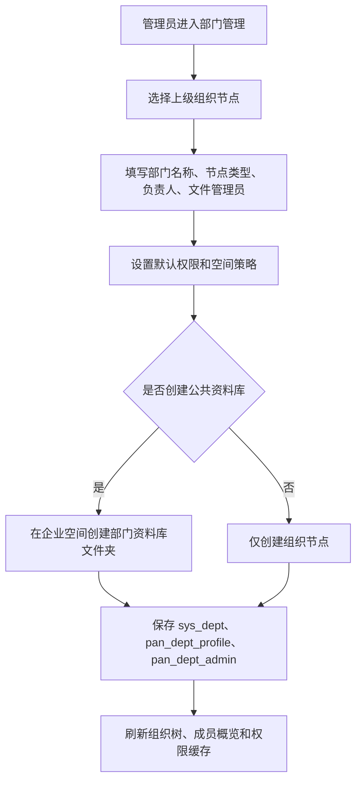
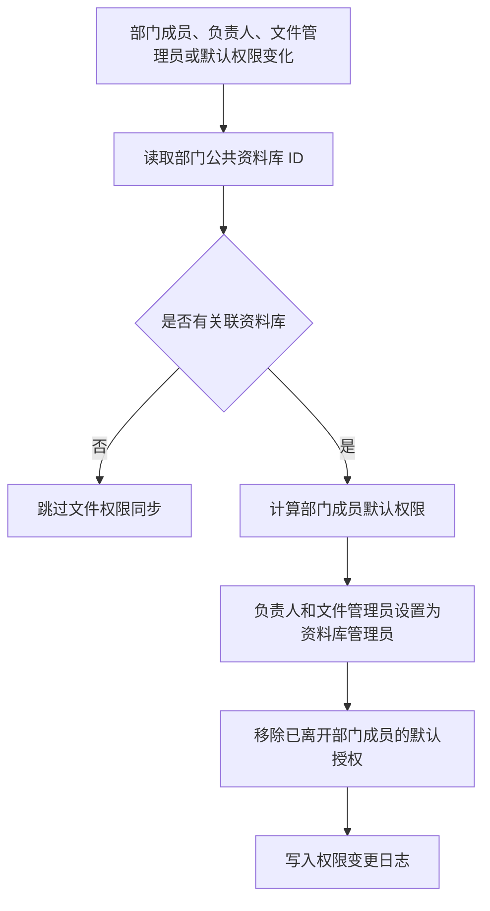
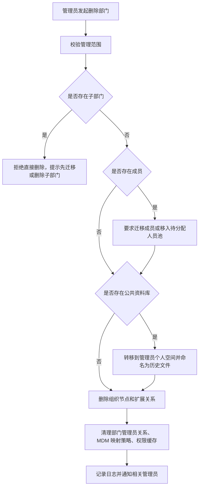

# 组织架构-部门管理模块说明

## 1. 模块定位

部门管理是网盘管理端“组织架构三件套”的第一个模块，负责维护企业组织树、部门节点、公司节点、部门负责人、文件管理员、默认权限、部门空间策略和部门公共资料库。

本模块虽然菜单名称可以叫“部门管理”，但产品含义不是单纯的部门 CRUD，而是“组织架构节点管理”。它是成员管理、管理员设置、企业空间、文件权限、MDM 同步、空间统计和离职/组织裁撤流程的基础。

参考产品定位：

- 亿方云：企业控制台中的“部门与成员管理”，支持邀请成员、管理成员、创建部门、设置成员权限，并要求部门主管删除前先替换。
- 腾讯云企业网盘：后台“用户与团队管理”中的团队管理，支持团队空间、默认权限、团队管理员、团队删除后的文件处理和空间统计。

## 2. 目标用户

| 角色 | 诉求 | 典型动作 |
|---|---|---|
| 超级管理员 | 维护全企业组织架构和网盘空间归属 | 新建公司节点、创建部门、设置负责人、配置公共资料库、删除或归档部门 |
| 分级管理员 | 管理授权范围内的组织和成员 | 在可见范围内创建子部门、调整部门信息、查看部门成员、管理部门公共资料库 |
| 部门负责人 | 负责部门成员和部门资料 | 查看部门成员、参与部门资料库管理、协助成员权限维护 |
| 文件管理员 | 管理部门公共资料库文件 | 管理部门资料库内容、处理部门文件权限、维护部门历史文件 |
| 普通成员 | 按组织关系访问部门资料 | 进入自己所属部门可见的企业空间或部门资料库 |

## 3. 页面入口与代码位置

| 类型 | 位置 |
|---|---|
| 菜单路径 | 管理端 > 组织管理 > 部门管理 |
| 前端路由 | `/pan/admin/dept` |
| 前端页面 | `plus-ui-v4/src/views/pan/admin/dept/index.vue` |
| 前端 API | `plus-ui-v4/src/api/pan/admin/dept` |
| 后端 Controller | `ruoyi-modules/ruoyi-pan/src/main/java/org/dromara/pan/controller/PanAdminDeptController.java` |
| 后端 Service | `ruoyi-modules/ruoyi-pan/src/main/java/org/dromara/pan/service/impl/PanAdminDeptServiceImpl.java` |
| 新增/编辑 BO | `ruoyi-modules/ruoyi-pan/src/main/java/org/dromara/pan/domain/bo/admin/PanAdminDeptUpdateBo.java` |
| 展示 VO | `ruoyi-modules/ruoyi-pan/src/main/java/org/dromara/pan/domain/vo/admin/PanAdminDeptVo.java` |
| 组织主表 | `sys_dept` |
| 网盘部门扩展表 | `pan_dept_profile` |
| 部门管理员关系表 | `pan_dept_admin` |
| MDM 部门映射表 | `mdm_dept_mapping` |
| 成员部门关系表 | `pan_user_dept` |

## 4. 核心概念

| 概念 | 说明 |
|---|---|
| 组织节点 | 组织树中的一个节点，可以是公司节点，也可以是普通部门节点。 |
| 公司节点 | 集团、分公司、子公司等法人或管理单元，当前通过 `deptCategory` 区分，例如 `sub1/sub2/sub3`。 |
| 普通部门 | 真实业务部门，建议 `deptCategory=dept`。 |
| 待分配人员池 | 虚拟节点，用于展示已进入租户但未挂载到正式部门的成员。它不是正式部门，不参与删除、空间和公共资料库逻辑。 |
| 部门负责人 | 部门业务负责人，可多人。真实来源是 `pan_dept_admin` 的 `DEPT_MANAGER`。 |
| 文件管理员 | 部门资料库和文件权限负责人，可多人。真实来源是 `pan_dept_admin` 的 `FILE_ADMIN`。 |
| 分级管理员 | 通过管理员设置模块授权，在某个公司节点或部门范围内拥有管理权限。 |
| 部门公共资料库 | 部门对应的企业空间文件夹，是部门资料沉淀和部门成员共享访问的载体。 |
| 部门空间 | 部门可使用的存储额度策略，默认使用租户同一个 OBS 容量池。 |

## 5. 功能清单

### 5.1 组织树浏览

- 左侧展示组织架构树。
- 支持懒加载根节点和子节点。
- 支持按部门名称搜索。
- 展示待分配人员池。
- 根据当前登录管理员的数据范围过滤可见部门。

### 5.2 部门详情

- 展示部门名称、上级部门、启用状态。
- 展示部门成员数量。
- 展示部门空间策略。
- 展示默认权限。
- 展示部门负责人、文件管理员、公司节点对应的分级管理员。
- 展示部门成员概览，支持按姓名、手机号、工号搜索。

### 5.3 新建部门

管理员可在授权范围内新建组织节点或子部门。核心字段包括：

- 部门名称
- 上级部门
- 节点类型
- 部门负责人
- 文件管理员
- 默认权限
- 部门空间策略
- 是否创建部门公共资料库

业务规则：

- 新建部门必须选择上级部门。
- 上级部门必须在当前管理员可管理范围内。
- 同一上级下部门名称不可重复。
- 节点类型必须明确，不允许空类型进入正式组织树。
- 如勾选创建部门公共资料库，则在企业空间的部门资料库根目录下创建对应文件夹。

### 5.4 编辑部门

可编辑部门名称、上级部门、节点类型、负责人、文件管理员、默认权限、空间策略和公共资料库配置。

已确认规则：

- 部门改名后，部门公共资料库应同步改名。
- 部门负责人和文件管理员以 `pan_dept_admin` 为准，`sys_dept.leader` 和 `sys_dept.file_admin` 只保留首位人员用于兼容展示。
- 修改部门成员或部门默认权限后，部门公共资料库的成员权限应同步刷新。
- MDM 同步来源的部门，后续需要明确哪些字段可本地覆盖，哪些字段以 MDM 为准。

### 5.5 启用与停用

当前已有启用/停用入口。

目标业务规则：

- 部门停用后，部门节点在组织树中保留。
- 部门停用后，部门成员不应再通过该部门访问部门公共资料库。
- 部门停用后，部门公共资料库应禁用普通成员访问。
- 超级管理员和有范围权限的分级管理员仍可访问和处理该部门资料。
- 停用动作应写入日志，并触发权限重算。

### 5.6 删除与组织裁撤

删除部门不能只按普通 CRUD 处理，应升级为“组织裁撤”流程。

目标业务规则：

- 有子部门时，不允许直接删除。
- 有成员时，不允许直接删除，必须先迁移成员或移入待分配人员池。
- 部门删除后，部门成员不会被删除。
- 部门删除后，部门公共资料库不能直接丢失。
- 部门历史文件应转移到对应管理者的个人空间下，建议命名为“某某组织历史文件”。
- 超级管理员和对应分级管理员应能访问到该历史文件。
- 删除或裁撤动作应记录日志，并通知相关管理员。

参考腾讯云企业网盘团队删除规则：删除团队后团队成员不会被删除，团队文件可删除或移入父级团队下，并需要校验父级团队剩余可用额度。

## 6. 部门公共资料库规则

部门公共资料库是部门管理和企业空间之间的核心连接点。

### 6.1 创建规则

- 创建部门时可选择是否创建部门公共资料库。
- 创建位置建议为企业空间下的统一根目录，例如 `/部门公共资料库/{部门名称}`。
- `pan_dept_profile.public_folder_id` 记录该部门关联的文件夹 ID。

### 6.2 命名规则

- 初次创建时与部门名称一致。
- 部门改名后，公共资料库同步改名。
- 如果文件夹名称冲突，需要按统一规则追加后缀，或提示管理员选择处理方式。

### 6.3 权限规则

- 部门成员默认拥有部门设置里的默认权限。
- 部门负责人自动成为部门公共资料库管理员。
- 文件管理员自动成为部门公共资料库管理员。
- 成员加入部门后，应自动获得该部门资料库权限。
- 成员移出部门后，应自动移除该部门资料库权限。
- 部门停用后，普通成员访问被禁用。
- 超级管理员、系统管理员、授权范围覆盖该部门的分级管理员仍可访问。

### 6.4 删除与归档规则

- 部门删除时不直接删除公共资料库。
- 公共资料库应转移到对应超级管理员或分级管理员的个人空间下。
- 转移后的文件夹命名建议为“{组织名称}历史文件”。
- 转移后原部门成员不再默认拥有权限。
- 转移动作需要生成日志，便于审计。

## 7. 部门空间与容量规则

当前产品规则采用“同一租户默认使用同一个 OBS 容量池”的模型。

结合腾讯云企业网盘手册，部门空间可抽象为三种策略：

| 策略 | 说明 | 适用场景 |
|---|---|---|
| 共享企业剩余可用额度 | 部门不单独锁定容量，使用租户 OBS 总容量池中未被分配或未使用的额度。 | 默认推荐，适合多数部门。 |
| 指定额度 | 给部门设置一个明确容量上限。 | 需要控制部门用量，或部门独立核算。 |
| 不分配空间 | 不给部门独立空间，成员只能使用其他有权限空间。 | 临时部门、只读组织节点、待启用部门。 |

容量统计口径：

- 企业购买容量：租户 OBS 可用总容量。
- 已使用容量：所有空间实际文件占用。
- 剩余可用容量：企业总容量减去已使用和已锁定的额度。
- 剩余已分配容量：已分配给部门或个人但尚未使用的额度，这部分对其他空间不可用。
- 部门已用容量：部门公共资料库及部门企业空间下文件的实际占用。

当前代码中部门已用量仍显示为 `0 B`，后续需要接入真实文件大小统计。

## 8. 权限规则

| 权限点 | 超级管理员 | 分级管理员 | 部门负责人 | 文件管理员 | 普通成员 |
|---|---|---|---|---|---|
| 查看组织树 | 全部 | 授权范围 | 所在部门及规则允许范围 | 所在部门及规则允许范围 | 仅用于选择和展示 |
| 新建部门 | 全部 | 授权范围内 | 默认不允许 | 默认不允许 | 不允许 |
| 编辑部门 | 全部 | 授权范围内 | 可按后续策略开放部分字段 | 默认不允许 | 不允许 |
| 停用部门 | 全部 | 授权范围内 | 不允许 | 不允许 | 不允许 |
| 删除/裁撤部门 | 全部 | 授权范围内，且需满足裁撤规则 | 不允许 | 不允许 | 不允许 |
| 设置负责人 | 全部 | 授权范围内 | 不允许修改自身管理角色 | 不允许 | 不允许 |
| 设置文件管理员 | 全部 | 授权范围内 | 可建议，是否允许待定 | 不允许 | 不允许 |
| 管理部门资料库 | 全部 | 授权范围内 | 允许 | 允许 | 按默认权限 |

## 9. 与其他模块的关系

| 关联模块 | 关系 | 影响 |
|---|---|---|
| 成员管理 | 部门是成员归属、默认权限和成员搜索筛选的基础。 | 成员新增、移动、删除会触发部门成员数和资料库权限变化。 |
| 管理员设置 | 分级管理员的授权范围依赖公司/部门节点。 | 部门移动、删除、停用会影响管理员可管理范围。 |
| MDM 同步 | 外部组织架构同步会创建、更新、停用部门节点。 | 需要处理 MDM 字段和本地编辑字段冲突。 |
| 企业空间 | 部门公共资料库创建在企业空间内。 | 部门新增、改名、停用、删除会影响文件夹和权限。 |
| 个人空间 | 部门删除或裁撤时，历史文件可转移到管理员个人空间。 | 需要校验接收者空间容量和权限。 |
| 文件权限 | 部门默认权限会映射到部门资料库成员权限。 | 成员变化、负责人变化、文件管理员变化都要触发权限同步。 |
| 空间统计 | 部门空间占用需要进入企业空间统计和部门用量统计。 | 需要真实统计部门资料库文件大小。 |
| 日志查询 | 部门创建、编辑、停用、删除、迁移资料库都属于管理审计事件。 | 需要记录操作者、范围、前后值和关联文件夹。 |
| 消息中心 | 部门停用、裁撤、历史文件转移可通知相关管理员。 | 避免资料转移后无人知晓。 |
| 离职/交接 | 成员离职时，如果其是部门负责人或文件管理员，需要先替换。 | 参考亿方云“部门主管无法直接删除”的规则。 |

## 10. 核心流程

### 10.1 新建部门流程

### 10.2 部门资料库权限同步流程

### 10.3 部门删除/裁撤流程

## 11. 当前代码现状

已实现或基本实现：

- 组织树接口、根节点和子节点懒加载。
- 部门搜索。
- 部门详情、成员概览、成员数量展示。
- 新增、编辑、删除、启用、停用入口。
- 部门负责人多选。
- 文件管理员多选。
- 部门默认权限字段。
- 部门空间策略字段。
- 部门公共资料库创建入口。
- 待分配人员池虚拟节点。
- 分级管理员可见范围过滤。
- MDM 同步入口。

需要补强：

- 后端强校验 `deptCategory` 必填和枚举范围。
- 后端强校验 `quotaTag/defaultPermission/status` 的合法值。
- 部门移动时校验不能移动到自己的子孙节点下。
- 部门改名后同步公共资料库改名。
- 部门停用后同步禁用资料库普通成员访问。
- 部门成员变化后同步公共资料库权限。
- 部门负责人、文件管理员自动成为资料库管理员。
- 删除部门升级为组织裁撤流程。
- 删除部门时将部门资料库转移到管理员个人空间。
- 接入真实部门已用容量和剩余额度计算。
- 明确 MDM 来源部门的本地可编辑字段。
- 操作日志和消息通知。

## 12. 参考手册映射

| 来源 | 对应能力 | 本系统采用方式 |
|---|---|---|
| 亿方云产品使用手册 V3 | 企业控制台包含“部门与成员管理”。 | 将部门管理作为组织管理核心入口。 |
| 亿方云产品使用手册 V3 | 创建部门时填写部门名称、上级部门、成员权限。 | 新建部门包含名称、上级、默认权限和空间策略。 |
| 亿方云产品使用手册 V3 | 部门主管无法直接删除，需要先更换部门主管。 | 成员离职或删除时，如果是负责人，需要先替换。 |
| 亿方云产品使用手册 V3 | 管理员设置支持分级管理员。 | 分级管理员在授权范围内管理组织节点。 |
| 腾讯云企业网盘手册 | 初始化设置支持团队空间默认容量和默认权限。 | 部门可设置默认权限和空间策略。 |
| 腾讯云企业网盘手册 | 团队空间可共享企业剩余可用额度或指定额度。 | 部门空间采用共享容量、指定额度、不分配三种策略。 |
| 腾讯云企业网盘手册 | 删除团队后成员不删除，团队文件可删除或移入父级团队。 | 本系统采用组织裁撤，成员不删除，历史文件转移到管理员个人空间。 |
| 腾讯云企业网盘手册 | 空间统计展示购买容量、剩余容量、已用容量、已分配未使用容量。 | 后续部门空间统计需要接入真实容量模型。 |

## 13. 待确认问题

- [ ] 公司节点类型编码是否固定为 `sub1/sub2/sub3...`，普通部门是否固定为 `dept`。
- [ ] 部门公共资料库根目录名称是否固定为“部门公共资料库”。
- [ ] 部门删除时历史文件接收者优先级：发起删除的管理员、该公司分级管理员、超级管理员，三者如何排序。
- [ ] 历史文件转移到个人空间时，是否占用接收者个人空间额度，还是仍占用企业空间额度。
- [ ] 部门默认权限角色是否完全采用腾讯云默认角色，还是保留自定义权限角色。
- [ ] MDM 来源部门是否允许本地改名、移动、停用。
- [ ] 部门负责人是否允许管理成员，还是只管理部门资料库。

## 14. 智能体执行规则与注意事项

本节用于指导后续智能体实现部门管理相关需求。处理“部门管理、组织架构、部门公共资料库、部门负责人、文件管理员、部门空间、组织裁撤”等需求时，应先阅读本节，再修改代码。

### 14.1 先读顺序

1. 先读本文档，确认目标业务规则。
2. 再读当前涉及的前端页面和 API。
3. 再读 `PanAdminDeptServiceImpl`、`PanAdminDeptUpdateBo`、`PanAdminDeptVo`。
4. 如果涉及成员变更，继续读成员管理相关 service。
5. 如果涉及资料库、文件夹、权限、容量，继续读 folder/file/permission/space 相关 service。
6. 如果涉及 MDM，同步读 `mdm_*` 相关 mapper、support 和同步任务。

不要只看 `sys_dept` 或 RuoYi 原生部门逻辑就开始实现。网盘部门管理有额外业务层，必须结合 `pan_dept_profile`、`pan_dept_admin`、MDM 映射和企业空间权限一起看。

### 14.2 新增或编辑部门时必须检查

- 是否校验当前管理员对上级部门有管理权限。
- 是否校验部门名称在同一上级下唯一。
- 是否校验 `deptCategory` 必填且属于允许值。
- 是否校验不能把部门移动到自己或自己的子孙节点下。
- 是否同步 `sys_dept` 和网盘扩展表。
- 是否同步 `pan_dept_admin` 中的部门负责人、文件管理员。
- 是否只把首位负责人和首位文件管理员回写到 `sys_dept` 兼容字段。
- 是否根据 `createPublicFolder/publicFolderId` 维护部门公共资料库。
- 如果部门名称变化，是否同步公共资料库名称。
- 如果默认权限变化，是否触发资料库成员权限重算。

### 14.3 停用部门时必须检查

- 停用不是删除，部门数据、成员关系、资料库都要保留。
- 普通成员应失去通过该部门访问公共资料库的能力。
- 超级管理员、系统管理员、授权范围覆盖该部门的分级管理员仍应能访问。
- 停用后是否影响子部门，需要明确规则后再实现。
- 停用动作要记录管理日志。
- 前端提示不能只写“是否停用部门”，还应提示会影响部门资料库访问。

### 14.4 删除或裁撤部门时必须检查

- 有子部门时不能直接删除。
- 有成员时不能直接删除，必须先迁移成员或进入裁撤流程。
- 部门成员不能因删除部门而被删除。
- 部门公共资料库不能直接删除。
- 历史文件应转移到对应管理员个人空间下，命名为“某某组织历史文件”。
- 转移前要校验目标空间、权限和容量策略。
- 删除后要清理或失效部门管理员关系、默认权限、资料库授权和相关缓存。
- 删除后要记录日志，并通知相关超级管理员或分级管理员。

### 14.5 部门公共资料库必须联动

以下动作发生时，都要考虑公共资料库联动：

- 创建部门
- 部门改名
- 部门停用
- 部门启用
- 部门删除或裁撤
- 成员加入部门
- 成员移出部门
- 成员离职或冻结
- 修改部门负责人
- 修改文件管理员
- 修改默认权限
- 修改部门空间策略

资料库权限来源优先级：

1. 超级管理员、系统管理员的全局权限。
2. 覆盖该部门范围的分级管理员权限。
3. 部门负责人和文件管理员的资料库管理员权限。
4. 部门成员按部门默认权限获得的权限。
5. 文件夹自身额外协作授权。

### 14.6 部门空间实现时必须检查

- 当前产品采用同一租户共用一个 OBS 容量池。
- 部门空间策略不是独立存储桶，而是容量分配和权限统计规则。
- “共享企业剩余可用额度”表示不锁定部门专属容量。
- “指定额度”表示该部门可用容量上限，需要上传、复制、移动时校验。
- “不分配空间”表示该部门不应获得独立部门资料库容量。
- 部门已用容量必须来自真实文件大小统计，不能长期使用固定 `0 B`。
- 空间统计模块需要能按部门展示已分配、已使用、剩余。

### 14.7 MDM 来源部门必须检查

- MDM 同步创建的部门要保留 `mdm_dept_mapping`。
- MDM 来源部门的名称、父级、状态、排序是否允许本地修改，需要看本文档的待确认项。
- 如果允许本地覆盖，要有覆盖标记，避免下一次同步被静默覆盖。
- MDM 同步范围变化时，不能简单删除部门，应考虑停用、归档或进入待处理状态。

### 14.8 前端交互注意事项

- “待分配人员池”是虚拟节点，不能展示新建子部门、编辑、停用、删除等正式部门操作。
- 公司节点和普通部门节点在视觉和表单上要能区分。
- 停用、删除、裁撤、转移资料库等高风险动作要有明确提示。
- 部门负责人、文件管理员多选时，首位人员只是兼容字段，不代表唯一负责人。
- 如果后台返回公共资料库状态，前端应展示是否已创建、是否禁用、是否已归档。

### 14.9 后端边界注意事项

- 不要把所有网盘业务字段继续堆到 `sys_dept`。
- `sys_dept` 负责组织树基础字段。
- `pan_dept_profile` 负责部门空间、默认权限、公共资料库等网盘配置。
- `pan_dept_admin` 负责多人负责人和文件管理员。
- 涉及文件夹、权限、容量时，优先调用网盘领域 service，不要在部门 service 里直接散写文件表。
- 所有写操作要考虑事务边界，尤其是部门、资料库、权限三者同时修改时。

### 14.10 完成后必须更新

如果实现或调整了部门管理业务规则，至少检查是否需要同步更新：

- `docs/product/modules/07-admin-dept.md`
- `docs/product/modules/00-module-map.md`
- `AGENTS.md`

如果只是修 bug，但暴露出新的业务边界，也要在本文档的待确认问题或代码现状中记录。
