# 组织架构-管理员设置模块说明

## 1. 模块定位

管理员设置是网盘管理端“组织架构三件套”的第三个模块，负责配置谁可以进入管理中心、谁可以管理某个公司范围、谁可以继续委派下级分级管理员，以及这些管理员能看到哪些管理菜单、能操作哪些组织和文件资产。

本模块不是 RuoYi 原生角色管理的重复实现。RuoYi 的角色、菜单、权限仍然是系统基础能力；管理员设置是网盘业务层自己的“管理中心授权模型”，核心是：

- 用 `pan_admin_grant` 记录网盘管理员授权。
- 用 `admin_type` 区分系统管理员和公司分级管理员。
- 用 `scope_dept_id` 定义公司级管辖范围。
- 用 `perm_json` 定义管理中心菜单权限。
- 用 `status` 控制授权是否启用。
- 用移交能力支持管理员离职、岗位变化和组织调整。

参考产品定位：

- 亿方云：企业控制台中有管理员设置和分级管理员概念，管理员可按组织范围和功能权限进行分工。
- 本项目：结合集团组织特点，将分级管理员绑定到公司层级节点，默认管理该公司及其下级组织，不自动获得全集团能力。

> 说明：本地 `360亿方云产品使用手册（V3）.pdf` 文字层无法被 `pdfplumber` 正常抽取，因此本文档不引用页码和原文。本文档依据已沉淀的亿方云管理控制台模式、现有部门文档、SQL 设计注释和当前代码实现整理。

## 2. 目标用户

| 角色 | 诉求 | 典型动作 |
|---|---|---|
| 超级管理员 | 拥有全局最高权限，配置所有网盘管理能力 | 创建系统管理员、创建分级管理员、调整权限、移交管理员、处理异常授权 |
| 系统管理员 | 负责网盘全局管理，但不一定是 RuoYi 超级管理员 | 管理企业级配置、组织、成员、报表、日志、管理员设置 |
| 分级管理员 | 管理授权公司范围内的组织、成员和部分网盘资源 | 管理本公司部门、成员、资料库、日志、报表，按授权管理下级分级管理员 |
| 部门负责人 | 管理部门业务和部门资料，不属于本模块授权对象 | 不在 `pan_admin_grant` 中配置，由部门管理维护 |
| 文件管理员 | 管理部门公共资料库和部门文件权限，不属于本模块授权对象 | 不在 `pan_admin_grant` 中配置，由部门管理维护 |
| 普通成员 | 不进入管理中心 | 无本模块操作 |

关键边界：

- “分级管理员”是后台管理权限。
- “部门负责人/文件管理员”是部门和文件业务权限。
- 两套权限不能混在一张表里，也不能互相自动晋升。

## 3. 页面入口与代码位置

| 类型 | 位置 |
|---|---|
| 菜单路径 | 管理端 > 组织管理 > 管理员设置 |
| 前端路由 | `/pan/admin/subadmin` |
| 前端页面 | `plus-ui-v4/src/views/pan/admin/subadmin/index.vue` |
| 前端 API | `plus-ui-v4/src/api/pan/admin.ts` |
| 前端类型 | `plus-ui-v4/src/api/pan/types.ts` |
| 管理中心侧边栏 | `plus-ui-v4/src/views/pan/layout/PanSidebar.vue` |
| 后端 Controller | `ruoyi-modules/ruoyi-pan/src/main/java/org/dromara/pan/controller/PanAdminGrantController.java` |
| 后端 Service | `ruoyi-modules/ruoyi-pan/src/main/java/org/dromara/pan/service/impl/PanAdminGrantServiceImpl.java` |
| 范围 Support | `ruoyi-modules/ruoyi-pan/src/main/java/org/dromara/pan/service/support/PanAdminGrantScopeSupport.java` |
| 权限 Support | `ruoyi-modules/ruoyi-pan/src/main/java/org/dromara/pan/service/support/PanAdminGrantPermissionSupport.java` |
| 会话刷新 Support | `ruoyi-modules/ruoyi-pan/src/main/java/org/dromara/pan/service/support/PanAdminGrantSessionSupport.java` |
| 管理端数据读取 Support | `ruoyi-modules/ruoyi-pan/src/main/java/org/dromara/pan/service/support/PanAdminSysDataSupport.java` |
| 数据表 | `pan_admin_grant` |
| SQL 设计 | `script/sql/pan_handover_admin_schema.sql` |

## 4. 核心概念

| 概念 | 说明 |
|---|---|
| 超级管理员 | RuoYi 内置最高权限用户，通常 `userId=1` 或拥有 `*:*:*`。不依赖 `pan_admin_grant`。 |
| 系统管理员 | 网盘全局管理员，设计上 `admin_type=SYSTEM`，`scope_dept_id=NULL`。当前前端主要展示公司分级管理员，系统管理员能力后续需要补前端入口。 |
| 分级管理员 | `admin_type=COMPANY`，`scope_dept_id` 指向公司层级节点，管理该公司及子树。 |
| 管辖公司 | 分级管理员绑定的公司节点。当前后端要求 `sys_dept.dept_category` 以 `sub` 开头。 |
| 管辖范围 | 管辖公司节点及其所有下级组织。后端通过组织树展开，不需要为每个子部门写授权。 |
| 权限点 | `perm_json` 中的功能开关，例如 `dept`、`member`、`adminSetting`、`grantSubAdmin`。 |
| 菜单权限 | 权限点映射到 RuoYi 菜单权限，例如 `adminSetting` 映射 `pan:admin:grant:list/query`。 |
| 管理中心入口 | `/pan/admin/grant/me` 返回当前用户是否可进入管理中心、是否超级管理员、是否分级管理员、合并权限和范围。 |
| 委派权限 | `grantSubAdmin=true` 表示分级管理员可在自己的管辖范围内继续指派下级分级管理员。 |
| 授权移交 | 将一个分级管理员的管辖公司和权限转给另一个成员，支持同范围权限合并。 |

## 5. 产品规则总览

### 5.1 管理员类型

| 类型 | `admin_type` | 范围 | 当前状态 | 说明 |
|---|---|---|---|---|
| 超级管理员 | 不在本表 | 全租户 | RuoYi 已有 | 全部管理中心菜单和全部数据范围。 |
| 系统管理员 | `SYSTEM` | 全集团 | 后端已有字段与逻辑雏形，前端未完整暴露 | 用于网盘业务全局管理，可作为非 RuoYi 超管的集团级管理员。 |
| 公司分级管理员 | `COMPANY` | `scope_dept_id` 公司节点子树 | 前后端主要已实现 | 本模块当前主能力。 |
| 部门负责人 | 不在本表 | 部门 | 部门管理实现 | 不进入管理员设置。 |
| 文件管理员 | 不在本表 | 部门公共资料库 | 部门管理实现 | 不进入管理员设置。 |

### 5.2 管辖范围规则

- 分级管理员必须选择管辖公司。
- 管辖公司必须是公司层级节点，当前代码要求 `dept_category` 以 `sub` 开头。
- 不能把普通部门节点作为分级管理员的 `scope_dept_id`。
- 同一个成员可以分管多个公司。
- 同一个公司可以有多个分级管理员。
- 如果同时选择上级公司和下级公司，后端会归并为上级公司，避免冗余授权。
- 分级管理员只能给自己管辖范围内的成员授权。
- 分级管理员只能选择自己管辖范围内的公司作为授权范围。
- 超级管理员不受管辖范围限制。

### 5.3 权限点规则

当前代码中权限点如下：

| `perm_json` 键 | 页面名称 | 业务含义 | 当前映射菜单权限 |
|---|---|---|---|
| `dept` | 部门管理 | 查看、新增、编辑管辖范围内部门 | `pan:admin:dept:list/query/add/edit` |
| `removeDept` | 删除部门 | 删除或裁撤管辖范围内部门 | `pan:admin:dept:remove` |
| `member` | 成员管理 | 查看管辖范围内成员 | `pan:admin:member:list` |
| `memberContent` | 成员内容管理 | 新增、编辑、分配成员 | `pan:admin:member:edit/add/assign` |
| `removeMember` | 删除成员 | 删除或移除成员 | `pan:admin:member:remove` |
| `extCollab` | 外部协作成员 | 管理外部协作成员 | 当前映射到 `pan:admin:member:list`，后续需独立权限 |
| `group` | 群组管理 | 管理协作空间/群组 | 当前映射到 `pan:admin:member:list`，后续需独立权限 |
| `report` | 数据报表 | 查看空间、用户、流量统计 | 当前映射到 `pan:admin:grant:query`，后续需独立报表权限 |
| `log` | 日志查询 | 查看管辖范围内日志 | 当前映射到 `pan:admin:grant:query`，后续需独立日志权限 |
| `adminSetting` | 管理员设置 | 进入管理员设置并查看授权 | `pan:admin:grant:list/query` |
| `grantSubAdmin` | 管理下级分级管理员 | 创建、编辑、删除下级分级管理员 | `pan:admin:grant:add/edit/remove` |

产品建议：

- 页面展示时可以按大功能展示，但后端仍应保留细粒度权限点。
- `removeMember`、`removeDept` 属于高风险权限，默认不勾选。
- `adminSetting` 只允许查看管理员设置。
- `grantSubAdmin` 才允许新增、编辑、删除、移交管理员。
- 额度分配、全局安全策略、全局外链策略建议只给超级管理员或系统管理员，不下放给普通分级管理员。

### 5.4 管理中心入口规则

用户侧左下角是否展示“管理中心”，由 `/pan/admin/grant/me` 决定。

| 用户类型 | 是否可进入 | 菜单可见范围 |
|---|---|---|
| 超级管理员 | 是 | 全部管理菜单 |
| 系统管理员 | 目标应为是 | 后续按 `SYSTEM` 权限定义 |
| 分级管理员 | 是 | `perm_json` 中开启的菜单 |
| 部门负责人 | 默认否 | 不因部门负责人身份进入管理中心 |
| 文件管理员 | 默认否 | 不因文件管理员身份进入管理中心 |
| 普通成员 | 否 | 不展示管理中心入口 |

当前代码现状：

- 超级管理员直接返回 `canAccessConsole=true`。
- 分级管理员存在启用中的 `COMPANY` 授权时返回 `canAccessConsole=true`。
- 返回 `permKeys`、`menuPermissions`、`scopeDeptIds` 给前端侧边栏过滤菜单。
- `SYSTEM` 类型虽然在表结构和 BO 中存在，但当前 `getCurrentConsoleAccess()` 未把 `SYSTEM` 作为可进入管理中心的判断来源，需要补强。

## 6. 功能清单

### 6.1 管理员列表

页面展示：

- 分级管理员数量。
- 已覆盖公司数量。
- 启用中管理员数量。
- 管理员卡片列表。
- 管辖公司标签。
- 权限摘要。
- 状态：启用/停用。
- 操作：详情、编辑、移交、删除。

接口：

- `GET /pan/admin/grant/list`
- 支持 `keyword`、`adminType`、`scopeDeptId` 参数。
- 当前前端调用时固定取 `adminType=COMPANY`。

业务规则：

- 超级管理员可查看全部授权。
- 分级管理员只能查看自己管辖范围内的分级管理员授权。
- 搜索可按姓名、工号、管辖公司过滤。
- 列表必须租户隔离。

### 6.2 创建分级管理员

页面能力：

- 可一次选择一个或多个成员。
- 可选择一个或多个管辖公司。
- 支持上级公司自动包含下级公司。
- 支持取消某些下级公司，前端通过公司级联组件处理。
- 配置控制台权限。
- 填写备注。

后端能力：

- `POST /pan/admin/grant/save-batch` 按用户批量保存多个公司授权。
- 校验管理员成员存在。
- 校验被授权成员在操作者可见范围内。
- 校验管辖公司是公司层级节点。
- 校验管辖公司在操作者可分配范围内。
- 同一用户、同一管理员类型、同一范围不可重复授权。

产品规则：

- 超级管理员可给任意公司范围配置分级管理员。
- 分级管理员只有拥有 `grantSubAdmin` 时，才可创建下级分级管理员。
- 分级管理员创建下级管理员时，被授权成员和管辖公司都必须落在自己的管辖范围内。
- 创建后目标成员应立即获得管理中心入口和对应菜单权限。
- 创建后应写管理日志。

### 6.3 编辑分级管理员

可编辑内容：

- 管辖公司范围。
- 控制台权限。
- 状态。
- 备注。
- 管理员成员本身。

当前前端行为：

- 编辑时若更换管理员成员，前端先调用 `/transfer-user` 将原管理员全部授权移交给新成员，再调用 `/save-batch` 保存新配置。

业务规则：

- 编辑范围时，新增范围必须在操作者可分配范围内。
- 删除某些管辖公司时，应删除对应 `pan_admin_grant` 记录。
- 修改权限后，应刷新目标管理员在线会话权限。
- 如果目标管理员当前在线，应尽量无需重新登录即可看到菜单变化。
- 高风险权限变更应写日志，建议记录前后 `perm_json`。

### 6.4 启用与停用授权

接口：

- `PUT /pan/admin/grant/{id}/status`

业务规则：

- 启用表示该授权生效，参与菜单权限合并和范围计算。
- 停用表示该授权暂时失效，不删除历史记录。
- 停用后目标管理员对该公司范围的管理中心入口、菜单和数据范围应立即失效。
- 如果该管理员还有其他启用授权，则仍可进入管理中心，只能管理剩余范围。
- 停用不是离职交接，文件归集和资料移交不应自动发生。

当前缺口：

- 前端卡片展示状态，但当前主页面没有明显的启用/停用按钮入口，需要补 UI。

### 6.5 删除管理员授权

接口：

- `DELETE /pan/admin/grant/{id}`

当前前端行为：

- 按管理员卡片删除时，会遍历该管理员所有 `grantIds`，删除其全部分级管理员权限。

业务规则：

- 删除授权会永久移除该授权记录。
- 删除前应提示影响范围。
- 删除不删除成员账号。
- 删除不删除该管理员个人空间文件。
- 删除不自动处理其作为部门负责人/文件管理员的业务身份。
- 如果管理员已离职，应优先走“移交”或“成员移除/离职交接”流程，再删除授权。

产品建议：

- 对单条范围授权，提供“移除某公司管辖范围”。
- 对某管理员，提供“删除全部分级管理员权限”。
- 高风险场景下优先推荐停用，而不是直接删除。

### 6.6 管理员移交

接口：

- `POST /pan/admin/grant/transfer`
- `POST /pan/admin/grant/transfer-user`

当前主要使用：

- 前端使用 `/transfer-user`，将某个管理员的全部 `COMPANY` 授权转给接替成员。

后端规则：

- 接替成员必须存在。
- 接替成员必须在操作者可见范围内。
- 接替成员不能与原管理员相同。
- 仅 `COMPANY` 分级管理员支持移交。
- 如果接替成员已有相同公司范围授权，则合并双方 `perm_json`，删除原授权。
- 如果接替成员没有相同范围授权，则直接修改 `user_id`。
- 移交后刷新原管理员和接替管理员会话权限。

业务规则：

- 管理员离职、岗位变化、公司调整时必须优先执行移交。
- 移交管理员设置权限，只移交后台管理授权。
- 文件归属、部门负责人、文件管理员、个人空间文件交接不是本操作自动完成，需要成员管理/离职交接模块处理。
- 如果管理员同时是部门负责人或文件管理员，需要在部门管理模块补充替换。

### 6.7 管理下级分级管理员

这是分级授权的核心能力。

规则：

- 默认只有超级管理员或系统管理员可以创建分级管理员。
- 分级管理员只有被授予 `adminSetting=true`，才可进入管理员设置查看授权。
- 分级管理员只有被授予 `grantSubAdmin=true`，才可创建、编辑、删除、移交下级分级管理员。
- 下级授权的管辖公司必须在操作者自己的管辖子树内。
- 下级授权的成员必须在操作者自己的可见成员范围内。
- 下级管理员不能获得超出操作者自身范围的数据范围。
- 对权限点是否允许“下级获得比上级更多功能权限”，建议采用保守规则：下级不能获得操作者自己没有的权限点。

当前代码现状：

- 后端已经校验公司范围是否在操作者管辖范围内。
- 后端已经校验目标成员是否在操作者可见范围内。
- 当前 `validateBo/saveBatch` 尚未显式校验“下级 perm_json 不得超过操作者自己的 perm_json”，需要补强。
- 前端目前没有按当前管理员的 `permKeys` 禁用超出自身权限的开关，需要补强。

## 7. 数据模型

### 7.1 `pan_admin_grant`

| 字段 | 说明 |
|---|---|
| `id` | 主键 |
| `user_id` | 被授权管理员，对应 `sys_user.user_id` |
| `admin_type` | `SYSTEM` 或 `COMPANY` |
| `scope_dept_id` | `COMPANY` 时指向公司节点；`SYSTEM` 时为空 |
| `perm_json` | 勾选式后台权限 JSON |
| `status` | `0` 正常，`1` 停用 |
| `remark` | 备注 |
| `tenant_id` | 租户编号 |
| `create_by/create_time/update_by/update_time` | 审计字段 |

唯一约束：

- `user_id + admin_type + scope_dept_id + tenant_id` 唯一。

索引：

- 按 `user_id` 查询用户授权。
- 按 `scope_dept_id` 查询公司范围授权。

### 7.2 `perm_json` 示例

```json
{
  "member": true,
  "dept": true,
  "removeMember": false,
  "removeDept": false,
  "memberContent": true,
  "extCollab": false,
  "group": false,
  "log": true,
  "report": false,
  "adminSetting": true,
  "grantSubAdmin": false
}
```

### 7.3 与其他管理身份的表关系

| 身份 | 数据表 | 说明 |
|---|---|---|
| 超级管理员 | RuoYi 用户/角色/权限 | 不依赖 `pan_admin_grant` |
| 系统管理员 | `pan_admin_grant` | `admin_type=SYSTEM`，后续需补全前端能力 |
| 分级管理员 | `pan_admin_grant` | 本模块核心 |
| 部门负责人 | `pan_dept_admin` | `role_type=DEPT_MANAGER` |
| 文件管理员 | `pan_dept_admin` | `role_type=FILE_ADMIN` |
| 成员部门关系 | `pan_user_dept`、`sys_user.dept_id` | 用于判断成员是否落在管理员范围内 |
| 部门公共资料库 | `pan_dept_profile.public_folder_id` | 分级管理员可管理范围内部门资料库 |

## 8. 核心操作流程图

本模块的每个主要操作都应有明确流程，后续实现时以这些流程作为验收骨架。

### 8.1 进入管理中心流程

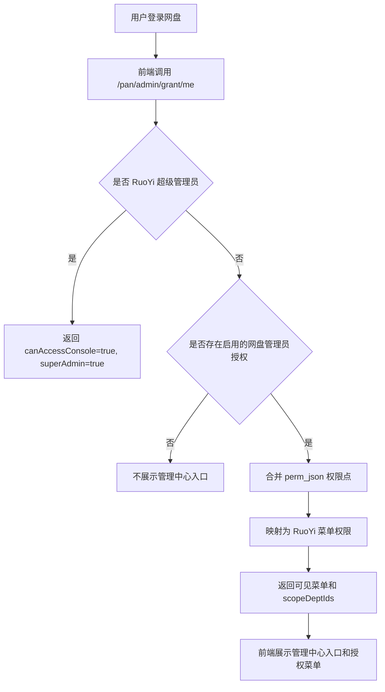

### 8.2 管理员列表流程

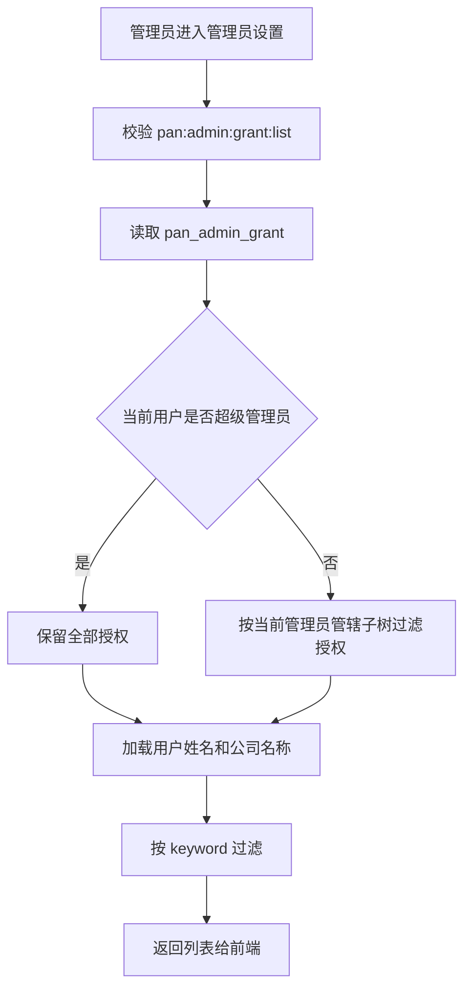

### 8.3 创建分级管理员流程

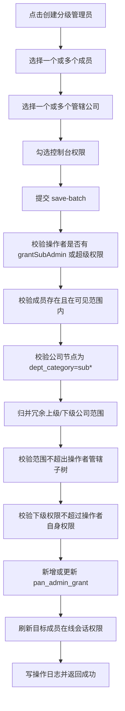

### 8.4 编辑管理员流程

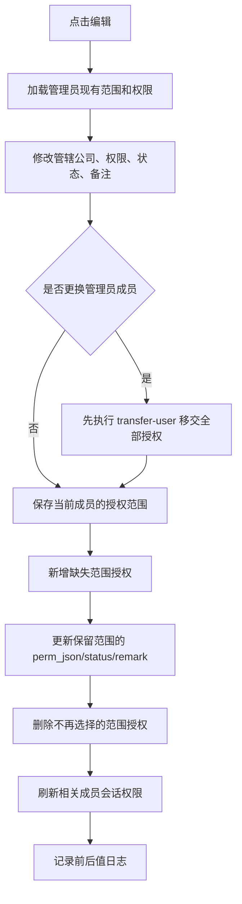

### 8.5 启用/停用授权流程

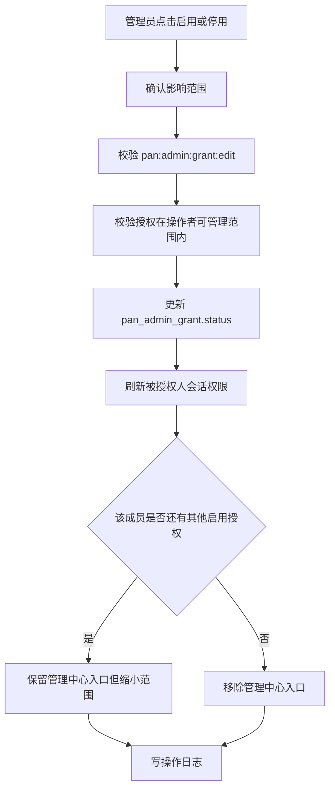

### 8.6 删除授权流程

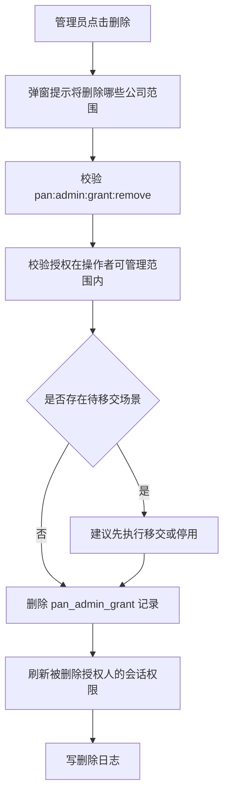

### 8.7 单条授权移交流程

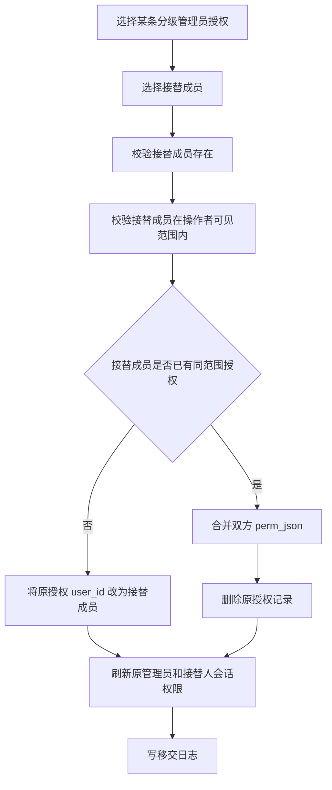

### 8.8 按用户移交全部授权流程

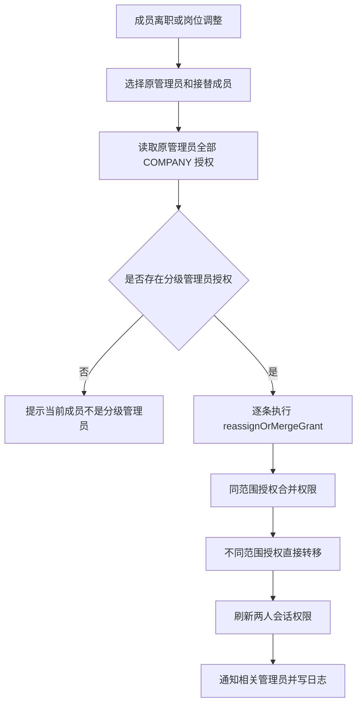

### 8.9 下级分级管理员委派流程

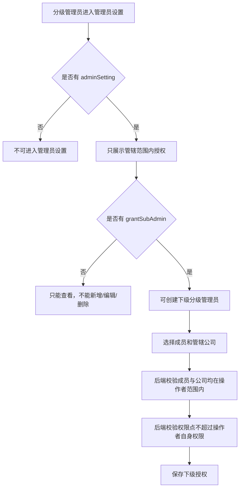

### 8.10 权限点映射菜单流程

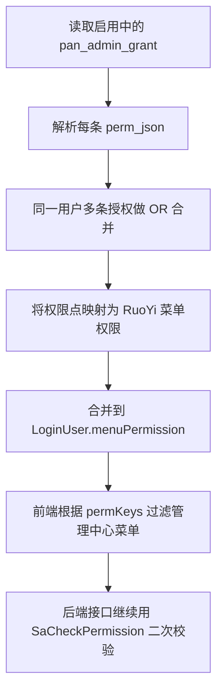

### 8.11 数据范围校验流程

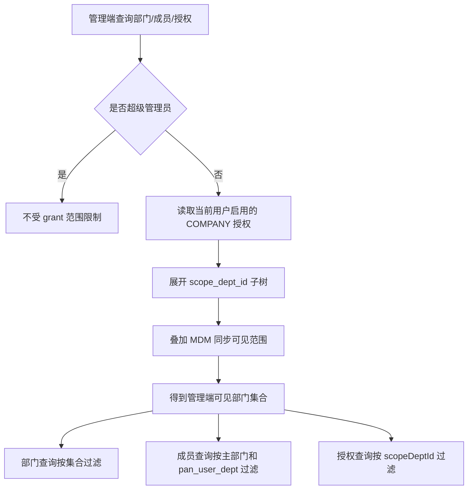

### 8.12 部门调整影响管理员范围流程

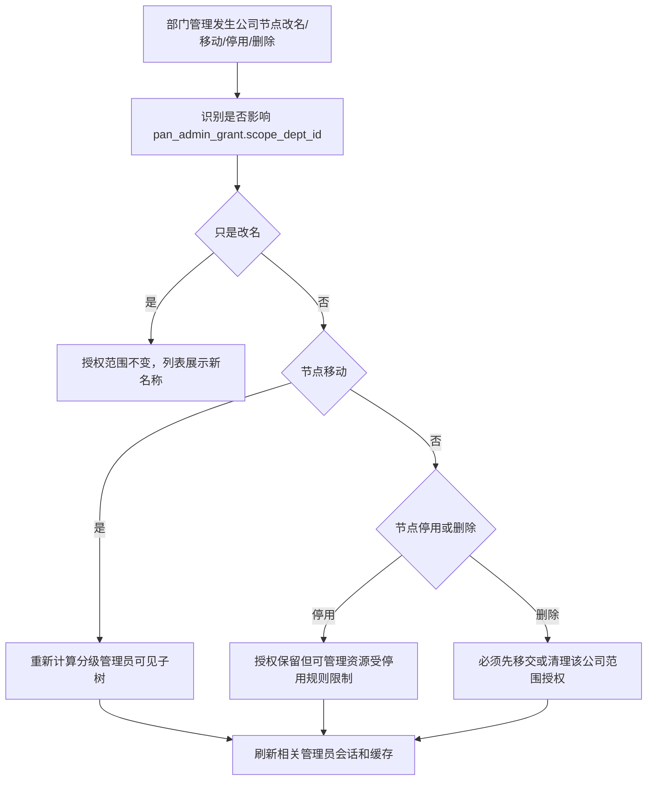

### 8.13 管理员离职联动流程

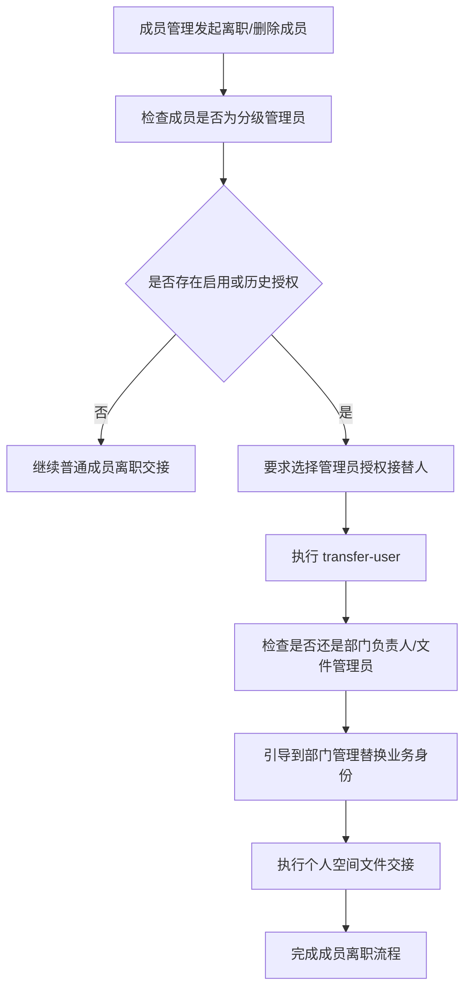

### 8.14 授权变更后会话刷新流程

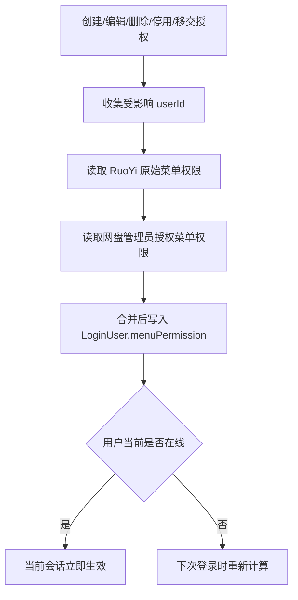

### 8.15 审计日志流程

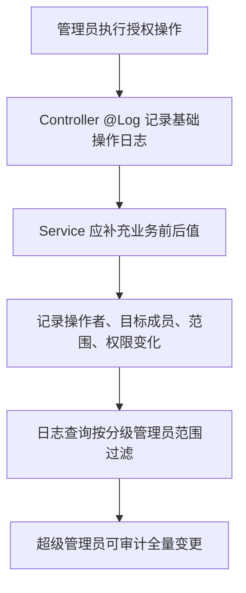

## 9. 与其他模块的关系

| 关联模块 | 关系 | 影响 |
|---|---|---|
| 部门管理 | 管辖范围依赖公司节点和组织树。 | 公司节点移动、停用、删除会影响分级管理员范围。 |
| 成员管理 | 被授权对象来自成员；离职时需移交管理员授权。 | 成员删除前必须检查是否为分级管理员。 |
| 企业空间 | 分级管理员可管理授权范围内部门公共资料库和企业文件。 | 企业空间文件操作必须校验管理员范围。 |
| 协作空间 | 分级管理员可按授权范围管理成员创建/参与的协作空间。 | 当前协作空间文档中该规则待落地。 |
| 个人空间 | 分级管理员默认不能浏览成员个人空间。 | 只在离职交接、文件归集等流程中处理交接，不直接开放内容浏览。 |
| 与我相关 | 分级管理员可能成为权限申请审批人或查看授权范围内动态。 | 审批范围必须受 `scope_dept_id` 限制。 |
| 安全外链 | 分级管理员可管理范围内文件产生的外链。 | 外链管理列表要按来源空间和组织范围过滤。 |
| 误删恢复 | 分级管理员可处理范围内企业空间删除项。 | 回收站查询和恢复必须受范围限制。 |
| 日志查询 | 分级管理员只能看范围内日志。 | 当前日志权限映射较粗，需要补真实日志数据范围。 |
| 数据报表 | 分级管理员只能看范围内空间、用户、流量统计。 | 当前报表权限映射较粗，需要补真实接口权限。 |
| MDM 同步 | MDM 可限制租户可见组织范围。 | 分级管理员范围与 MDM 范围取交集。 |
| 离职交接 | 管理员离职必须先移交授权。 | `transfer-user` 与个人空间归集、部门负责人替换联动。 |

## 10. 当前代码现状

### 10.1 已实现或基本实现

- `pan_admin_grant` 表设计已存在。
- `PanAdminGrantController` 覆盖当前访问、列表、详情、创建、编辑、删除、状态更新、单条移交、按用户移交、批量保存。
- `PanAdminGrantServiceImpl` 已实现核心增删改查。
- 支持同一管理员分管多个公司。
- 支持同一公司多个分级管理员。
- 支持公司范围去冗余，选择上级公司后不重复保存下级公司。
- 支持范围内授权校验。
- 支持目标成员范围校验。
- 支持 `perm_json` 规范化和权限摘要。
- 支持同范围移交时合并权限。
- 支持在线会话权限刷新。
- 支持 `/pan/admin/grant/me` 返回管理中心入口、权限点、菜单权限、范围。
- 前端管理员设置页面已具备列表、统计、创建、编辑、详情、移交、删除。
- 前端侧边栏已根据 `permKeys` 过滤管理菜单。
- `PanEnterprisePermissionSupport` 已在企业空间权限判断中使用分级管理员范围。
- `PanAdminSysDataSupport` 已绕过 RuoYi 原生数据权限，用网盘自己的范围模型统一过滤。

### 10.2 需要补强的问题

| 问题 | 风险 | 建议 |
|---|---|---|
| `SYSTEM` 系统管理员前端入口不完整 | 无法区分 RuoYi 超管和网盘系统管理员 | 补系统管理员列表、创建和 `/me` 判断 |
| `/me` 当前未判断 `SYSTEM` 授权 | 系统管理员即使存在也可能不能进入管理中心 | `getCurrentConsoleAccess()` 应合并 `SYSTEM` 和 `COMPANY` |
| 下级权限不能超过上级权限未强校验 | 分级管理员可能授出自己没有的功能 | 后端保存时校验 `perm_json` 子集 |
| 前端权限开关未按当前用户权限禁用 | 分级管理员可能在 UI 上勾选越权权限 | 前端根据 `permKeys` 禁用不可授予项 |
| `extCollab/group/log/report` 映射临时借用其他权限 | 后续接口权限不清晰 | 为外部协作、协作空间、日志、报表补独立权限码 |
| 启用/停用 UI 不明显 | 管理员只能删除，缺少低风险停用路径 | 卡片增加启用/停用操作 |
| 删除授权没有强制移交提示 | 离职场景容易直接删授权，丢失治理链路 | 成员离职时强制先移交，普通删除加强提示 |
| 管理员设置与部门负责人/文件管理员身份联动不足 | 同一人离职时只移交后台权限，部门业务身份仍残留 | 成员离职流程统一检查三类身份 |
| 授权变更日志只有 Controller `@Log` | 难以审计权限前后变化 | 增加业务日志记录前后 `scope`、`perm_json`、状态 |
| 分级管理员可见日志/报表范围未完全落地 | 可能看到全集团日志或统计 | 日志、报表接口必须接入 scope 过滤 |
| 授权记录使用物理删除 | 不利于审计历史 | 高风险场景建议优先停用，或增加历史表/操作日志 |
| 公司节点删除前未统一检查授权 | 删除组织可能留下悬空 `scope_dept_id` | 部门删除/裁撤前校验并要求移交或清理 |

## 11. 目标验收规则

### 11.1 创建与编辑验收

- 超级管理员可以创建任意公司范围的分级管理员。
- 分级管理员只有拥有 `adminSetting + grantSubAdmin` 才能创建/编辑下级分级管理员。
- 分级管理员不能授权超出自己管辖范围的公司。
- 分级管理员不能给管辖范围外成员授权。
- 分级管理员不能授出自己没有的权限点。
- 同一用户同一公司范围不能重复授权。
- 批量保存时取消选择的范围要被删除或停用，并写日志。

### 11.2 管理中心菜单验收

- 无授权普通成员不显示管理中心入口。
- 分级管理员只看到已授权菜单。
- 超级管理员看到全部菜单。
- 后端接口必须继续用 `@SaCheckPermission` 校验，不只靠前端隐藏。
- 权限变更后，在线用户菜单权限应及时刷新。

### 11.3 数据范围验收

- 分级管理员查询部门时只能看到管辖子树。
- 分级管理员查询成员时只能看到管辖范围内成员。
- 分级管理员查询管理员授权时只能看到管辖范围内授权。
- 分级管理员管理企业空间时只能操作范围内部门资料库。
- 分级管理员查询回收站、外链、日志、报表时只能看到范围内数据。

### 11.4 移交验收

- 原管理员和接替成员不能相同。
- 接替成员必须存在且在操作者可见范围内。
- 接替成员已有同范围授权时，权限合并而不是报错。
- 移交后原管理员失去对应管理权限。
- 移交后接替成员立即获得对应管理权限。
- 移交动作写日志。
- 成员离职时必须检查并移交管理员授权。

## 12. 推荐实现优先级

### P0 必须补齐

1. `/pan/admin/grant/me` 支持 `SYSTEM` 系统管理员授权。
2. 后端强校验下级分级管理员 `perm_json` 不得超过操作者自身权限。
3. 成员离职/删除流程强制检查分级管理员身份并触发移交。
4. 部门/公司节点删除前检查 `pan_admin_grant.scope_dept_id`，要求移交或清理。
5. 日志记录授权前后值，至少覆盖创建、编辑、停用、删除、移交。

### P1 应尽快补齐

1. 前端增加授权启用/停用入口。
2. 前端按当前管理员 `permKeys` 禁用不可授予权限点。
3. 系统管理员前端入口和列表能力。
4. 外部协作、协作空间、日志、报表补独立权限码。
5. 管理员设置列表支持按状态、公司、权限点筛选。

### P2 后续完善

1. 授权历史版本或授权变更明细。
2. 管理员覆盖率报表：哪些公司没有分级管理员。
3. 风险提示：拥有删除成员、删除部门、管理下级管理员的高权限账号列表。
4. 管理员授权导出。
5. 管理员授权审批流。

## 13. 待确认问题

- [ ] 系统管理员是否要作为独立页面能力开放，还是先只保留超级管理员和分级管理员。
- [ ] 系统管理员是否允许管理额度、外链策略、水印策略、历史版本策略等全局配置。
- [ ] 分级管理员是否允许授出自己没有的功能权限。本文档建议不允许。
- [ ] 分级管理员是否允许给同级公司成员授权。本文档建议不允许，只能在自己管辖范围内。
- [ ] 公司节点停用后，绑定该公司的分级管理员授权是自动停用、保留但不可用，还是提示管理员处理。本文档建议保留授权但资源不可操作，并在列表中标记异常。
- [ ] 公司节点删除时，授权是必须先移交到上级公司管理员，还是直接删除。本文档建议先移交或清理，不允许静默删除。
- [ ] 授权删除是否保留历史表。当前代码物理删除，本文档建议至少通过业务日志保留前后值。
- [ ] 是否需要管理员授权审批流。当前阶段建议不上，先由超级管理员/有 `grantSubAdmin` 的分级管理员直接配置。

## 14. 智能体执行规则与注意事项

本节用于指导后续智能体实现管理员设置相关需求。处理“管理员设置、分级管理员、系统管理员、授权范围、权限点、管理中心入口、管理员移交、离职联动”等需求时，必须先阅读本文档。

### 14.1 先读顺序

1. 先读 `docs/product/modules/09-admin-subadmin.md`。
2. 再读 `docs/product/modules/07-admin-dept.md`，确认公司节点、部门节点、部门负责人和文件管理员规则。
3. 再读 `docs/product/modules/03-personal-space.md`，确认离职交接和个人空间文件归集边界。
4. 再读当前涉及的前端页面和 API。
5. 再读 `PanAdminGrantServiceImpl`、`PanAdminGrantScopeSupport`、`PanAdminGrantPermissionSupport`。
6. 如果涉及企业文件权限，继续读 `PanEnterprisePermissionSupport`。
7. 如果涉及成员离职，继续读成员管理和 handover 相关 service/schema。

不要只按 RuoYi 原生角色权限来实现管理员设置。网盘管理员设置必须同时校验 RuoYi 菜单权限、`pan_admin_grant` 权限点和组织范围。

### 14.2 创建或编辑管理员时必须检查

- 是否校验操作者拥有 `pan:admin:grant:add/edit`。
- 是否校验操作者拥有 `grantSubAdmin`，除非操作者是超级管理员或系统管理员。
- 是否校验被授权成员存在。
- 是否校验被授权成员在操作者管辖范围内。
- 是否校验管辖公司是 `dept_category` 以 `sub` 开头的公司节点。
- 是否校验管辖公司在操作者管辖范围内。
- 是否校验 `perm_json` 是合法 JSON。
- 是否补齐所有权限点默认值，避免前端漏字段造成后端空值。
- 是否校验下级管理员权限点不超过操作者自身权限。
- 是否处理同一用户同一范围重复授权。
- 是否刷新目标用户在线会话。
- 是否写操作日志，并记录前后权限和范围。

### 14.3 移交管理员时必须检查

- 原管理员是否存在分级管理员授权。
- 接替成员是否存在且启用。
- 接替成员是否在操作者管辖范围内。
- 接替成员是否与原管理员相同。
- 接替成员已有同公司范围授权时是否合并权限。
- 移交后原管理员是否失去对应授权。
- 移交后双方在线会话是否刷新。
- 是否提示该成员可能还拥有部门负责人或文件管理员身份。
- 是否与成员离职/个人空间交接流程衔接。

### 14.4 删除或停用授权时必须检查

- 删除授权不是删除用户。
- 停用优先于删除，尤其是临时停权、岗位调整待确认场景。
- 删除前应展示影响公司范围和权限点。
- 删除前若是离职场景，应先移交。
- 删除或停用后应刷新会话。
- 删除或停用后应检查该用户是否还有管理中心入口。
- 删除 `scope_dept_id` 对应公司前，应先处理相关授权。

### 14.5 与部门管理联动必须检查

以下部门动作发生时，都要考虑管理员设置联动：

- 公司节点改名。
- 公司节点移动。
- 公司节点停用。
- 公司节点删除或裁撤。
- 部门节点移动到其他公司下。
- MDM 同步导致组织树变化。
- 部门负责人或文件管理员离职。

公司节点改名一般不需要改 `pan_admin_grant`，因为授权绑定的是 `dept_id`。公司节点移动、停用、删除会改变授权含义，必须重新计算范围或进入移交/清理流程。

### 14.6 与文件模块联动必须检查

- 分级管理员不等于文件所有者。
- 分级管理员可以管理授权范围内企业空间文件，但默认不能浏览成员个人空间。
- 分级管理员可处理范围内企业空间回收站、外链、日志、统计。
- 分级管理员对协作空间的管理范围，需要按成员归属和群组归属补规则。
- 文件下载、分享、预览、删除、恢复等操作仍必须走文件模块自己的权限校验，不能只看管理中心菜单。

### 14.7 前端注意事项

- `PanUserPicker` 返回的雪花 ID 不要用 `Number()` 强转，保持字符串或后端可接收格式。
- 管辖公司选择器只展示公司层级节点，不展示普通部门作为授权根。
- 创建分级管理员时可以多人批量保存。
- 编辑时如果更换管理员，本质是移交，应有明确提示。
- 权限开关应按当前操作者能力禁用不可授予项。
- 高风险权限建议视觉上分组和提示，例如删除成员、删除部门、管理下级分级管理员。
- 超级管理员和分级管理员看到的管理员设置页面应有所区别。

### 14.8 后端注意事项

- 所有查询都要考虑 `tenant_id`。
- 网盘管理端读取 `sys_dept/sys_user` 时可以绕过 RuoYi 数据权限，但必须在业务层用 `PanAdminGrantScopeSupport` 过滤。
- 不要用前端菜单隐藏代替后端权限校验。
- 不要把部门负责人、文件管理员写入 `pan_admin_grant`。
- 不要把分级管理员写入 `pan_dept_admin`。
- 权限点和菜单权限映射变更时，要同步前端侧边栏、后端 support、产品文档和 SQL 注释。
- 涉及授权变更的 service 必须有事务。
- 管理员设置变更后必须刷新会话或使缓存失效。

### 14.9 完成后必须更新

如果实现或调整了管理员设置业务规则，至少检查是否需要同步更新：

- `docs/product/modules/09-admin-subadmin.md`
- `docs/product/modules/00-module-map.md`
- `docs/product/system-overview.md`
- `AGENTS.md`

如果只是修 bug，但暴露出新的业务边界，也要在本文档的“当前代码现状”或“待确认问题”中记录。
