# 组织架构-成员管理模块说明

## 1. 模块定位

成员管理是网盘管理端“组织架构三件套”的第二个模块，负责管理企业网盘成员的进入、部门归属、基础资料、账号状态、默认文件权限、管理身份展示、移除交接和 MDM 同步后的本地治理。

本模块不是单纯的 RuoYi 用户管理页面。它复用 `sys_user` 作为登录账号和基础用户主表，同时叠加网盘自己的成员扩展模型：

- `pan_member_profile`：成员在网盘内的扩展资料、文件权限、待分配状态、本地管理标记、网盘启用标记。
- `pan_user_dept`：成员与部门的多对多关系，支持一人多部门，并标记主部门。
- `pan_dept_admin`：成员是否为部门负责人或文件管理员。
- `pan_admin_grant`：成员是否为分级管理员。
- 个人空间交接：成员移除时必须指定接收人，将个人空间文件归集给接收人。

参考产品定位：

- 亿方云：企业控制台中的“部门与成员管理”，成员可以被邀请、添加、分配部门、设置权限、停用或删除；部门主管不能直接删除，需要先更换主管。
- 本项目：结合集团组织与 MDM 同步，将成员管理定义为“人员治理 + 网盘身份治理 + 文件资产交接”的入口。

> 说明：本地 `360亿方云产品使用手册（V3）.pdf` 文字层无法被 `pdfplumber` 正常抽取，因此本文档不引用页码和原文。本文档依据已沉淀的亿方云管理控制台模式、现有部门/管理员设置文档、SQL 设计注释和当前代码实现整理。

## 2. 目标用户

| 角色 | 诉求 | 典型动作 |
|---|---|---|
| 超级管理员 | 管理全企业成员、处理异常账号、恢复误停用成员 | 新增成员、编辑成员、分配部门、停用/启用、移除并交接 |
| 系统管理员 | 管理全局成员治理和同步结果 | 查看成员、修正同步信息、处理待分配成员 |
| 分级管理员 | 管理授权公司范围内成员 | 查看范围内成员、添加成员、调岗、停用/启用、移除并交接 |
| 部门负责人 | 关注本部门成员和资料交接 | 查看部门成员、协助确认接收人、参与离职交接 |
| 文件管理员 | 关注成员文件权限和部门资料库访问 | 处理成员离开后部门资料权限 |
| 普通成员 | 被管理对象 | 登录网盘、访问个人/企业/协作空间 |

## 3. 页面入口与代码位置

| 类型 | 位置 |
|---|---|
| 菜单路径 | 管理端 > 组织管理 > 成员管理 |
| 前端路由 | `/pan/admin/member` |
| 前端页面 | `plus-ui-v4/src/views/pan/admin/member/index.vue` |
| 前端原型 | `plus-ui-v4/src/views/pan/admin/member/prototype.vue` |
| 前端 API | `plus-ui-v4/src/api/pan/admin.ts` |
| 前端类型 | `plus-ui-v4/src/api/pan/types.ts` |
| 后端 Controller | `ruoyi-modules/ruoyi-pan/src/main/java/org/dromara/pan/controller/PanAdminMemberController.java` |
| 后端 Service | `ruoyi-modules/ruoyi-pan/src/main/java/org/dromara/pan/service/impl/PanAdminMemberServiceImpl.java` |
| 后端接口 | `ruoyi-modules/ruoyi-pan/src/main/java/org/dromara/pan/service/IPanAdminMemberService.java` |
| 成员扩展 Support | `ruoyi-modules/ruoyi-pan/src/main/java/org/dromara/pan/service/support/PanMemberProfileSupport.java` |
| 个人空间交接 Support | `ruoyi-modules/ruoyi-pan/src/main/java/org/dromara/pan/service/support/PanPersonalSpaceHandoverSupport.java` |
| 管理范围 Support | `PanAdminGrantScopeSupport`、`PanAdminSysDataSupport` |
| 数据表 | `sys_user`、`pan_member_profile`、`pan_user_dept`、`pan_dept_admin`、`pan_admin_grant` |
| SQL 设计 | `script/sql/pan_org_schema.sql`、`script/sql/pan_org_menu.sql`、`script/sql/pan_handover_admin_schema.sql` |

## 4. 核心概念

| 概念 | 说明 |
|---|---|
| 网盘成员 | 已进入网盘治理范围的 `sys_user`，通常 `pan_member_profile.pan_activated=true`。 |
| 登录账号/工号 | 当前创建成员时 `userName` 作为登录账号，也默认写入 `employeeNo`。 |
| 姓名 | `sys_user.nick_name`，用于成员展示。 |
| 主部门 | `pan_user_dept.is_primary=true` 的部门，同时同步到 `sys_user.dept_id`。 |
| 多部门 | 成员可属于多个部门，访问企业空间时可按多个部门关系获得默认权限。 |
| 待分配人员池 | 虚拟人员池，表示成员暂无正式部门。不可与正式部门同时选择。 |
| 本地管理标记 | `pan_member_profile.local_managed=true`，表示管理员在网盘本地改过部门/空间等，增量 MDM 同步不要静默覆盖。 |
| 网盘启用标记 | `pan_member_profile.pan_activated`，控制是否在网盘成员体系中启用。 |
| 账号状态 | `sys_user.status`，控制是否能登录系统。 |
| 文件权限 | `pan_member_profile.file_permission`，当前默认“操作者”，用于成员默认文件能力或展示。 |
| 管理身份徽标 | 超级管理员、分级管理员、部门主管、文件管理员等展示标签，分别来自不同数据源。 |
| 个人空间交接 | 移除成员时将其个人空间根目录内容转移到接收人的个人空间交接包中。 |

## 5. 功能清单

### 5.1 成员列表

页面展示：

- 左侧组织树。
- 待分配人员池。
- 部门搜索。
- 成员列表。
- 搜索：姓名、工号、手机号、邮箱。
- 状态筛选：全部、正常、停用。
- 权限/身份筛选：超级管理员、分级管理员、部门主管、文件管理员。
- 成员姓名、工号、手机/邮箱、所属部门、管理权限、状态、最近活跃、操作。

接口：

- `GET /pan/admin/member/list`

后端参数：

- `deptId`
- `keyword`
- `statusFilter`
- `roleBadge`
- `activeOnly`
- `excludeSubDept`
- `pageNum/pageSize`

业务规则：

- 超级管理员可查看全租户成员。
- 分级管理员只能查看其管辖范围内成员。
- MDM 开启同步范围时，普通管理端可见范围受 MDM 范围影响。
- 待分配人员对有权限的管理员可见，便于后续分配。
- 成员排序优先展示管理身份：超级管理员、分级管理员、部门主管、文件管理员、普通员工。

### 5.2 添加成员

页面能力：

- 填写工号/账号。
- 填写姓名。
- 设置初始密码，空则后端自动生成随机密码。
- 填写手机号、邮箱、职位、身份标签。
- 选择所属部门，可选待分配人员池。

接口：

- `POST /pan/admin/member`

后端规则：

- 工号不能为空。
- 姓名不能为空。
- 工号必须唯一。
- 初始密码如填写，长度必须 6 到 20 位。
- 必须选择所属部门。
- 待分配人员池不能和其他部门同时选择。
- 成员默认分配 RuoYi 角色 `role_key=user`。
- 所选部门必须在操作者可管理范围内。
- `pan_member_profile.local_managed=true`。
- `pan_member_profile.pan_activated=true`。
- `pan_user_dept` 写入完整部门关系。
- 第一项真实部门写入 `sys_user.dept_id` 作为主部门。

产品规则：

- 手工添加成员适合临时成员、MDM 未同步成员、修复账号场景。
- MDM 作为主要人员来源时，手工新增要谨慎，避免和后续 MDM 人员重复。
- 如果成员创建到待分配人员池，不能获得正式部门资料库默认权限。
- 创建成员后，个人空间无需立即创建，可按个人空间模块规则懒创建。

### 5.3 编辑成员

可编辑内容：

- 姓名。
- 手机号。
- 邮箱。
- 职位。
- 身份标签。
- 所属部门。
- 启用状态。
- 目标上支持文件权限字段，但当前前端未明显提交 `filePermission`。

接口：

- `PUT /pan/admin/member`
- 状态变更时前端会额外调用 `PUT /pan/admin/member/{userId}/status`

后端规则：

- 目标成员必须存在。
- 目标成员必须在操作者可管理范围内。
- 修改部门时，所选部门必须在操作者可管理范围内。
- 修改部门会同步 `pan_user_dept` 和 `sys_user.dept_id`。
- 修改后 `local_managed=true`，避免 MDM 增量同步静默覆盖本地部门调整。
- 编辑后标记 `pan_activated=true`。

产品规则：

- 编辑成员不是调整管理员设置。分级管理员、部门负责人、文件管理员身份应到对应模块处理。
- 调整部门会影响企业空间部门资料库访问。
- 调整部门会影响与我相关、权限申请审批、日志和统计的组织归属。
- 如果成员原来是部门负责人或文件管理员，调出部门前应检查其身份是否仍合理。

### 5.4 分配部门

接口：

- `POST /pan/admin/member/assign`

业务含义：

- 专门用于将成员分配到部门，或从待分配池转入正式部门。
- 可同时设置成员文件权限。

当前代码规则：

- 成员必须存在。
- 成员必须在操作者可见范围内。
- 目标部门必须在操作者管辖范围内。
- `pan_user_dept` 被重写为新的完整部门集合。
- 第一项真实部门为主部门。
- 待分配人员池会清空真实部门关系。

产品规则：

- 调岗、兼岗、一人多部门，都通过此能力承载。
- 分配部门后，企业空间资料库权限应按新部门关系动态生效。
- 如果后续采用显式 ACL 表，则部门变更后必须触发部门资料库权限重算。

### 5.5 启用与停用成员

接口：

- `PUT /pan/admin/member/{userId}/status`

后端规则：

- 状态只能是 `0` 正常或 `1` 停用。
- 调用 RuoYi `updateUserStatus` 更新 `sys_user.status`。
- 启用时标记 `pan_activated=true`。
- 停用时标记 `pan_activated=false`。

业务规则：

- 停用成员后，成员不能正常登录网盘。
- 停用不删除成员账号。
- 停用不移动个人空间文件。
- 停用不自动移交文件。
- 停用不自动删除外链、共享授权、协作空间成员关系，但这些访问应因账号不可用而失效。
- 启用后恢复登录和正常访问，但仍受部门、共享和文件权限控制。

### 5.6 移除成员

接口：

- `POST /pan/admin/member/{userId}/remove`

当前前端提示：

- 必须指定个人空间交接接收人。
- 个人空间文件会转入接收人的个人空间根目录。
- 文件夹命名为“{被移除成员姓名}的个人空间交接包”。
- 原成员账号停用。
- 部门主管、文件管理员权限将自动移除。

当前后端实际行为：

- 禁止移除当前登录账号。
- 校验被移除成员和接收人在操作者可见范围内。
- 调用 `PanPersonalSpaceHandoverSupport.handoverPersonalSpace(userId, recipientUserId)`。
- 删除 `pan_dept_admin` 中该成员的部门负责人/文件管理员关系。
- 停用 `sys_user.status`。
- 标记 `pan_activated=false`。

目标业务规则：

- 移除成员不是物理删除用户，不应删除历史日志和文件记录。
- 移除成员必须先完成个人空间交接。
- 如果成员是分级管理员，必须先移交或删除其 `pan_admin_grant` 授权。
- 如果成员是协作空间群主，必须先转让群主或归档/解散协作空间。
- 如果成员是部门负责人或文件管理员，必须替换或清理对应身份，并同步部门兼容字段。
- 如果成员有未处理审批、外链、共享授权、文件收集、消息待办，应进入交接或失效流程。
- 移除后成员不再通过部门关系访问企业空间资料库。

### 5.7 重置密码

当前前端能力：

- 操作菜单中有“重置密码”。
- 前端调用 RuoYi 系统用户接口 `resetUserPwd`。
- 弹窗支持生成随机密码。

产品规则：

- 重置密码属于账号安全操作，应写审计日志。
- 分级管理员只能重置管辖范围内成员密码。
- 不允许普通分级管理员重置超级管理员、系统管理员或管辖范围外成员密码。
- 重置后建议强制下次登录修改密码。

当前缺口：

- 该操作当前绕过 `PanAdminMemberController`，依赖系统用户接口权限。需要确认分级管理员是否具备对应 RuoYi 系统权限，否则前端按钮可能可见但调用失败。

### 5.8 成员搜索

接口：

- `GET /pan/admin/member/search`

用途：

- 部门负责人选择。
- 文件管理员选择。
- 交接接收人选择。
- 管理员设置选择成员。

后端规则：

- 按姓名、账号、手机号、邮箱搜索。
- 额外按 `pan_member_profile.employee_no` 搜索。
- 最多返回 50 条。
- 结果受当前管理员可见范围限制。
- 返回公司、部门、工号等展示信息。

### 5.9 MDM 同步成员

相关能力：

- `script/sql/pan_org_menu.sql` 已声明 `pan:admin:member:sync` 权限。
- `PanMemberProfileSupport` 支持 MDM 同步人员时写入工号、部门关系、待分配状态、网盘启用标记。
- `local_managed=true` 表示本地管理员调整过，不应被增量同步静默覆盖。

产品规则：

- MDM 是正式人员来源。
- 成员管理是同步结果治理入口。
- MDM 同步后无部门成员应进入待分配人员池。
- MDM 已离职或移出同步范围的成员，不应直接物理删除，应进入停用/交接/待处理流程。
- MDM 字段和本地字段冲突时，必须有明确优先级。

当前缺口：

- 前端“导入”按钮当前没有看到实际绑定 MDM 同步逻辑。
- 成员管理页面没有明显展示同步任务进度、失败原因和待处理差异。

## 6. 权限规则

### 6.1 菜单与按钮权限

| 权限码 | 含义 | 关联操作 |
|---|---|---|
| `pan:admin:member:list` | 查看成员 | 列表、搜索成员 |
| `pan:admin:member:add` | 新增成员 | 添加成员 |
| `pan:admin:member:edit` | 修改成员 | 编辑资料、启用/停用 |
| `pan:admin:member:assign` | 分配成员 | 调整部门、默认文件权限 |
| `pan:admin:member:remove` | 删除/移除成员 | 移除成员并交接 |
| `pan:admin:member:sync` | MDM 同步人员 | 从 MDM 同步人员 |

### 6.2 角色权限建议

| 操作 | 超级管理员 | 系统管理员 | 分级管理员 | 部门负责人 | 文件管理员 |
|---|---|---|---|---|---|
| 查看成员 | 全部 | 全部或授权范围 | 授权范围 | 可选开放本部门 | 默认不开放管理端 |
| 添加成员 | 全部 | 全部或授权范围 | 授权范围 | 默认不允许 | 不允许 |
| 编辑成员 | 全部 | 全部或授权范围 | 授权范围 | 可选开放部分字段 | 不允许 |
| 分配部门 | 全部 | 全部或授权范围 | 授权范围 | 默认不允许 | 不允许 |
| 启用/停用 | 全部 | 全部或授权范围 | 授权范围 | 不允许 | 不允许 |
| 移除成员 | 全部 | 全部或授权范围 | 授权范围且需交接 | 不允许 | 不允许 |
| 重置密码 | 全部 | 全部或授权范围 | 授权范围内普通成员 | 不允许 | 不允许 |
| MDM 同步 | 全部 | 可选开放 | 默认不开放 | 不允许 | 不允许 |

### 6.3 数据范围规则

- 超级管理员不受 `pan_admin_grant` 范围限制。
- 分级管理员只能管理 `scope_dept_id` 子树内成员。
- 成员可见性同时看 `sys_user.dept_id` 和 `pan_user_dept`。
- 待分配成员对管理端可见，便于分配，但后续可按来源范围进一步限制。
- MDM 启用同步范围时，成员可见范围应与 MDM 范围取交集。
- 成员移出当前管理员范围后，该管理员不应继续看到或操作该成员。

## 7. 数据模型

### 7.1 `sys_user`

复用 RuoYi 用户表，承载：

- 登录账号 `user_name`。
- 姓名 `nick_name`。
- 手机号。
- 邮箱。
- 状态。
- 主部门 `dept_id`。
- 角色关系。

### 7.2 `pan_member_profile`

| 字段 | 说明 |
|---|---|
| `user_id` | 对应 `sys_user.user_id` |
| `file_permission` | 成员默认文件权限，当前默认“操作者” |
| `identity_label` | 身份展示 |
| `employee_no` | OA/MDM 工号 |
| `position` | 职位 |
| `unassigned` | 是否在待分配人员池 |
| `local_managed` | 是否被本地管理员调整过 |
| `pan_activated` | 是否在网盘成员管理中启用 |
| `last_access_text` | 最近访问展示 |
| `tenant_id` | 租户编号 |

### 7.3 `pan_user_dept`

| 字段 | 说明 |
|---|---|
| `user_id` | 成员 ID |
| `dept_id` | 部门 ID |
| `is_primary` | 是否主部门 |
| `tenant_id` | 租户编号 |

规则：

- 同一用户同一部门同一租户唯一。
- 主部门应同步到 `sys_user.dept_id`。
- 待分配人员池不写真实部门关系。

### 7.4 相关表

| 表 | 与成员管理的关系 |
|---|---|
| `pan_dept_admin` | 成员是否为部门负责人或文件管理员 |
| `pan_admin_grant` | 成员是否为分级管理员 |
| `pan_space` | 个人空间按用户懒创建 |
| `pan_file/pan_folder` | 个人空间文件交接、企业空间权限判断 |
| `pan_collab_member` | 成员参与协作空间 |
| `pan_share_link` | 成员创建的外链 |
| `pan_file_grant` | 成员获得或授出的共享授权 |
| `pan_permission_apply` | 成员发起或审批的权限申请 |

## 8. 核心操作流程图

### 8.1 成员列表流程

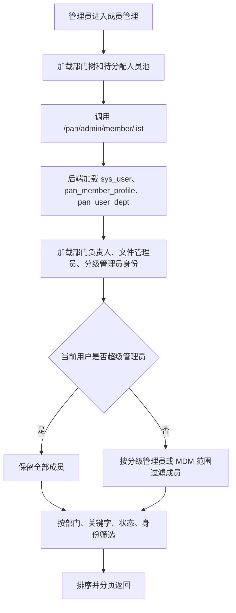

### 8.2 按部门筛选流程

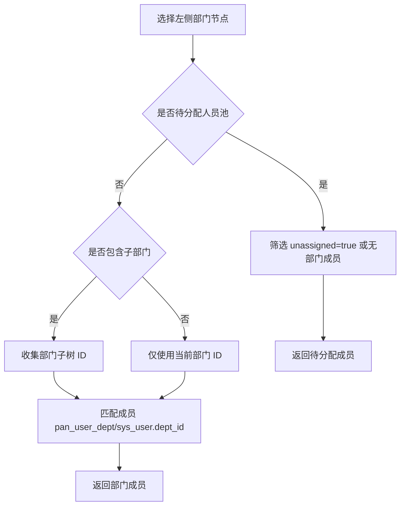

### 8.3 添加成员流程

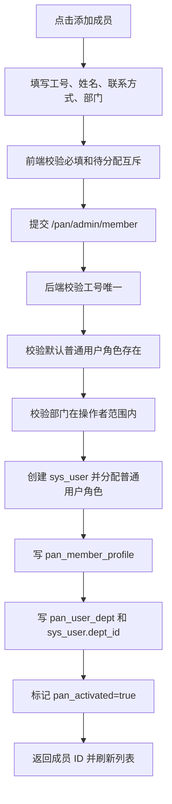

### 8.4 编辑成员资料流程

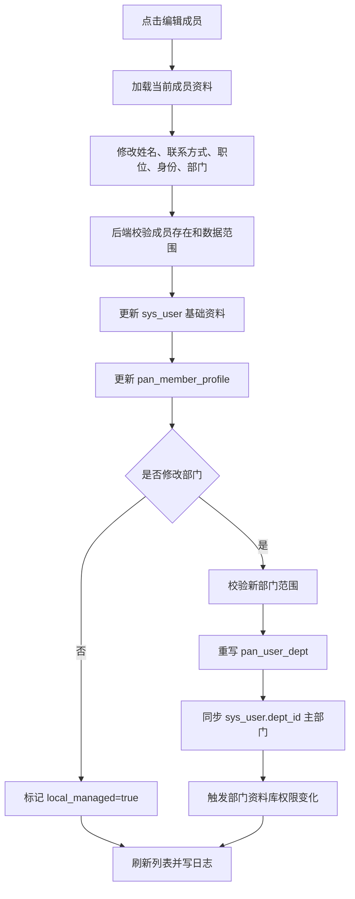

### 8.5 分配部门流程

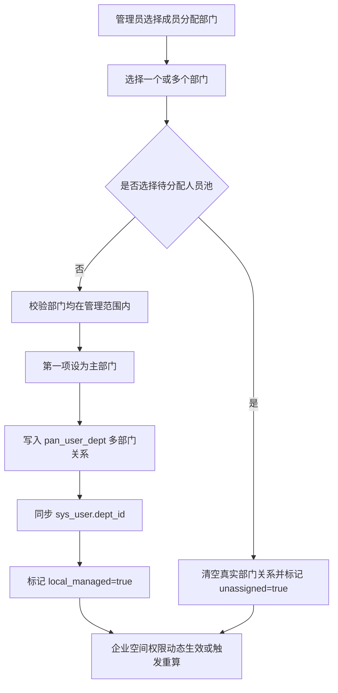

### 8.6 启用成员流程

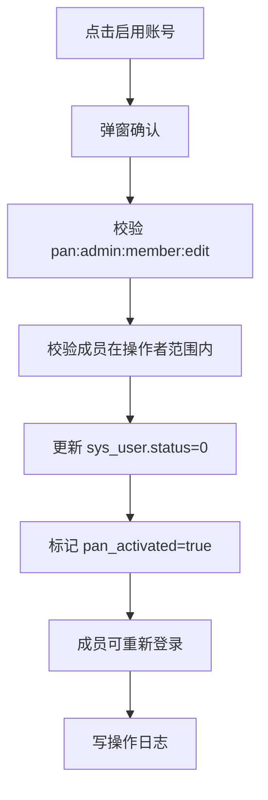

### 8.7 停用成员流程

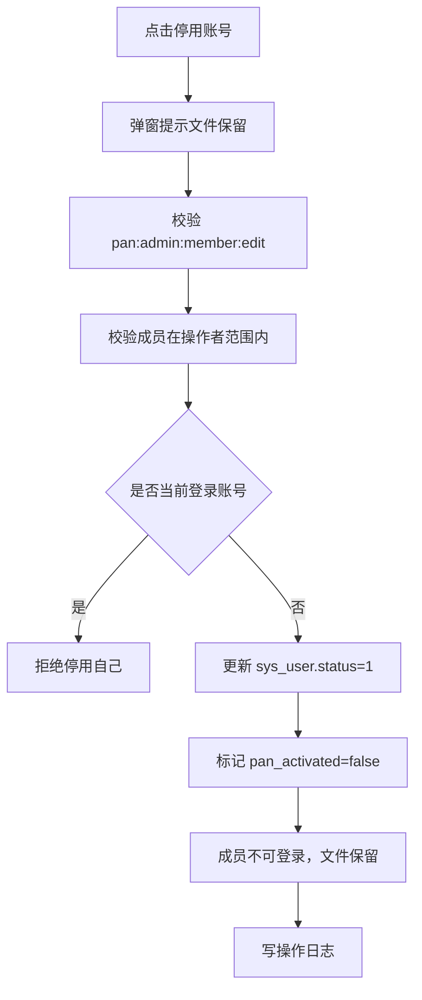

### 8.8 移除成员流程

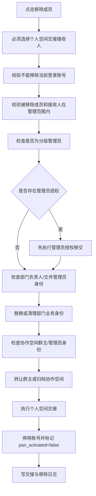

### 8.9 个人空间交接流程

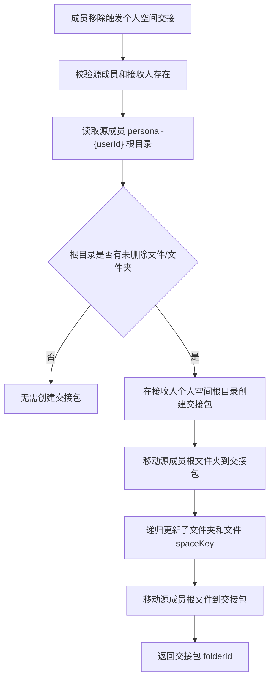

### 8.10 重置密码流程

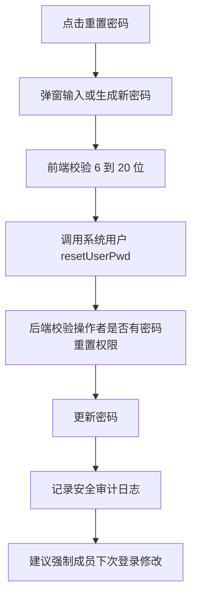

### 8.11 成员搜索流程

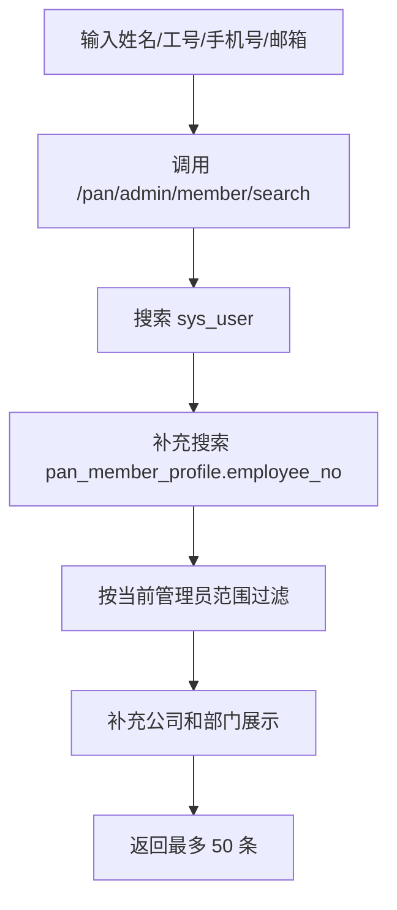

### 8.12 MDM 同步成员流程

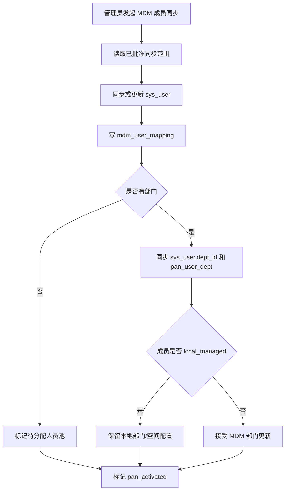

### 8.13 成员调岗影响文件权限流程

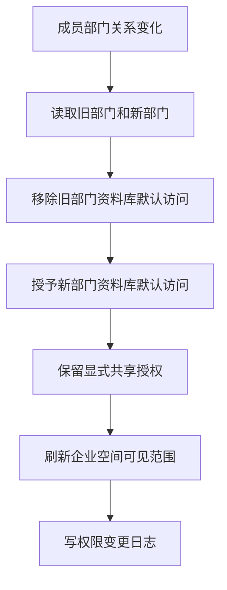

### 8.14 成员停用影响文件访问流程

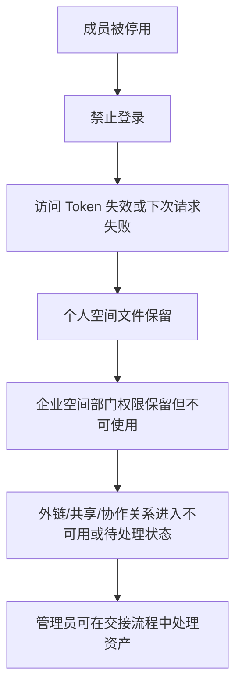

### 8.15 成员移除后的关联清理流程

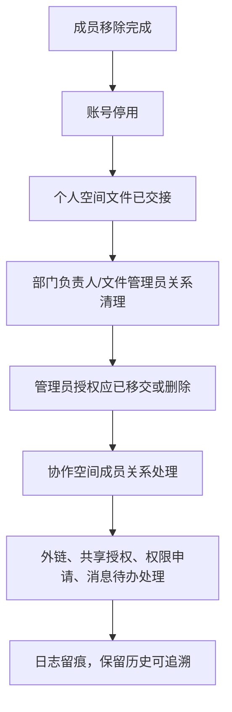

## 9. 与其他模块的关系

| 关联模块 | 关系 | 影响 |
|---|---|---|
| 部门管理 | 成员归属部门，多部门关系和待分配人员池依赖部门树。 | 成员调岗会影响部门成员数、负责人/文件管理员、资料库访问。 |
| 管理员设置 | 分级管理员本质是成员的一种后台管理身份。 | 移除成员前必须处理 `pan_admin_grant`。 |
| 个人空间 | 成员拥有个人空间，移除时必须交接。 | 个人空间文件迁移到接收人交接包。 |
| 企业空间 | 成员部门关系决定部门公共资料库默认访问。 | 入职、调岗、停用、移除会影响企业空间权限。 |
| 协作空间 | 成员可创建或参与协作空间。 | 移除前要处理群主转让、成员退出、协作空间归档。 |
| 与我相关 | 成员状态决定共享给我、我审批、我参与等聚合可见性。 | 停用/移除后相关待办应失效或转交。 |
| 安全外链 | 成员可能创建外链。 | 成员停用/移除后，其外链是否失效要由外链策略决定。 |
| 误删恢复 | 成员可能有个人空间或企业空间删除项。 | 移除交接需要明确回收站文件是否一起交接。 |
| 权限申请 | 成员可能是申请人或审批人。 | 移除前待审批任务应转交。 |
| 日志查询 | 成员变更、停用、移除、交接都应写审计日志。 | 分级管理员只能看范围内成员日志。 |
| MDM 同步 | MDM 是组织人员来源。 | 本地修改与同步覆盖规则必须清晰。 |

## 10. 当前代码现状

### 10.1 已实现或基本实现

- 成员列表接口和页面。
- 左侧部门树、部门搜索、待分配人员池。
- 按关键字、状态、身份筛选成员。
- 按部门筛选成员，支持子树。
- 成员身份标签展示：超级管理员、分级管理员、部门主管、文件管理员。
- 手工添加成员。
- 编辑成员基础资料和部门。
- 分配成员到一个或多个部门。
- 待分配人员池互斥规则。
- 启用/停用成员。
- 移除成员时指定接收人。
- 个人空间根目录文件交接。
- 移除成员时删除 `pan_dept_admin` 中的部门负责人/文件管理员关系。
- 恢复全部成员为正常状态，限超级管理员。
- 成员搜索接口，供选择负责人、文件管理员、接收人等场景复用。
- 分级管理员范围过滤。
- MDM 同步扩展字段和 `local_managed` 标记。

### 10.2 需要补强的问题

| 问题 | 风险 | 建议 |
|---|---|---|
| 列表后端一次扫描最多 10000 用户再内存分页 | 用户量大时性能不稳，分页总数可能不准 | 后续改为数据库分页 + 条件过滤 |
| `activeOnly` 参数语义混乱 | 当前用于筛选停用成员，命名容易误导 | 改名为 `disabledOnly` 或移除 |
| 前端“导入”按钮未绑定实际导入/MDM 同步 | 用户以为可导入但无动作 | 接 `syncMdmMember` 或隐藏按钮 |
| 前端编辑未明显提交 `filePermission` | 后端支持但页面可能无法维护 | 补文件权限字段或移除未用字段 |
| 重置密码走系统用户接口 | 分级管理员可能没有权限，且网盘审计不统一 | 后端补 `/pan/admin/member/{id}/password` |
| 移除成员未强制处理分级管理员授权 | 离职后仍可能残留管理中心权限 | 移除前检查并调用管理员设置移交 |
| 移除成员未处理协作空间群主/管理员 | 协作空间可能无人管理 | 移除前要求转让或归档协作空间 |
| 移除成员未处理外链、共享授权、审批待办 | 访问关系和待办可能残留 | 建立成员移除关联清理清单 |
| 移除成员只删除 `pan_dept_admin`，未同步 `sys_dept` 兼容负责人字段 | 部门页面可能仍显示旧负责人 | 删除后同步部门兼容字段 |
| 个人空间交接只处理未删除的根目录内容 | 回收站文件、历史版本、外链状态未覆盖 | 与个人空间/回收站文档统一交接口径 |
| 个人空间交接更新 `spaceKey`，但不改 `createBy` | 接收人空间中创建人仍显示原成员 | 明确“创建人保留历史”或增加 owner 字段 |
| 停用成员未主动踢下线 | 已登录会话可能短时间内仍有效 | 停用后失效 Token/会话 |
| 成员部门变更未写专门业务日志 | 权限变化不可追溯 | 记录部门前后值和操作者 |
| MDM 与本地字段冲突策略仍不够显性 | 同步可能覆盖或跳过管理员预期 | 页面展示 local_managed 和同步来源 |

## 11. 目标验收规则

### 11.1 列表与查询验收

- 超级管理员可看全租户成员。
- 分级管理员只看授权范围内成员。
- 待分配成员可被有权限管理员看到并处理。
- 搜索姓名、工号、手机号、邮箱均可命中。
- 身份筛选能正确识别超级管理员、分级管理员、部门主管、文件管理员。
- 大数据量下分页不能依赖全量内存扫描。

### 11.2 新增与编辑验收

- 工号唯一。
- 部门必选。
- 待分配人员池不可与正式部门同时选择。
- 部门选择必须受管理员范围限制。
- 主部门写入 `sys_user.dept_id`。
- 多部门写入 `pan_user_dept`。
- 本地修改后 `local_managed=true`。
- 成员启用后 `pan_activated=true`。

### 11.3 停用与移除验收

- 停用保留文件，不做交接。
- 移除必须指定接收人。
- 移除前必须处理管理员授权、部门业务身份、协作空间身份。
- 个人空间文件进入接收人交接包。
- 移除后账号停用且 `pan_activated=false`。
- 移除后写交接日志和账号变更日志。

### 11.4 文件权限联动验收

- 成员加入部门后可访问该部门公共资料库。
- 成员移出部门后失去该部门默认资料库访问。
- 成员停用后不能通过任何入口访问文件。
- 成员移除后个人空间文件可由接收人访问。
- 显式共享授权、外链、审批待办有明确保留、失效或转交规则。

## 12. 推荐实现优先级

### P0 必须补齐

1. 移除成员前检查并处理 `pan_admin_grant` 分级管理员授权。
2. 移除成员前检查协作空间群主身份，要求转让或归档。
3. 移除成员后同步清理 `sys_dept` 兼容负责人/文件管理员字段。
4. 停用成员后主动失效登录会话。
5. 成员部门变更、移除、交接写专门业务日志。

### P1 应尽快补齐

1. 成员列表改为数据库分页和条件查询。
2. 前端“导入”按钮接 MDM 同步或隐藏。
3. 补网盘内重置密码接口和审计。
4. 前端补文件权限字段或删除未生效交互。
5. 页面展示 MDM 来源、本地管理标记、同步冲突状态。

### P2 后续完善

1. 成员导入模板和批量导入。
2. 成员变更审批流。
3. 成员全生命周期时间线。
4. 成员个人空间、企业空间、协作空间资产总览。
5. 成员离职交接任务化、进度化、可回滚。

## 13. 待确认问题

- [ ] 手工添加成员是否长期保留，还是只作为 MDM 异常补录能力。
- [ ] 成员移除后是否保留 `pan_user_dept` 历史归属，还是清空部门关系。
- [ ] 个人空间交接是否要同时交接回收站文件。
- [ ] 个人空间交接后，文件 `createBy` 是否保留原成员，还是新增 owner 字段表达新归属。
- [ ] 成员停用后，外链是否自动失效。
- [ ] 成员移除后，成员创建的协作空间默认转给谁。
- [ ] 成员移除后，成员作为权限申请审批人时待办转给谁。
- [ ] MDM 来源字段和本地字段冲突时，哪些字段以 MDM 为准，哪些字段以本地为准。

## 14. 智能体执行规则与注意事项

本节用于指导后续智能体实现成员管理相关需求。处理“成员管理、成员新增、成员编辑、分配部门、待分配人员池、成员停用、成员移除、离职交接、MDM 人员同步”等需求时，必须先阅读本文档。

### 14.1 先读顺序

1. 先读 `docs/product/modules/10-admin-member.md`。
2. 再读 `docs/product/modules/07-admin-dept.md`，确认部门、负责人、文件管理员、公共资料库规则。
3. 再读 `docs/product/modules/09-admin-subadmin.md`，确认分级管理员和移交规则。
4. 如果涉及个人空间交接，读 `docs/product/modules/03-personal-space.md`。
5. 如果涉及协作空间成员或群主，读 `docs/product/modules/04-collaboration-space.md`。
6. 再读当前涉及的前端页面、API、BO、VO、Service。

不要只按 RuoYi 原生用户管理理解本模块。成员管理是网盘人员治理入口，必须同时考虑部门、管理员、个人空间、企业空间、协作空间和交接。

### 14.2 新增成员时必须检查

- 工号唯一。
- 普通用户角色是否存在。
- 部门选择是否合法。
- 待分配人员池是否与真实部门互斥。
- 所选部门是否在操作者管辖范围内。
- 是否写入 `pan_member_profile`。
- 是否写入 `pan_user_dept`。
- 是否同步 `sys_user.dept_id`。
- 是否标记 `pan_activated=true`。
- 是否写操作日志。

### 14.3 编辑或分配部门时必须检查

- 目标成员是否存在。
- 目标成员是否在操作者管辖范围内。
- 新部门是否在操作者管辖范围内。
- 主部门是否明确。
- 多部门关系是否完整重写。
- 待分配人员池是否清空真实部门关系。
- 是否标记 `local_managed=true`。
- 是否触发部门资料库权限变化。
- 如果成员是部门负责人/文件管理员，部门变化是否影响其身份合理性。

### 14.4 停用成员时必须检查

- 不能停用当前登录账号。
- 停用不是移除，不做个人空间交接。
- 停用后账号不能登录。
- 停用后应失效在线会话。
- 停用后文件保留。
- 停用后外链、共享、协作访问应按安全策略失效或不可用。
- 停用后写审计日志。

### 14.5 移除成员时必须检查

- 必须指定接收人。
- 接收人不能是被移除成员。
- 被移除成员和接收人都必须在操作者范围内。
- 不能移除当前登录账号。
- 如果是分级管理员，先移交 `pan_admin_grant`。
- 如果是部门负责人/文件管理员，先替换或清理 `pan_dept_admin` 和兼容字段。
- 如果是协作空间群主，先转让或处理协作空间。
- 个人空间文件必须交接。
- 回收站、外链、共享授权、权限申请、文件收集、消息待办必须有处理策略。
- 移除后停用账号并标记 `pan_activated=false`。
- 全过程写日志。

### 14.6 MDM 同步成员时必须检查

- `local_managed=true` 的成员不要被增量同步静默覆盖本地部门配置。
- 无部门成员进入待分配人员池。
- MDM 移出范围或离职成员不要物理删除，进入停用或待处理。
- 工号、账号、手机号、邮箱冲突必须有处理规则。
- 同步任务应能查看进度、成功数、失败数、失败原因。

### 14.7 前端注意事项

- 成员移除弹窗必须明确展示交接影响。
- 成员移除接收人选择器必须排除本人。
- “导入”按钮没有实现时不要显示，或接入真实同步/导入流程。
- 重置密码按钮要确认当前管理员有权限。
- 成员身份标签只是展示，不应在成员管理里直接编辑分级管理员、部门负责人、文件管理员。
- 部门选择器要清晰区分待分配人员池和真实部门。

### 14.8 后端注意事项

- 所有查询和写入要考虑 `tenant_id`。
- 不要只依赖前端隐藏按钮，后端必须校验权限和范围。
- 成员查询不要长期使用全量扫描内存分页。
- 交接和移除必须加事务，复杂交接建议任务化。
- 更新 `pan_user_dept` 时要同步 `sys_user.dept_id`。
- 删除 `pan_dept_admin` 后要同步 `sys_dept` 兼容字段。
- 个人空间交接如果改 `spaceKey`，要明确 `createBy`/owner 语义。

### 14.9 完成后必须更新

如果实现或调整了成员管理业务规则，至少检查是否需要同步更新：

- `docs/product/modules/10-admin-member.md`
- `docs/product/modules/07-admin-dept.md`
- `docs/product/modules/09-admin-subadmin.md`
- `docs/product/modules/03-personal-space.md`
- `docs/product/modules/04-collaboration-space.md`
- `docs/product/modules/00-module-map.md`
- `AGENTS.md`

如果只是修 bug，但暴露出新的业务边界，也要在本文档的“当前代码现状”或“待确认问题”中记录。
