# 企业网盘系统功能说明文档

> 版本：v1.0
> 适用范围：产品设计与开发团队
> 文档依据：当前项目前后端代码实现、`docs/product/` 业务规则、`docs/ui/` 设计规范
> 维护规则：本文档与代码同步更新，模块化结构便于扩展

---

## 目录

- [1. 文档说明](#1-文档说明)
- [2. 术语表](#2-术语表)
- [3. 系统概述](#3-系统概述)
  - [3.1 项目背景与业务价值](#31-项目背景与业务价值)
  - [3.2 目标用户群体](#32-目标用户群体)
  - [3.3 技术栈选型](#33-技术栈选型)
  - [3.4 系统分层架构](#34-系统分层架构)
  - [3.5 核心设计理念](#35-核心设计理念)
  - [3.6 功能模块划分](#36-功能模块划分)
- [4. 公共技术架构](#4-公共技术架构)
  - [4.1 前端工程结构](#41-前端工程结构)
  - [4.2 后端模块结构](#42-后端模块结构)
  - [4.3 数据库与存储设计](#43-数据库与存储设计)
  - [4.4 权限模型](#44-权限模型)
- [5. 用户侧功能模块](#5-用户侧功能模块)
  - [5.1 工作台](#51-工作台)
  - [5.2 企业空间](#52-企业空间)
  - [5.3 个人空间](#53-个人空间)
  - [5.4 协作空间](#54-协作空间)
  - [5.5 与我相关](#55-与我相关)
  - [5.6 安全外链](#56-安全外链)
  - [5.7 误删恢复](#57-误删恢复)
  - [5.8 可疑文件](#58-可疑文件)
  - [5.9 全局搜索](#59-全局搜索)
  - [5.10 消息中心](#510-消息中心)
  - [5.11 文件收集](#511-文件收集)
  - [5.12 文件预览](#512-文件预览)
  - [5.13 外链公开访问页](#513-外链公开访问页)
- [6. 管理侧功能模块](#6-管理侧功能模块)
  - [6.1 部门管理](#61-部门管理)
  - [6.2 成员管理](#62-成员管理)
  - [6.3 管理员设置](#63-管理员设置)
  - [6.4 统计报表](#64-统计报表)
  - [6.5 安全配置](#65-安全配置)
  - [6.6 账号中心](#66-账号中心)
  - [6.7 域名管理](#67-域名管理)
  - [6.8 外部协作管理](#68-外部协作管理)
  - [6.9 初始化向导](#69-初始化向导)
- [7. 关键技术实现说明](#7-关键技术实现说明)
  - [7.1 大文件分片上传](#71-大文件分片上传)
  - [7.2 OBS 存储路径设计](#72-obs-存储路径设计)
  - [7.3 复合权限服务](#73-复合权限服务)
  - [7.4 软删除与回收站](#74-软删除与回收站)
  - [7.5 外链分享与共享授权](#75-外链分享与共享授权)
  - [7.6 个人空间交接](#76-个人空间交接)
  - [7.7 MDM 同步](#77-mdm-同步)
- [8. 附录](#8-附录)
  - [8.1 数据库表清单](#81-数据库表清单)
  - [8.2 后端 Controller 清单](#82-后端-controller-清单)
  - [8.3 前端 API 清单](#83-前端-api-清单)
  - [8.4 权限码清单](#84-权限码清单)
  - [8.5 公共组件清单](#85-公共组件清单)

---

## 1. 文档说明

### 1.1 文档目的

本文档基于 RuoYi-Vue-Plus 企业网盘项目当前前后端代码实现，系统性地描述：

- 系统整体架构与技术栈
- 各功能模块的线框原型、交互逻辑、操作流程、边界条件
- 关键功能的技术实现方案与代码引用
- 术语统一、数据库与接口清单

供产品经理、UI 设计师、前端工程师、后端工程师、测试工程师在需求沟通、开发实现、测试验收、运维交接中使用。

### 1.2 文档约定

- **代码引用**：使用 `file:///` 协议的相对路径链接，便于在 IDE 中跳转
- **流程图**：使用 Mermaid 语法
- **线框图**：使用 ASCII 字符画，颗粒度高于 `docs/product/modules/` 下的参考样式
- **术语**：首次出现加粗，并收录于第 2 章术语表
- **状态标识**：✅ 已实现 / ⚠️ 部分实现 / ❌ 未实现 / 📋 文档已确认待实现

### 1.3 维护规则

- 代码变更涉及功能行为变化时，同步更新对应章节
- 新增模块时，按现有章节模板补充
- 文档与 `docs/product/modules/` 下的模块文档保持互补，不重复长篇业务规则

---

## 2. 术语表

| 术语 | 英文 | 含义 |
|---|---|---|
| 网盘 | Pan | 本项目对企业网盘业务的统称，对应后端模块 `ruoyi-pan`、前端路由前缀 `/pan` |
| 个人空间 | Personal Space | 用户私有文件存储空间，`spaceKey=personal-{userId}` |
| 企业空间 | Enterprise Space | 组织级文件存储空间，`spaceKey=enterprise`，按部门划分资料库 |
| 协作空间 | Collaboration Space | 群组协作文件存储空间，`spaceKey=collab-{collabId}` |
| 空间键 | Space Key | 唯一标识一个空间的字符串，用于文件、文件夹、OBS 路径归属 |
| 部门公共资料库 | Department Public Library | 企业空间下挂载到部门的特殊根目录，由部门负责人/文件管理员治理 |
| 超级管理员 | Super Admin | RuoYi 内置最高权限用户，不依赖 `pan_admin_grant` |
| 系统管理员 | System Admin | `pan_admin_grant.admin_type=SYSTEM`，全集团网盘管理员 |
| 分级管理员 | Company Admin | `pan_admin_grant.admin_type=COMPANY`，绑定管辖公司范围 |
| 部门负责人 | Dept Manager | `pan_dept_admin.role_type=DEPT_MANAGER`，部门业务管理者 |
| 文件管理员 | File Admin | `pan_dept_admin.role_type=FILE_ADMIN`，部门资料库治理者 |
| 待分配人员池 | Unassigned Pool | `pan_member_profile.unassigned=true` 的成员集合，无正式部门 |
| 本地管理标记 | Local Managed | `pan_member_profile.local_managed=true`，MDM 增量同步不静默覆盖 |
| 网盘启用标记 | Pan Activated | `pan_member_profile.pan_activated`，控制是否进入网盘成员体系 |
| 原子权限 | Atomic Permission | 文件操作的细粒度能力：list/preview/download/upload/modify/delete/share/print |
| 权限角色 | Permission Role | 原子权限组合的预设角色：观察者/预览者/下载者/上传者/传输者/编辑者/操作者/禁止访问者 |
| 复合权限服务 | Composite Permission Service | `PanCompositePermissionService`，合并 RuoYi 角色菜单权限与 `pan_admin_grant.perm_json` |
| 外链分享 | Share Link | 通过链接对外分享文件/文件夹，对应 `pan_share_link` |
| 共享授权 | File Grant | 将文件授权给指定成员，对应 `pan_file_grant` |
| 软删除 | Soft Delete | `is_deleted=1` + `delete_time`，进入回收站可恢复 |
| 彻底删除 | Purge | 从回收站永久清理，业务记录删除，OBS 对象按引用检查后清理 |
| 保留期 | Retention Period | 回收站删除项可恢复的时间窗口，默认 30 天 |
| OBS | Object Storage Service | 对象存储服务，本项目对接兼容 S3 协议的存储 |
| 秒传 | Instant Upload | 通过 SHA-256 文件指纹匹配已有 OBS 对象，跳过上传 |
| 断点续传 | Resumable Upload | 分片上传中断后可从已上传分片继续 |
| MDM | Master Data Management | 主数据管理，本项目对接 Gafz 网关同步人员组织数据 |
| 管理中心 | Admin Console | 管理端入口，由 `/pan/admin/grant/me` 判断可见性 |
| 交接包 | Handover Package | 移除成员时将其个人空间根目录打包转移到接收人个人空间 |
| 水印 | Watermark | 预览/下载时叠加的用户身份信息，用于溯源 |
| 提取码 | Access Code | 外链访问所需的密码，由创建者设置或系统生成 |

---

## 3. 系统概述

### 3.1 项目背景与业务价值

本项目是基于 **RuoYi-Vue-Plus** 框架二次开发的企业网盘系统，对标腾讯云企业网盘、亿方云、爱数企业网盘等产品，面向中大型集团企业提供文件存储、协作、分享、治理一体化能力。

**业务价值**：

1. **统一文件资产治理**：将分散在个人设备、邮件附件、即时通讯工具中的企业文件统一归集到受控空间
2. **组织架构联动**：复用 RuoYi 部门/用户/角色体系，文件权限与组织树深度绑定
3. **多空间分层协作**：个人空间、企业空间、协作空间三套模型覆盖不同协作场景
4. **分级管理员体系**：支持集团-子公司-部门多级授权，避免单一超级管理员瓶颈
5. **安全合规**：水印、外链策略、回收站、审计日志、可疑文件隔离形成完整安全闭环
6. **大文件能力**：5MB 分片、3 并发、SHA-256 秒传、断点续传，支撑 GB 级文件传输

### 3.2 目标用户群体

| 用户角色 | 使用场景 | 主要诉求 |
|---|---|---|
| 普通员工 | 个人文件存储、部门资料查阅、项目协作 | 大文件上传下载、跨设备同步、外链分享 |
| 项目经理 | 协作空间群组管理、成员邀请、文件分发 | 群组权限、内部邀请、文件收集 |
| 部门负责人 | 部门公共资料库治理、成员管理 | 部门资料库权限、成员调岗交接 |
| 文件管理员 | 部门资料库日常维护 | 文件审核、权限授予、可疑文件处理 |
| 分级管理员 | 管辖公司范围内的组织/成员/资源治理 | 公司级授权、下级委派、报表查看 |
| 系统管理员 | 全集团网盘配置与治理 | 全局策略、容量统计、安全配置 |
| 超级管理员 | 系统初始化与最高权限操作 | 初始化向导、管理员设置、域名管理 |
| 外部访客 | 通过外链访问文件 | 免登录预览、提取码验证、下载保存 |

### 3.3 技术栈选型

#### 后端技术栈

| 技术 | 版本 | 用途 |
|---|---|---|
| Spring Boot | 3.x | 应用框架 |
| MyBatis-Plus | 3.5.x | ORM 框架 |
| Sa-Token | 1.37.x | 权限认证 |
| Redisson | 3.x | 分布式锁、缓存 |
| RuoYi-Vue-Plus | 5.x | 基础框架（用户/部门/角色/租户/日志） |
| Hutool | 5.8.x | 工具集 |
| SnailJob | 1.x | 分布式定时任务（MDM 同步） |
| S3 SDK | 2.x | 对象存储客户端 |

#### 前端技术栈

| 技术 | 版本 | 用途 |
|---|---|---|
| Vue | 3.4+ | 视图框架 |
| TypeScript | 5.x | 类型系统 |
| Pinia | 2.x | 状态管理 |
| Vue Router | 4.x | 路由 |
| Element Plus | 2.x | UI 组件库 |
| Vite | 5.x | 构建工具 |
| SCSS | - | 样式预处理 |
| Mermaid | 10.x | 流程图渲染 |

#### 基础设施

| 组件 | 用途 |
|---|---|
| MySQL 8.x | 主数据库 |
| Redis 7.x | 缓存、会话、分布式锁 |
| MinIO / 腾讯云 COS / 华为云 OBS | 对象存储（兼容 S3） |
| Nacos | 配置中心、服务注册 |
| SnailJob Server | 定时任务调度 |

### 3.4 系统分层架构

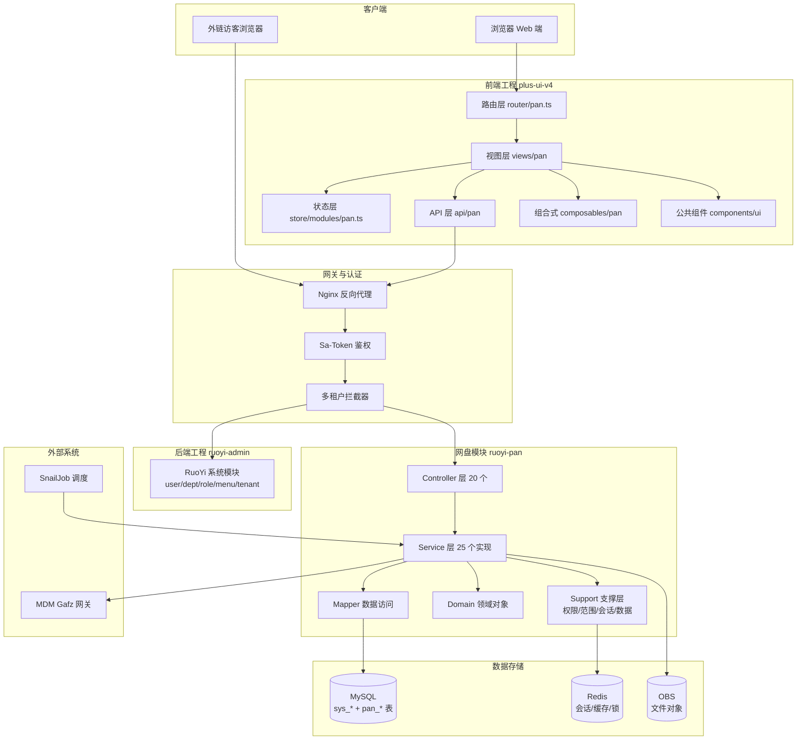

**分层说明**：

- **前端工程**：严格分层，路由 → 视图 → API → 后端，状态层和组合式函数为视图提供复用能力，公共组件统一设计语言
- **网关与认证**：Sa-Token 负责会话与权限校验，多租户拦截器自动注入 `tenant_id`
- **后端工程**：RuoYi 系统模块提供基础能力，网盘模块通过 Support 层叠加业务权限，不污染 RuoYi 原生表结构
- **数据存储**：MySQL 存业务元数据，Redis 存会话与缓存，OBS 存文件实体

### 3.5 核心设计理念

#### 理念一：复用 RuoYi，不重造轮子

- `sys_user`、`sys_dept`、`sys_role`、`sys_menu` 作为组织与权限主表
- 网盘业务字段放在 `pan_*` 扩展表，通过 `user_id`、`dept_id` 关联
- 多租户能力复用 RuoYi 的 `tenant_id` 字段与拦截器

#### 理念二：三空间模型清晰边界

| 空间类型 | 归属 | 默认权限来源 | 典型场景 |
|---|---|---|---|
| 个人空间 | 用户私有 | 本人 | 个人文档、草稿、私人文件 |
| 企业空间 | 组织资产 | 部门关系 + 显式授权 | 部门公共资料库、公司公告文件 |
| 协作空间 | 群组共享 | 群组成员关系 + 群组角色 | 项目协作、跨部门临时小组 |

#### 理念三：权限模型分层叠加

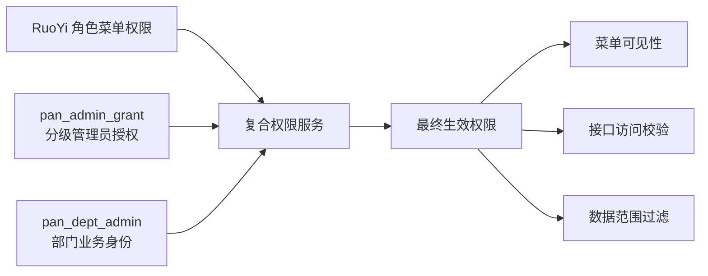

#### 理念四：文件生命周期可追溯

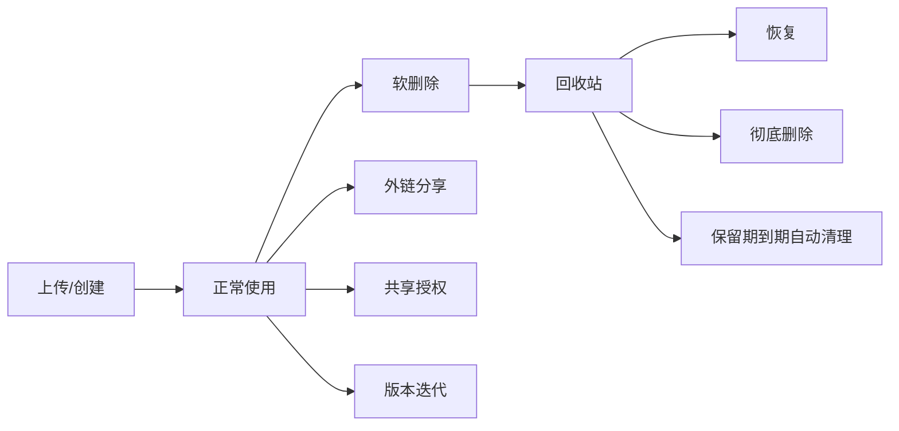

#### 理念五：UI 设计系统统一

- 柔和企业蓝 + 冷灰白 + 高密度操作台主题
- 所有页面复用 `plus-ui-v4/src/components/ui` 公共组件
- 文件类型图标统一来自 `plus-ui-v4/src/assets/myicons`
- 不允许新建第二套颜色、圆角、阴影、按钮系统

### 3.6 功能模块划分

依据 `docs/product/modules/00-module-map.md`，模块划分为用户侧与管理侧两大类：

#### 用户侧模块（13 项）

| 序号 | 模块 | 路由 | 核心能力 |
|---|---|---|---|
| 1 | 工作台 | `/pan/workbench` | 入口聚合、快捷操作、最近文件 |
| 2 | 企业空间 | `/pan/files` | 部门资料库、企业文件管理 |
| 3 | 个人空间 | `/pan/personal` | 个人文件管理、大文件上传 |
| 4 | 协作空间 | `/pan/collaboration` | 群组协作、成员邀请 |
| 5 | 与我相关 | `/pan/related` | 共享给我、审批、动态 |
| 6 | 安全外链 | `/pan/links` | 外链管理 |
| 7 | 误删恢复 | `/pan/recycle` | 回收站 |
| 8 | 可疑文件 | `/pan/suspicious` | 安全隔离区 |
| 9 | 全局搜索 | `/pan/search` | 跨空间搜索 |
| 10 | 消息中心 | `/pan/messages` | 通知待办 |
| 11 | 文件收集 | `/pan/collect` | 收集任务 |
| 12 | 文件预览 | `/pan/preview` | 在线预览 |
| 13 | 外链公开访问 | `/pan/share/public` | 外链访客页 |

#### 管理侧模块（16 项）

| 序号 | 模块 | 路由 | 核心能力 |
|---|---|---|---|
| 1 | 部门管理 | `/pan/admin/dept` | 组织树、部门资料库 |
| 2 | 成员管理 | `/pan/admin/member` | 成员增删改、部门分配 |
| 3 | 管理员设置 | `/pan/admin/subadmin` | 分级管理员授权 |
| 4 | 统计报表 | `/pan/admin/statistics` | 空间/用户/流量统计 |
| 5 | 安全配置 | `/pan/admin/config` | 水印、外链策略 |
| 6 | 账号中心 | `/pan/admin/account` | 个人账号设置 |
| 7 | 域名管理 | `/pan/admin/domain` | 访问域名配置 |
| 8 | 外部协作管理 | `/pan/admin/external` | 外部成员管理 |
| 9 | 初始化向导 | `/pan/admin/init` | 系统初始化 |
| 10 | UI 设置 | `/pan/admin/ui` | 界面定制 |

---

## 4. 公共技术架构

### 4.1 前端工程结构

前端工程位于 [plus-ui-v4](file:///d:/coder/codeProduct/RuoYi-Vue-Plus-v4/plus-ui-v4)，关键目录结构：

```
plus-ui-v4/src/
├── api/pan/                    # 网盘 API 接口层
│   ├── types.ts                # 类型定义
│   ├── file.ts                 # 文件接口
│   ├── folder.ts               # 文件夹接口
│   ├── space.ts                # 空间接口
│   ├── entry.ts                # 统一条目接口
│   ├── share.ts                # 外链接口
│   ├── favorite.ts             # 收藏接口
│   ├── permission.ts           # 权限接口
│   ├── enterprise.ts           # 企业空间接口
│   ├── collab.ts               # 协作空间接口
│   ├── recycle.ts              # 回收站接口
│   ├── admin.ts                # 管理端接口
│   ├── tag.ts                  # 标签接口
│   ├── watermark.ts            # 水印接口
│   ├── chunk.ts                # 分片上传接口
│   └── message.ts              # 消息接口
├── components/ui/              # 公共组件体系
│   ├── icons/                  # 图标组件
│   ├── layout/                 # 布局组件
│   ├── controls/               # 控件组件
│   ├── data/                   # 数据展示组件
│   ├── feedback/               # 反馈组件
│   ├── navigation/             # 导航组件
│   ├── overlay/                # 浮层组件
│   └── templates/              # 页面模板
├── views/pan/                  # 网盘页面
│   ├── layout/                 # 布局壳
│   ├── workbench/              # 工作台
│   ├── files/                  # 企业空间
│   ├── personal/               # 个人空间
│   ├── collaboration/          # 协作空间
│   ├── related/                # 与我相关
│   ├── links/                  # 安全外链
│   ├── recycle/                # 误删恢复
│   ├── suspicious/             # 可疑文件
│   ├── search/                 # 全局搜索
│   ├── messages/               # 消息中心
│   ├── collect/                # 文件收集
│   ├── preview/                # 文件预览
│   ├── share/                  # 外链公开访问
│   ├── admin/                  # 管理中心
│   └── shared/                 # 共享组件
├── composables/pan/            # 组合式函数
├── store/modules/pan.ts        # Pinia 状态
├── router/pan.ts               # 路由配置
└── utils/                      # 工具函数
    ├── panFileIcon.ts
    ├── panPreviewWatermark.ts
    ├── panChunkUpload.ts
    ├── panDownload.ts
    └── panFileHash.ts
```

**路由配置**：[router/pan.ts](file:///d:/coder/codeProduct/RuoYi-Vue-Plus-v4/plus-ui-v4/src/router/pan.ts)

- 路径前缀 `/pan`
- 根路由重定向到 `/pan/workbench`
- 使用 `PanUserLayout.vue` 作为外壳

**状态管理**：[store/modules/pan.ts](file:///d:/coder/codeProduct/RuoYi-Vue-Plus-v4/plus-ui-v4/src/store/modules/pan.ts)

核心状态：
- `sidebarCollapsed`：侧边栏折叠状态
- `isAdminMode`：是否管理端模式
- `currentSpace`：当前空间
- `currentDeptId`：当前部门
- `selectedFiles`：选中文件
- `transferActive`：传输任务激活
- `searchQuery`：搜索关键字

### 4.2 后端模块结构

后端模块位于 [ruoyi-modules/ruoyi-pan](file:///d:/coder/codeProduct/RuoYi-Vue-Plus-v4/ruoyi-modules/ruoyi-pan)，包路径 `org.dromara.pan`，pom 描述"腾讯云网盘业务模块"。

```
ruoyi-modules/ruoyi-pan/src/main/java/org/dromara/pan/
├── controller/                 # 20 个 Controller
├── service/
│   ├── impl/                   # 25 个 Service 实现
│   └── support/                # 权限与范围支撑层
├── domain/                     # 领域对象（实体/BO/VO）
├── mapper/                     # MyBatis-Plus Mapper
├── config/                     # 配置类
└── util/                       # 工具类
```

**Controller 清单**（20 个）：

| Controller | 路径前缀 | 职责 |
|---|---|---|
| `PanFileController` | `/pan/file` | 文件 CRUD、上传、下载 |
| `PanFileExtraController` | `/pan` | 文件附加能力（收藏、标签、属性） |
| `PanFolderController` | `/pan/folder` | 文件夹 CRUD |
| `PanSpaceController` | `/pan/space` | 空间查询 |
| `PanEntryController` | `/pan/entry` | 统一条目查询 |
| `PanEntryTagController` | `/pan/tag` | 标签管理 |
| `PanChunkController` | `/pan/file/chunk` | 分片上传 |
| `PanShareController` | `/pan/share` | 外链分享 |
| `PanRecycleController` | `/pan/recycle` | 回收站 |
| `PanCollabController` | `/pan/collab` | 协作空间 |
| `PanEnterpriseController` | `/pan/enterprise` | 企业空间 |
| `PanPreviewController` | - | 文件预览 |
| `PanWatermarkController` | `/pan/watermark` | 水印策略 |
| `PanFavoriteController` | `/pan/favorite` | 收藏 |
| `PanSearchController` | `/pan/search` | 搜索 |
| `PanMessageController` | `/pan/message` | 消息 |
| `PanAdminDeptController` | `/pan/admin/dept` | 部门管理 |
| `PanAdminMemberController` | `/pan/admin/member` | 成员管理 |
| `PanAdminGrantController` | `/pan/admin/grant` | 管理员授权 |
| `PanMdmSyncController` | `/pan/admin/mdm/sync` | MDM 同步 |

### 4.3 数据库与存储设计

#### 数据库表清单

数据库采用 MySQL 8.x，表分为三类：

1. **RuoYi 系统表**（复用）：`sys_user`、`sys_dept`、`sys_role`、`sys_menu`、`sys_tenant` 等
2. **网盘业务表**（自建）：`pan_*` 前缀，约 25 张表
3. **MDM 同步表**：`mdm_user_map` 等

完整清单见 [附录 8.1](#81-数据库表清单)。

#### OBS 存储路径设计

依据 [script/sql/pan_obs_storage_design.md](file:///d:/coder/codeProduct/RuoYi-Vue-Plus-v4/script/sql/pan_obs_storage_design.md)：

**路径约定**：

```
{env}/{groupId}/{companyId}/{spaceType}/{ownerId}/{yyyy}/{MM}/{dd}/{fileId}.{ext}
```

**字段说明**：

| 字段 | 说明 | 示例 |
|---|---|---|
| `env` | 环境标识 | `dev`、`prod` |
| `groupId` | 集团 ID | `10001` |
| `companyId` | 公司 ID | `20001` |
| `spaceType` | 空间类型 | `personal`、`enterprise`、`collab`、`share`、`temp`、`preview` |
| `ownerId` | 归属 ID（带类型前缀） | `user_1001`、`org_2001`、`space_3001` |
| `yyyy/MM/dd` | 日期分层 | `2026/06/22` |
| `fileId` | 文件 ID | `100001` |
| `ext` | 扩展名 | `pdf`、`docx` |

**实现类**：`PanObsKeyBuilder`

- `buildPersonalKey(userId, fileId, ext)`
- `buildEnterpriseKey(deptId, fileId, ext)`
- `buildCollabKey(collabId, fileId, ext)`
- `buildForSpaceKey(spaceKey, fileId, ext)`

**配置类**：`PanStorageProperties`（前缀 `pan.storage`）

- `env`：环境标识
- `chunkTempDir`：分片临时目录
- `integrity.secret`：完整性签名密钥
- `integrity.verifyOnDownload`：下载时是否校验完整性

### 4.4 权限模型

#### 权限三层结构

```mermaid
flowchart TB
    subgraph 第一层 RuoYi 角色菜单权限
        A1[sys_role]
        A2[sys_menu]
        A3[sys_role_menu]
    end

    subgraph 第二层 网盘管理员授权
        B1[pan_admin_grant<br/>admin_type=SYSTEM/COMPANY]
        B2[perm_json 权限点]
    end

    subgraph 第三层 部门业务身份
        C1[pan_dept_admin<br/>role_type=DEPT_MANAGER/FILE_ADMIN]
    end

    subgraph 复合权限服务
        D1[PanCompositePermissionService<br/>@Primary]
        D2[PanAdminGrantPermissionSupport]
        D3[PanEnterprisePermissionSupport]
    end

    A1 --> D1
    B1 --> D1
    C1 --> D3
    D1 --> D2
    D2 --> D3
```

#### 原子权限（文件操作）

| 权限码 | 含义 |
|---|---|
| `list` | 查看列表 |
| `preview` | 预览 |
| `download` | 下载 |
| `print` | 打印 |
| `upload` | 上传 |
| `modify` | 修改 |
| `delete` | 删除 |
| `share` | 分享 |

#### 权限角色（预设组合）

| 角色 | list | preview | download | print | upload | modify | delete | share |
|---|---|---|---|---|---|---|---|---|
| 观察者 | ✅ | ❌ | ❌ | ❌ | ❌ | ❌ | ❌ | ❌ |
| 预览者 | ✅ | ✅ | ❌ | ❌ | ❌ | ❌ | ❌ | ❌ |
| 下载者 | ✅ | ✅ | ✅ | ✅ | ❌ | ❌ | ❌ | ❌ |
| 上传者 | ✅ | ✅ | ✅ | ✅ | ✅ | ❌ | ❌ | ❌ |
| 传输者 | ✅ | ✅ | ✅ | ✅ | ✅ | ✅ | ❌ | ❌ |
| 编辑者 | ✅ | ✅ | ✅ | ✅ | ✅ | ✅ | ❌ | ✅ |
| 操作者 | ✅ | ✅ | ✅ | ✅ | ✅ | ✅ | ✅ | ✅ |
| 禁止访问者 | ❌ | ❌ | ❌ | ❌ | ❌ | ❌ | ❌ | ❌ |

#### 管理员权限点（perm_json）

| 键 | 含义 | 映射菜单权限 |
|---|---|---|
| `member` | 查看成员 | `pan:admin:member:list` |
| `memberContent` | 成员内容管理 | `pan:admin:member:edit/add/assign` |
| `removeMember` | 删除成员 | `pan:admin:member:remove` |
| `dept` | 部门管理 | `pan:admin:dept:list/query/add/edit` |
| `removeDept` | 删除部门 | `pan:admin:dept:remove` |
| `extCollab` | 外部协作成员 | `pan:admin:member:list`（待独立） |
| `group` | 群组管理 | `pan:admin:member:list`（待独立） |
| `report` | 数据报表 | `pan:admin:grant:query`（待独立） |
| `log` | 日志查询 | `pan:admin:grant:query`（待独立） |
| `adminSetting` | 管理员设置 | `pan:admin:grant:list/query` |
| `grantSubAdmin` | 委派下级 | `pan:admin:grant:add/edit/remove` |

---

## 5. 用户侧功能模块

### 5.1 工作台

#### 5.1.1 模块概述

工作台是用户登录后的默认首页，聚合展示常用入口、最近文件、待办事项、存储用量，提供快捷操作能力。

- **路由**：`/pan/workbench`
- **前端页面**：[views/pan/workbench/index.vue](file:///d:/coder/codeProduct/RuoYi-Vue-Plus-v4/plus-ui-v4/src/views/pan/workbench/index.vue)
- **状态**：✅ 基础已实现，⚠️ 部分数据为 mock

#### 5.1.2 线框原型图

```
┌────────────────────────────────────────────────────────────────────────────┐
│  [☰] 企业网盘            [搜索框]        [传输任务] [消息] [头像]            │
├──────────┬─────────────────────────────────────────────────────────────────┤
│ 侧边栏    │  工作台                                                         │
│          │                                                                 │
│ 📊 工作台 │  ┌──────────────────────────────────────────────────────────┐  │
│ 🏢 企业   │  │ 欢迎卡片                                                  │  │
│ 👤 个人   │  │  早上好，张三！您有 3 个待办、2 个未读消息                  │  │
│ 🤝 协作   │  └──────────────────────────────────────────────────────────┘  │
│ ⭐ 与我相关│                                                                 │
│ 🔗 外链   │  ┌─────────────┐ ┌─────────────┐ ┌─────────────┐ ┌─────────┐  │
│ 🗑️ 回收站  │  │ 个人空间     │ │ 企业空间     │ │ 协作空间     │ │ 外链分享 │  │
│          │  │ 已用 2.3GB   │ │ 已用 15.6GB  │ │ 5 个群组     │ │ 8 个有效 │  │
│          │  │ [进入]       │ │ [进入]       │ │ [进入]       │ │ [管理]   │  │
│          │  └─────────────┘ └─────────────┘ └─────────────┘ └─────────┘  │
│          │                                                                 │
│          │  ┌─────────────────────────────────┐ ┌──────────────────────┐  │
│          │  │ 最近文件                         │ │ 待办事项              │  │
│          │  │ ┌──┬──────────┬─────┬──────┐   │ │ • 审批：李四申请下载  │  │
│          │  │ │📄│季度报告   │2.3MB│10分钟│   │ │ • 收集：项目资料收集  │  │
│          │  │ │📁│设计稿/    │ -   │1小时 │   │ │ • 邀请：协作空间邀请  │  │
│          │  │ │🎬│演示.mp4   │56MB │3小时 │   │ │                      │  │
│          │  │ └──┴──────────┴─────┴──────┘   │ │ [查看全部]            │  │
│          │  └─────────────────────────────────┘ └──────────────────────┘  │
│          │                                                                 │
│          │  ┌──────────────────────────────────────────────────────────┐  │
│          │  │ 存储用量                                                  │  │
│          │  │ 个人空间 ████████░░ 80%                                   │  │
│          │  │ 企业空间 ██████░░░░ 60%                                   │  │
│          │  └──────────────────────────────────────────────────────────┘  │
└──────────┴─────────────────────────────────────────────────────────────────┘
```

**元素标注**：

| 编号 | 元素 | 功能 | 交互 |
|---|---|---|---|
| 1 | 顶部栏 | 全局导航 | 见 PanTopbar |
| 2 | 侧边栏 | 模块导航 | 点击切换路由，见 PanSidebar |
| 3 | 欢迎卡片 | 个性化问候 | 根据时间显示问候语，聚合待办与消息数 |
| 4 | 空间入口卡片 | 快捷进入各空间 | 点击跳转对应路由 |
| 5 | 最近文件列表 | 展示最近访问文件 | 点击文件预览，点击文件夹进入 |
| 6 | 待办事项 | 审批/收集/邀请待办 | 点击跳转处理页 |
| 7 | 存储用量 | 容量可视化 | 悬浮显示具体数值 |

#### 5.1.3 功能详述

**欢迎卡片**

- **功能用途**：根据当前时间显示问候语，聚合展示待办数与未读消息数
- **交互逻辑**：
  - 触发条件：页面加载时
  - 系统响应：读取 `usePanStore` 中的用户信息、待办数、未读消息数
- **操作流程**：
  1. 用户进入工作台
  2. 前端调用 `GET /pan/message/unread/count` 获取未读数
  3. 前端调用 `GET /pan/related/todo/count` 获取待办数
  4. 渲染问候语与数字
- **边界条件**：未读数为 0 时不显示数字角标

**空间入口卡片**

- **功能用途**：快捷进入各空间
- **交互逻辑**：
  - 触发条件：点击卡片
  - 系统响应：路由跳转到对应空间
- **操作流程**：
  1. 用户点击"个人空间"卡片
  2. 路由跳转到 `/pan/personal`
  3. 加载个人空间文件列表
- **边界条件**：个人空间未创建时懒创建

**最近文件列表**

- **功能用途**：展示最近访问的文件
- **交互逻辑**：
  - 触发条件：页面加载
  - 系统响应：调用 `GET /pan/entry/recent?limit=10`
- **操作流程**：
  1. 用户进入工作台
  2. 前端请求最近条目
  3. 后端从 `pan_entry_activity` 查询当前用户最近访问的 10 条
  4. 渲染列表
- **边界条件**：无最近文件时显示空状态

#### 5.1.4 技术实现说明

**前端实现**：

- 页面组件：[workbench/index.vue](file:///d:/coder/codeProduct/RuoYi-Vue-Plus-v4/plus-ui-v4/src/views/pan/workbench/index.vue)
- 使用 `AppShell` + `PageContainer` 布局
- 卡片使用 `SpaceCardPageTemplate` 模板

**后端实现**：

- 最近文件查询：`PanEntryActivityServiceImpl.listRecent(userId, limit)`
- 待办数查询：`PanMessageServiceImpl.countTodo(userId)`
- 未读数查询：`PanMessageServiceImpl.countUnread(userId)`

**数据表**：

- `pan_entry_activity`：记录用户对条目的访问活动
- `pan_message`：消息表

---

### 5.2 企业空间

#### 5.2.1 模块概述

企业空间是组织级文件存储空间，按部门划分资料库，文件属于组织资产，权限由部门关系与显式授权共同决定。

- **路由**：`/pan/files`
- **前端页面**：[views/pan/files/index.vue](file:///d:/coder/codeProduct/RuoYi-Vue-Plus-v4/plus-ui-v4/src/views/pan/files/index.vue)
- **业务文档**：[docs/product/modules/02-enterprise-space.md](file:///d:/coder/codeProduct/RuoYi-Vue-Plus-v4/docs/product/modules/02-enterprise-space.md)
- **状态**：✅ 核心已实现，⚠️ 部分高级能力待补

#### 5.2.2 线框原型图

```
┌────────────────────────────────────────────────────────────────────────────┐
│  [☰] 企业网盘            [搜索框]        [传输任务] [消息] [头像]            │
├──────────┬─────────────────────────────────────────────────────────────────┤
│ 侧边栏    │  企业空间                                                       │
│          │  ┌──────────────────────────────────────────────────────────┐  │
│ 📊 工作台 │  │ [上传] [新建文件夹] [下载] [分享] [删除] [重命名] [⋮]    │  │
│ 🏢 企业●  │  └──────────────────────────────────────────────────────────┘  │
│   ├ 总裁办│  ┌──────────────────────────────────────────────────────────┐  │
│   ├ 技术部│  │ 面包屑：企业空间 > 技术部 > 设计稿                        │  │
│   ├ 市场部│  ├──────────────────────────────────────────────────────────┤  │
│   └ 财务部│  │ [☑] 名称              │大小  │修改时间   │创建人 │操作    │  │
│          │  │──────────────────────────────────────────────────────────│  │
│ 👤 个人   │  │ [☐] 📁 2026Q1         │ -    │2026-04-01 │张三   │[⋮]    │  │
│ 🤝 协作   │  │ [☐] 📁 2026Q2         │ -    │2026-04-15 │李四   │[⋮]    │  │
│ ⭐ 与我相关│  │ [☑] 📄 季度报告.docx   │2.3MB │2026-04-20 │张三   │[⋮]    │  │
│ 🔗 外链   │  │ [☐] 📄 设计稿.fig     │15MB  │2026-04-18 │王五   │[⋮]    │  │
│ 🗑️ 回收站  │  │ [☐] 🎬 演示.mp4       │56MB  │2026-04-10 │张三   │[⋮]    │  │
│          │  └──────────────────────────────────────────────────────────┘  │
│          │                                                                 │
│          │  ┌──────────────────────────────────────────────────────────┐  │
│          │  │ 右侧详情面板（选中文件时展开）                            │  │
│          │  │ ┌────────────┐                                          │  │
│          │  │ │📄 季度报告 │  基本信息                                 │  │
│          │  │ │  .docx     │  大小：2.3MB                              │  │
│          │  │ └────────────┘  创建：2026-04-20 10:30                   │  │
│          │  │                  修改：2026-04-20 11:45                   │  │
│          │  │                  创建人：张三                              │  │
│          │  │                  权限：操作者                              │  │
│          │  │  [预览] [下载] [分享] [属性]                              │  │
│          │  └──────────────────────────────────────────────────────────┘  │
└──────────┴─────────────────────────────────────────────────────────────────┘
```

**元素标注**：

| 编号 | 元素 | 功能 | 交互 |
|---|---|---|---|
| 1 | 部门树 | 切换部门资料库 | 点击切换右侧文件列表 |
| 2 | 工具栏 | 文件操作按钮 | 上传/新建/下载/分享/删除/重命名 |
| 3 | 面包屑 | 显示当前路径 | 点击跳转上级 |
| 4 | 文件列表 | 展示文件/文件夹 | 单击进入文件夹/预览文件，右键菜单 |
| 5 | 复选框 | 多选 | 支持批量操作 |
| 6 | 右侧详情面板 | 展示选中文件详情 | 选中时自动展开 |
| 7 | 操作按钮 | 快捷操作 | 预览/下载/分享/属性 |

#### 5.2.3 功能详述

**部门资料库切换**

- **功能用途**：切换查看不同部门的公共资料库
- **前置条件**：用户对该部门有 `list` 权限
- **操作流程**：
  1. 用户在左侧部门树点击"技术部"
  2. 前端调用 `GET /pan/enterprise/dept/{deptId}/files`
  3. 后端校验用户对 `deptId` 的权限
  4. 返回该部门公共资料库根目录文件列表
- **预期结果**：右侧展示技术部资料库文件
- **异常流程**：无权限时返回 403，前端提示"无访问权限"

**文件上传**

- **功能用途**：上传文件到当前部门资料库
- **前置条件**：用户对当前部门有 `upload` 权限
- **操作流程**：
  1. 用户点击"上传"按钮
  2. 选择本地文件
  3. 前端计算文件 SHA-256
  4. 调用 `POST /pan/file/chunk/check` 检查秒传
  5. 若可秒传，直接创建文件记录
  6. 否则分片上传，每片 5MB，3 并发
  7. 上传完成调用 `POST /pan/file/chunk/complete` 合并
- **预期结果**：文件出现在列表中
- **边界条件**：
  - 单文件最大 5GB
  - 同名文件自动追加 `(1)`、`(2)`
  - 网络中断支持断点续传

**文件预览**

- **功能用途**：在线预览文件内容
- **前置条件**：用户对文件有 `preview` 权限
- **操作流程**：
  1. 用户点击文件名或"预览"按钮
  2. 前端调用 `GET /pan/preview/{fileId}`
  3. 后端校验权限，生成预览 URL
  4. 前端打开预览页 `/pan/preview/{fileId}`
  5. 根据文件类型渲染（图片/PDF/Office/视频/文本）
- **预期结果**：新标签页打开预览
- **边界条件**：
  - 不支持的类型提示下载
  - 启用水印时叠加用户身份信息

**外链分享**

- **功能用途**：生成外链对外分享文件
- **前置条件**：用户对文件有 `share` 权限
- **操作流程**：
  1. 选中文件，点击"分享"
  2. 弹窗配置：有效期、提取码、权限（预览/下载）
  3. 调用 `POST /pan/share`
  4. 返回链接 URL 与提取码
  5. 用户复制链接分享
- **预期结果**：生成外链记录
- **边界条件**：
  - 企业策略限制最长有效期
  - 启用提取码时访客需输入

**共享授权**

- **功能用途**：将文件授权给指定成员
- **前置条件**：用户对文件有 `share` 权限
- **操作流程**：
  1. 选中文件，点击"共享给"
  2. 选择成员与权限角色
  3. 调用 `POST /pan/permission/grant`
  4. 被授权成员在"与我相关"看到共享文件
- **预期结果**：被授权成员获得对应权限
- **边界条件**：权限角色不可超过授权者自身权限

#### 5.2.4 操作流程图

**文件上传流程**：

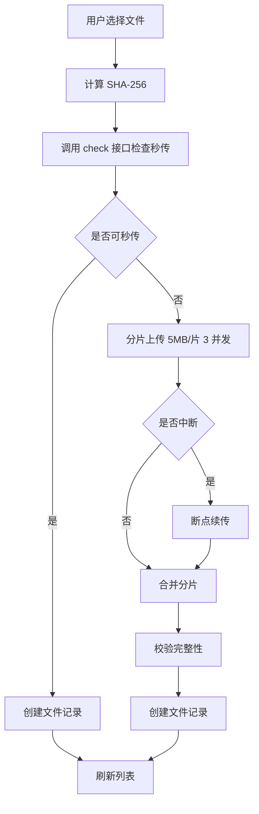

**文件删除流程**：

```mermaid
flowchart TD
    A[选中文件点击删除] --> B[弹窗确认]
    B --> C[调用 DELETE /pan/file/{fileId}]
    C --> D[校验删除权限]
    D --> E[设置 is_deleted=1]
    E --> F[记录 delete_time]
    F --> G[失效相关外链]
    G --> H[从搜索索引移除]
    H --> I[写审计日志]
    I --> J[刷新列表]
```

#### 5.2.5 技术实现说明

**前端实现**：

- 页面组件：[files/index.vue](file:///d:/coder/codeProduct/RuoYi-Vue-Plus-v4/plus-ui-v4/src/views/pan/files/index.vue)
- 文件列表：[shared/FileList32.vue](file:///d:/coder/codeProduct/RuoYi-Vue-Plus-v4/plus-ui-v4/src/views/pan/shared/FileList32.vue)
- 右键菜单：[shared/Pan32ContextMenu.vue](file:///d:/coder/codeProduct/RuoYi-Vue-Plus-v4/plus-ui-v4/src/views/pan/shared/Pan32ContextMenu.vue)
- 上传逻辑：[composables/pan/usePanUpload.ts](file:///d:/coder/codeProduct/RuoYi-Vue-Plus-v4/plus-ui-v4/src/composables/pan/usePanUpload.ts)
- 部门树：[layout/PanDeptTree32.vue](file:///d:/coder/codeProduct/RuoYi-Vue-Plus-v4/plus-ui-v4/src/views/pan/layout/PanDeptTree32.vue)

**后端实现**：

- Controller：`PanEnterpriseController`、`PanFileController`
- Service：`PanEnterpriseServiceImpl`、`PanFileServiceImpl`
- 权限支撑：`PanEnterprisePermissionSupport`

**权限校验关键代码**（`PanEnterprisePermissionSupport`）：

```java
public void assertCanUpload(Long deptId, Long userId) {
    String permission = resolvePermissionSource(deptId, userId);
    if (!hasAtomicPermission(permission, "upload")) {
        throw new ServiceException("无上传权限");
    }
}
```

**数据表**：

- `pan_file`：文件记录
- `pan_folder`：文件夹记录
- `pan_dept_profile`：部门资料库配置（`public_folder_id` 指向部门公共资料库根目录）

---

### 5.3 个人空间

#### 5.3.1 模块概述

个人空间是用户私有文件存储空间，文件归用户所有，权限由本人决定。

- **路由**：`/pan/personal`
- **前端页面**：[views/pan/personal/index.vue](file:///d:/coder/codeProduct/RuoYi-Vue-Plus-v4/plus-ui-v4/src/views/pan/personal/index.vue)
- **业务文档**：[docs/product/modules/03-personal-space.md](file:///d:/coder/codeProduct/RuoYi-Vue-Plus-v4/docs/product/modules/03-personal-space.md)
- **状态**：✅ 核心已实现

#### 5.3.2 线框原型图

```
┌────────────────────────────────────────────────────────────────────────────┐
│  [☰] 企业网盘            [搜索框]        [传输任务] [消息] [头像]            │
├──────────┬─────────────────────────────────────────────────────────────────┤
│ 侧边栏    │  个人空间                                                       │
│          │  ┌──────────────────────────────────────────────────────────┐  │
│ 📊 工作台 │  │ [上传] [新建文件夹] [下载] [分享] [删除] [重命名] [⋮]    │  │
│ 🏢 企业   │  │ 已用 2.3GB / 10GB                                        │  │
│ 👤 个人●  │  └──────────────────────────────────────────────────────────┘  │
│ 🤝 协作   │  ┌──────────────────────────────────────────────────────────┐  │
│ ⭐ 与我相关│  │ 面包屑：个人空间                                          │  │
│ 🔗 外链   │  ├──────────────────────────────────────────────────────────┤  │
│ 🗑️ 回收站  │  │ [☑] 名称              │大小  │修改时间   │操作          │  │
│          │  │──────────────────────────────────────────────────────────│  │
│          │  │ [☐] 📁 工作文档         │ -    │2026-04-20 │[⋮]          │  │
│          │  │ [☐] 📁 个人照片         │ -    │2026-04-15 │[⋮]          │  │
│          │  │ [☑] 📄 简历.docx        │1.2MB │2026-04-10 │[⋮]          │  │
│          │  │ [☐] 📄 合同.pdf         │3.5MB │2026-04-08 │[⋮]          │  │
│          │  │ [☐] 🎬 旅行视频.mp4     │256MB │2026-04-01 │[⋮]          │  │
│          │  └──────────────────────────────────────────────────────────┘  │
└──────────┴─────────────────────────────────────────────────────────────────┘
```

#### 5.3.3 功能详述

**个人空间懒创建**

- **功能用途**：首次访问时自动创建个人空间
- **前置条件**：用户已登录，`pan_activated=true`
- **操作流程**：
  1. 用户点击"个人空间"
  2. 前端调用 `GET /pan/space/personal`
  3. 后端检查 `pan_space` 是否存在 `spaceKey=personal-{userId}`
  4. 不存在则创建：插入 `pan_space` 记录，创建根文件夹
  5. 返回空间信息
- **预期结果**：进入个人空间根目录

**大文件分片上传**

- **功能用途**：支持 GB 级文件上传
- **前置条件**：个人空间已创建
- **操作流程**：
  1. 用户选择大文件
  2. 前端计算 SHA-256（使用 `panFileHash.ts` 的流式计算）
  3. 调用 `POST /pan/file/chunk/prepare` 创建分片任务
  4. 分片上传，每片 5MB，3 并发，3 次重试
  5. 中断后可调用 `GET /pan/file/chunk/{uploadId}/status` 查询已上传分片
  6. 续传未完成分片
  7. 全部完成后调用 `POST /pan/file/chunk/complete` 合并
- **边界条件**：
  - 分片大小：5MB（`CHUNK_SIZE_BYTES = 5 * 1024 * 1024`）
  - 并发数：3
  - 重试次数：3
  - 单文件最大：5GB

**文件夹转移所有权**

- **功能用途**：将个人空间文件夹转移给其他成员
- **前置条件**：用户为文件夹所有者
- **操作流程**：
  1. 选中文件夹，点击"转移所有权"
  2. 选择接收成员
  3. 调用 `POST /pan/folder/{folderId}/transfer`
  4. 后端递归更新文件夹及子项的 `spaceKey`、`owner_user_id`
  5. 文件夹出现在接收人个人空间
- **预期结果**：原用户失去该文件夹，接收人获得

#### 5.3.4 技术实现说明

**前端实现**：

- 页面组件：[personal/index.vue](file:///d:/coder/codeProduct/RuoYi-Vue-Plus-v4/plus-ui-v4/src/views/pan/personal/index.vue)
- 分片上传：[utils/panChunkUpload.ts](file:///d:/coder/codeProduct/RuoYi-Vue-Plus-v4/plus-ui-v4/src/utils/panChunkUpload.ts)
- 文件哈希：[utils/panFileHash.ts](file:///d:/coder/codeProduct/RuoYi-Vue-Plus-v4/plus-ui-v4/src/utils/panFileHash.ts)

**关键代码**（分片大小常量）：

```typescript
// plus-ui-v4/src/utils/panChunkUpload.ts
export const CHUNK_SIZE_BYTES = 5 * 1024 * 1024; // 5MB
export const MAX_CONCURRENT_UPLOADS = 3;
export const MAX_RETRY_COUNT = 3;
```

**后端实现**：

- Controller：`PanFileController`、`PanChunkController`
- Service：`PanFileServiceImpl`、`PanChunkUploadServiceImpl`
- OBS 路径：`PanObsKeyBuilder.buildPersonalKey(userId, fileId, ext)`

**OBS 路径示例**：

```
prod/10001/20001/personal/user_1001/2026/06/22/100001.pdf
```

---

### 5.4 协作空间

#### 5.4.1 模块概述

协作空间是群组协作文件存储空间，由群主创建，邀请成员加入，文件归群组共有。

- **路由**：`/pan/collaboration`
- **前端页面**：[views/pan/collaboration/index.vue](file:///d:/coder/codeProduct/RuoYi-Vue-Plus-v4/plus-ui-v4/src/views/pan/collaboration/index.vue)、[detail.vue](file:///d:/coder/codeProduct/RuoYi-Vue-Plus-v4/plus-ui-v4/src/views/pan/collaboration/detail.vue)、[join.vue](file:///d:/coder/codeProduct/RuoYi-Vue-Plus-v4/plus-ui-v4/src/views/pan/collaboration/join.vue)
- **业务文档**：[docs/product/modules/04-collaboration-space.md](file:///d:/coder/codeProduct/RuoYi-Vue-Plus-v4/docs/product/modules/04-collaboration-space.md)
- **状态**：✅ 核心已实现

#### 5.4.2 线框原型图

**协作空间列表页**：

```
┌────────────────────────────────────────────────────────────────────────────┐
│  协作空间                                                    [+ 新建群组]    │
├────────────────────────────────────────────────────────────────────────────┤
│  [搜索框]  [全部 / 我创建的 / 我加入的]                                     │
│                                                                            │
│  ┌────────────────┐ ┌────────────────┐ ┌────────────────┐                 │
│  │ 🤝 项目A协作    │ │ 🤝 设计评审     │ │ 🤝 跨部门项目   │                 │
│  │ 群主：张三      │ │ 群主：李四      │ │ 群主：王五      │                 │
│  │ 成员：8 人      │ │ 成员：5 人      │ │ 成员：12 人     │                 │
│  │ 文件：56 个     │ │ 文件：23 个     │ │ 文件：108 个    │                 │
│  │ [进入] [⋮]      │ │ [进入] [⋮]      │ │ [进入] [⋮]      │                 │
│  └────────────────┘ └────────────────┘ └────────────────┘                 │
└────────────────────────────────────────────────────────────────────────────┘
```

**协作空间详情页**：

```
┌────────────────────────────────────────────────────────────────────────────┐
│  ← 返回    项目A协作    [成员管理] [设置] [⋮]                                │
├────────────────────────────────────────────────────────────────────────────┤
│  [上传] [新建文件夹] [下载] [分享] [删除]                                    │
│  面包屑：项目A协作                                                          │
│  ┌────────────────────────────────────────────────────────────────────────┐│
│  │ [☑] 名称              │大小  │修改时间   │创建人 │权限      │操作      ││
│  │────────────────────────────────────────────────────────────────────────││
│  │ [☐] 📁 需求文档        │ -    │2026-04-20 │张三   │操作者    │[⋮]      ││
│  │ [☐] 📁 设计稿          │ -    │2026-04-18 │李四   │编辑者    │[⋮]      ││
│  │ [☑] 📄 项目计划.docx   │2.3MB │2026-04-15 │张三   │操作者    │[⋮]      ││
│  └────────────────────────────────────────────────────────────────────────┘│
└────────────────────────────────────────────────────────────────────────────┘
```

**成员管理弹窗**：

```
┌────────────────────────────────────────────────────┐
│  成员管理 - 项目A协作                          [×] │
├────────────────────────────────────────────────────┤
│  [+ 邀请成员]  [生成邀请链接]                       │
│  ┌──────────────────────────────────────────────┐ │
│  │ 姓名      │角色    │加入时间    │操作         │ │
│  │──────────────────────────────────────────────│ │
│  │ 张三 👑   │群主    │2026-04-01  │[转让群主]   │ │
│  │ 李四      │管理员  │2026-04-02  │[改角色][移除]│ │
│  │ 王五      │编辑者  │2026-04-05  │[改角色][移除]│ │
│  │ 赵六      │预览者  │2026-04-10  │[改角色][移除]│ │
│  └──────────────────────────────────────────────┘ │
└────────────────────────────────────────────────────┘
```

#### 5.4.3 功能详述

**创建协作空间**

- **功能用途**：创建新的协作群组
- **前置条件**：用户已登录
- **操作流程**：
  1. 点击"+ 新建群组"
  2. 填写群组名称、描述、标签
  3. 选择默认文件角色（观察者/预览者/下载者/上传者/传输者/编辑者/操作者）
  4. 调用 `POST /pan/collab`
  5. 后端创建 `pan_collab_space` 记录、空间记录、根文件夹
  6. 创建者成为群主
- **预期结果**：群组出现在列表

**邀请成员**

- **功能用途**：邀请成员加入协作空间
- **前置条件**：用户为群主或管理员
- **操作流程**：
  1. 点击"邀请成员"
  2. 选择成员（同租户内）
  3. 设置角色
  4. 调用 `POST /pan/collab/{collabId}/member`
  5. 被邀请成员收到消息
- **边界条件**：当前阶段不支持外部成员

**生成邀请链接**

- **功能用途**：生成内部邀请链接
- **操作流程**：
  1. 点击"生成邀请链接"
  2. 调用 `POST /pan/collab/{collabId}/invite-link`
  3. 返回链接 URL
  4. 链接打开后进入 `/pan/collaboration/join?token=xxx`
  5. 校验 token 有效后加入群组
- **边界条件**：链接有时效，仅同租户成员可加入

**转让群主**

- **功能用途**：将群主身份转让给其他成员
- **前置条件**：当前用户为群主
- **操作流程**：
  1. 在成员列表点击"转让群主"
  2. 选择新群主
  3. 确认转让
  4. 调用 `POST /pan/collab/{collabId}/transfer-owner`
  5. 原群主变为管理员，新群主获得群主权限
- **预期结果**：群主身份变更

**解散/归档**

- **功能用途**：解散或归档协作空间
- **前置条件**：当前用户为群主
- **操作流程**：
  1. 点击"设置" > "解散"或"归档"
  2. 二次确认
  3. 调用 `POST /pan/collab/{collabId}/dissolve` 或 `/archive`
  4. 解散：文件按策略彻底删除或归档
  5. 归档：空间变为只读
- **边界条件**：解散不可恢复，需二次确认

#### 5.4.4 技术实现说明

**前端实现**：

- 列表页：[collaboration/index.vue](file:///d:/coder/codeProduct/RuoYi-Vue-Plus-v4/plus-ui-v4/src/views/pan/collaboration/index.vue)
- 详情页：[collaboration/detail.vue](file:///d:/coder/codeProduct/RuoYi-Vue-Plus-v4/plus-ui-v4/src/views/pan/collaboration/detail.vue)
- 加入页：[collaboration/join.vue](file:///d:/coder/codeProduct/RuoYi-Vue-Plus-v4/plus-ui-v4/src/views/pan/collaboration/join.vue)

**后端实现**：

- Controller：`PanCollabController`
- Service：`PanCollabServiceImpl`
- OBS 路径：`PanObsKeyBuilder.buildCollabKey(collabId, fileId, ext)`

**数据表**：

- `pan_collab_space`：协作空间主表
  - `collab_id`、`space_key`、`name`、`description`、`owner_user_id`、`root_folder_id`
  - `member_count`、`file_count`、`tags`、`default_file_role`
  - `status`、`dissolve_policy`
- `pan_collab_member`：成员关系表

---

### 5.5 与我相关

#### 5.5.1 模块概述

"与我相关"聚合展示共享给当前用户的文件、待审批事项、协作动态、文件收集入口，不是独立存储空间。

- **路由**：`/pan/related`
- **前端页面**：[views/pan/related/index.vue](file:///d:/coder/codeProduct/RuoYi-Vue-Plus-v4/plus-ui-v4/src/views/pan/related/index.vue)
- **业务文档**：[docs/product/modules/05-related.md](file:///d:/coder/codeProduct/RuoYi-Vue-Plus-v4/docs/product/modules/05-related.md)
- **状态**：✅ 基础已实现

#### 5.5.2 线框原型图

```
┌────────────────────────────────────────────────────────────────────────────┐
│  与我相关                                                                  │
├────────────────────────────────────────────────────────────────────────────┤
│  [共享给我] [审批中心] [协作动态] [文件收集]                                │
│                                                                            │
│  ── 共享给我 ────────────────────────────────────────────────────────────  │
│  ┌────────────────────────────────────────────────────────────────────────┐│
│  │ [搜索]  [全部 / 文件 / 文件夹]  [来源：全部 ▼]                          ││
│  │────────────────────────────────────────────────────────────────────────││
│  │ 名称              │来源        │共享人│共享时间   │权限  │操作          ││
│  │ 📄 季度报告.docx   │企业空间    │张三  │2026-04-20 │编辑者│[打开][⋮]     ││
│  │ 📁 设计稿/         │协作空间    │李四  │2026-04-18 │预览者│[打开][⋮]     ││
│  │ 📄 合同.pdf        │个人空间    │王五  │2026-04-15 │下载者│[打开][⋮]     ││
│  └────────────────────────────────────────────────────────────────────────┘│
│                                                                            │
│  ── 待审批 ──────────────────────────────────────────────────────────────  │
│  ┌────────────────────────────────────────────────────────────────────────┐│
│  │ 类型      │申请人│资源          │申请权限│申请时间   │操作              ││
│  │ 下载申请   │赵六  │季度报告.docx  │下载    │2026-04-20 │[同意][拒绝]      ││
│  │ 加入群组   │孙七  │项目A协作      │成员    │2026-04-19 │[同意][拒绝]      ││
│  └────────────────────────────────────────────────────────────────────────┘│
└────────────────────────────────────────────────────────────────────────────┘
```

#### 5.5.3 功能详述

**共享给我**

- **功能用途**：展示共享给当前用户的文件
- **数据来源**：`pan_file_grant` 表中 `grantee_user_id=当前用户`
- **操作流程**：
  1. 进入"与我相关"默认展示
  2. 调用 `GET /pan/related/shared`
  3. 后端查询 `pan_file_grant` 关联文件信息
  4. 点击文件跳转到来源空间预览
- **边界条件**：来源文件被删除时显示"源文件已删除"

**审批中心**

- **功能用途**：处理权限申请、加入申请等
- **操作流程**：
  1. 切换到"审批中心"标签
  2. 调用 `GET /pan/permission/apply/pending`
  3. 展示待审批列表
  4. 点击"同意"或"拒绝"
  5. 调用 `POST /pan/permission/apply/{applyId}/approve`
- **边界条件**：只有有审批权限的用户可见

**协作动态**

- **功能用途**：展示协作空间内的操作动态
- **数据来源**：`pan_entry_activity` 表
- **操作流程**：
  1. 切换到"协作动态"标签
  2. 调用 `GET /pan/related/activities`
  3. 展示最近动态时间线

**文件收集**

- **功能用途**：展示分配给当前用户的收集任务
- **操作流程**：
  1. 切换到"文件收集"标签
  2. 调用 `GET /pan/collect/my`
  3. 展示收集任务列表
  4. 点击任务进入提交页

#### 5.5.4 技术实现说明

**后端实现**：

- Controller：`PanPermissionApplyController`（审批）
- Service：`PanPermissionApplyServiceImpl`
- 共享查询：`PanFileGrantServiceImpl.listGrantedToUser(userId)`

**数据表**：

- `pan_file_grant`：文件授权关系
  - `grant_id`、`file_id`、`grantee_user_id`、`permission`
- `pan_permission_apply`：权限申请
  - `apply_id`、`resource_type`、`resource_id`、`space_key`、`reason`、`status`、`applicant_id`

---

### 5.6 安全外链

#### 5.6.1 模块概述

安全外链模块管理用户创建的外链分享链接，支持配置有效期、提取码、权限、水印。

- **路由**：`/pan/links`
- **前端页面**：[views/pan/links/index.vue](file:///d:/coder/codeProduct/RuoYi-Vue-Plus-v4/plus-ui-v4/src/views/pan/links/index.vue)
- **业务文档**：[docs/product/modules/06-share-link.md](file:///d:/coder/codeProduct/RuoYi-Vue-Plus-v4/docs/product/modules/06-share-link.md)
- **状态**：✅ 核心已实现

#### 5.6.2 线框原型图

```
┌────────────────────────────────────────────────────────────────────────────┐
│  安全外链                                                    [+ 新建外链]    │
├────────────────────────────────────────────────────────────────────────────┤
│  [搜索]  [状态：全部/有效/失效/过期]  [来源：全部 ▼]                         │
│  ┌────────────────────────────────────────────────────────────────────────┐│
│  │ 名称            │类型│创建时间   │失效时间   │访问次数│状态│操作        ││
│  │────────────────────────────────────────────────────────────────────────││
│  │ 📄 季度报告.docx │文件│2026-04-20 │2026-05-20 │23    │有效│[复制][⋮]   ││
│  │ 📁 设计稿/       │目录│2026-04-18 │2026-05-18 │56    │有效│[复制][⋮]   ││
│  │ 📄 合同.pdf      │文件│2026-04-10 │2026-04-30 │108   │过期│[续期][⋮]   ││
│  └────────────────────────────────────────────────────────────────────────┘│
└────────────────────────────────────────────────────────────────────────────┘
```

**新建外链弹窗**：

```
┌────────────────────────────────────────────────────┐
│  新建外链                                      [×] │
├────────────────────────────────────────────────────┤
│  选择文件：[选择文件或文件夹]                       │
│                                                    │
│  有效期：[7天 ▼]                                   │
│    ○ 1天   ○ 7天   ○ 30天   ○ 永久                │
│                                                    │
│  提取码：[自动生成]  [自定义]                       │
│    提取码：[••••••]                                │
│                                                    │
│  权限：                                            │
│    ☑ 预览   ☑ 下载   ☐ 打印                       │
│                                                    │
│  水印：☑ 启用预览水印   ☑ 启用下载水印             │
│                                                    │
│  访问限制：                                        │
│    ☐ 限制 IP 段   ☐ 限制访问次数                   │
│                                                    │
│             [取消]  [创建]                         │
└────────────────────────────────────────────────────┘
```

#### 5.6.3 功能详述

**创建外链**

- **功能用途**：生成对外分享链接
- **前置条件**：用户对源文件有 `share` 权限
- **操作流程**：
  1. 点击"+ 新建外链"
  2. 选择文件或文件夹
  3. 配置有效期、提取码、权限、水印
  4. 调用 `POST /pan/share`
  5. 后端生成 `link_token`，写入 `pan_share_link`
  6. 返回链接 URL 与提取码
- **预期结果**：外链记录出现在列表
- **边界条件**：
  - 企业策略限制最长有效期
  - 文件夹外链支持 zip 下载

**外链管理**

- **功能用途**：管理已创建的外链
- **操作流程**：
  1. 在列表查看所有外链
  2. 点击"复制"获取链接与提取码
  3. 点击"⋮"展开操作：编辑、续期、失效、删除
  4. 失效：调用 `PUT /pan/share/{linkId}/disable`
  5. 续期：调用 `PUT /pan/share/{linkId}/renew`
- **边界条件**：源文件删除时外链自动失效

**外链失效联动**

- **功能用途**：源文件删除时自动失效外链
- **实现方式**：
  - 文件软删除时，更新 `pan_share_link.status=source_deleted`
  - 访客访问时校验源文件状态

#### 5.6.4 技术实现说明

**前端实现**：

- 页面组件：[links/index.vue](file:///d:/coder/codeProduct/RuoYi-Vue-Plus-v4/plus-ui-v4/src/views/pan/links/index.vue)

**后端实现**：

- Controller：`PanShareController`
- Service：`PanShareServiceImpl`

**数据表**：`pan_share_link`

- `link_id`、`file_id`、`file_name`、`link_token`
- `permission`、`access_code`、`expire_at`
- `view_count`、`download_count`、`status`

---

### 5.7 误删恢复

#### 5.7.1 模块概述

误删恢复是企业网盘的统一回收站，承接用户在个人空间、企业空间、协作空间中删除的文件和文件夹，支持恢复与彻底删除。

- **路由**：`/pan/recycle`
- **前端页面**：[views/pan/recycle/index.vue](file:///d:/coder/codeProduct/RuoYi-Vue-Plus-v4/plus-ui-v4/src/views/pan/recycle/index.vue)
- **业务文档**：[docs/product/modules/08-recycle-bin.md](file:///d:/coder/codeProduct/RuoYi-Vue-Plus-v4/docs/product/modules/08-recycle-bin.md)
- **状态**：✅ 基础已实现，⚠️ 保留期自动清理待补

#### 5.7.2 线框原型图

```
┌────────────────────────────────────────────────────────────────────────────┐
│  误删恢复                                                                  │
├────────────────────────────────────────────────────────────────────────────┤
│  [搜索]  [来源：全部/个人/企业/协作]  [类型：全部/文件/文件夹]               │
│  [删除时间范围]  [批量还原]  [批量彻底删除]                                  │
│  ┌────────────────────────────────────────────────────────────────────────┐│
│  │ [☑]│名称           │类型│来源    │原路径      │删除人│删除时间  │操作  ││
│  │────────────────────────────────────────────────────────────────────────││
│  │ [☐]│📄 季度报告.docx│文件│企业空间│/技术部     │张三  │2026-04-20│[还原]││
│  │ [☐]│📁 旧设计稿/    │目录│个人空间│/工作文档   │李四  │2026-04-18│[还原]││
│  │ [☑]│📄 合同.pdf     │文件│协作空间│/项目A      │王五  │2026-04-10│[还原]││
│  └────────────────────────────────────────────────────────────────────────┘│
│                                                                            │
│  提示：回收站文件保留 30 天，到期自动彻底删除                              │
└────────────────────────────────────────────────────────────────────────────┘
```

**还原确认弹窗**：

```
┌────────────────────────────────────────────────────┐
│  还原文件                                      [×] │
├────────────────────────────────────────────────────┤
│  将还原以下 3 个文件到原位置：                      │
│  • 季度报告.docx → /技术部                          │
│  • 旧设计稿/ → /工作文档                            │
│  • 合同.pdf → /项目A                                │
│                                                    │
│  ⚠️ 原路径不存在的文件将还原到根目录                 │
│                                                    │
│             [取消]  [确认还原]                      │
└────────────────────────────────────────────────────┘
```

#### 5.7.3 功能详述

**回收站列表**

- **功能用途**：展示当前用户可见的删除项
- **可见范围**：
  - 普通用户：自己个人空间删除项、自己有权限的企业/协作空间删除项
  - 部门负责人/文件管理员：管理部门资料库删除项
  - 分级管理员：管辖范围内删除项
  - 超级管理员：全部删除项
- **操作流程**：
  1. 进入误删恢复
  2. 调用 `GET /pan/recycle/list`
  3. 后端按用户身份计算可见范围
  4. 返回 `is_deleted=1` 的文件和文件夹
- **边界条件**：文件夹删除只展示根删除项

**还原**

- **功能用途**：将删除项恢复到原位置
- **前置条件**：用户对删除项有恢复权限
- **操作流程**：
  1. 选中删除项，点击"还原"
  2. 后端校验原父目录是否存在且未删除
  3. 原路径可用：设置 `is_deleted=0`，清空 `delete_time`
  4. 原路径不可用：提示选择新位置
  5. 文件夹还原：递归恢复子项
- **预期结果**：文件回到原位置
- **异常流程**：
  - 原父目录已删除：提示选择新位置
  - 同名冲突：自动追加 `(1)`
  - 来源空间已解散：拒绝还原

**彻底删除**

- **功能用途**：永久清理删除项
- **前置条件**：用户有彻底删除权限
- **操作流程**：
  1. 选中删除项，点击"彻底删除"
  2. 二次确认
  3. 调用 `POST /pan/recycle/purge`
  4. 后端检查 `ossId` 是否被其他记录引用
  5. 无引用时删除 OBS 对象
  6. 删除业务记录
  7. 写审计日志
- **边界条件**：OBS 对象被引用时不删除

**保留期自动清理**

- **功能用途**：到期自动彻底删除
- **实现方式**：SnailJob 定时任务扫描 `expire_time < now()` 的记录
- **保留期**：默认 30 天，可由管理端配置
- **状态**：📋 文档已确认，⚠️ 定时任务待实现

#### 5.7.4 技术实现说明

**前端实现**：

- 页面组件：[recycle/index.vue](file:///d:/coder/codeProduct/RuoYi-Vue-Plus-v4/plus-ui-v4/src/views/pan/recycle/index.vue)

**后端实现**：

- Controller：`PanRecycleController`
- Service：`PanRecycleServiceImpl`
- 接口：
  - `GET /pan/recycle/list`
  - `POST /pan/recycle/restore`
  - `POST /pan/recycle/purge`

**数据表**：

- `pan_file.is_deleted`、`pan_file.delete_time`
- `pan_folder.is_deleted`、`pan_folder.delete_time`
- 📋 建议新增 `pan_recycle_record` 独立回收站记录表

---

### 5.8 可疑文件

#### 5.8.1 模块概述

可疑文件模块是安全隔离区，展示被安全扫描判定为可疑的文件，供管理员审核处理。

- **路由**：`/pan/suspicious`
- **前端页面**：[views/pan/suspicious/index.vue](file:///d:/coder/codeProduct/RuoYi-Vue-Plus-v4/plus-ui-v4/src/views/pan/suspicious/index.vue)
- **状态**：⚠️ 基础已实现，📋 安全扫描引擎待接入

#### 5.8.2 线框原型图

```
┌────────────────────────────────────────────────────────────────────────────┐
│  可疑文件                                                                  │
├────────────────────────────────────────────────────────────────────────────┤
│  [搜索]  [风险等级：全部/高/中/低]  [状态：全部/待处理/已处理]               │
│  ┌────────────────────────────────────────────────────────────────────────┐│
│  │ 名称           │来源    │上传人│风险等级│检测时间   │状态  │操作        ││
│  │────────────────────────────────────────────────────────────────────────││
│  │ 📄 可疑.exe     │个人空间│张三  │高     │2026-04-20 │待处理│[放行][删除] ││
│  │ 📄 脚本.js      │企业空间│李四  │中     │2026-04-18 │待处理│[放行][删除] ││
│  │ 📄 异常.docx    │协作空间│王五  │低     │2026-04-15 │已放行│[详情]      ││
│  └────────────────────────────────────────────────────────────────────────┘│
└────────────────────────────────────────────────────────────────────────────┘
```

#### 5.8.3 功能详述

**可疑文件列表**

- **功能用途**：展示被标记为可疑的文件
- **可见范围**：管理员可见
- **操作流程**：
  1. 进入可疑文件页
  2. 调用 `GET /pan/file/suspicious`
  3. 后端查询 `pan_file.is_suspicious=1` 的记录
  4. 展示列表

**放行**

- **功能用途**：将文件标记为正常
- **操作流程**：
  1. 选中可疑文件，点击"放行"
  2. 调用 `POST /pan/file/{fileId}/approve`
  3. 后端设置 `is_suspicious=0`
  4. 文件回到原位置

**删除**

- **功能用途**：删除可疑文件
- **操作流程**：
  1. 选中可疑文件，点击"删除"
  2. 二次确认
  3. 调用 `DELETE /pan/file/{fileId}`
  4. 文件进入回收站

---

### 5.9 全局搜索

#### 5.9.1 模块概述

全局搜索支持跨空间、跨类型搜索文件和文件夹。

- **路由**：`/pan/search`
- **前端页面**：[views/pan/search/index.vue](file:///d:/coder/codeProduct/RuoYi-Vue-Plus-v4/plus-ui-v4/src/views/pan/search/index.vue)
- **状态**：✅ 基础已实现

#### 5.9.2 线框原型图

```
┌────────────────────────────────────────────────────────────────────────────┐
│  [搜索框：输入关键字]                                          [搜索]      │
├────────────────────────────────────────────────────────────────────────────┤
│  筛选：[类型：全部/文件/文件夹]  [空间：全部/个人/企业/协作]  [时间范围]    │
│                                                                            │
│  搜索结果（共 23 条）                                                       │
│  ┌────────────────────────────────────────────────────────────────────────┐│
│  │ 📄 季度报告.docx    │企业空间 > 技术部     │2.3MB │2026-04-20 │[打开]   ││
│  │ 📁 设计稿/          │协作空间 > 项目A      │-     │2026-04-18 │[打开]   ││
│  │ 📄 合同.pdf         │个人空间              │3.5MB │2026-04-15 │[打开]   ││
│  └────────────────────────────────────────────────────────────────────────┘│
└────────────────────────────────────────────────────────────────────────────┘
```

#### 5.9.3 功能详述

**搜索**

- **功能用途**：跨空间搜索文件
- **操作流程**：
  1. 用户在搜索框输入关键字
  2. 调用 `GET /pan/search?keyword=xxx&type=xxx&space=xxx`
  3. 后端按用户可见范围过滤
  4. 返回匹配结果
- **边界条件**：
  - 只搜索未删除文件
  - 只搜索用户有 `list` 权限的文件
  - 支持文件名、标签、属性搜索

#### 5.9.4 技术实现说明

**后端实现**：

- Controller：`PanSearchController`
- Service：`PanSearchServiceImpl`
- 实现：基于 MySQL LIKE 查询，📋 后续可接入 Elasticsearch

---

### 5.10 消息中心

#### 5.10.1 模块概述

消息中心展示系统通知、协作邀请、审批待办、文件收集等消息。

- **路由**：`/pan/messages`
- **前端页面**：[views/pan/messages/index.vue](file:///d:/coder/codeProduct/RuoYi-Vue-Plus-v4/plus-ui-v4/src/views/pan/messages/index.vue)
- **状态**：✅ 基础已实现

#### 5.10.2 线框原型图

```
┌────────────────────────────────────────────────────────────────────────────┐
│  消息中心                                                                  │
├────────────────────────────────────────────────────────────────────────────┤
│  [全部] [未读] [系统通知] [协作邀请] [审批待办] [文件收集]   [全部已读]      │
│  ┌────────────────────────────────────────────────────────────────────────┐│
│  │ 🔵 张三 邀请你加入协作空间"项目A"                  2026-04-20 10:30     ││
│  │    [接受] [拒绝]                                              ●未读   ││
│  │────────────────────────────────────────────────────────────────────────││
│  │ ⚪ 赵六 申请下载"季度报告.docx"                    2026-04-20 09:15     ││
│  │    [去审批]                                                            ││
│  │────────────────────────────────────────────────────────────────────────││
│  │ ⚪ 系统通知：您的个人空间容量已用 80%              2026-04-19 18:00     ││
│  └────────────────────────────────────────────────────────────────────────┘│
└────────────────────────────────────────────────────────────────────────────┘
```

#### 5.10.3 功能详述

**消息列表**

- **功能用途**：展示用户消息
- **操作流程**：
  1. 进入消息中心
  2. 调用 `GET /pan/message/list?type=xxx&status=xxx`
  3. 展示消息列表
  4. 点击消息跳转对应处理页

**标记已读**

- **功能用途**：将消息标记为已读
- **操作流程**：
  1. 点击消息或"全部已读"
  2. 调用 `PUT /pan/message/{id}/read` 或 `PUT /pan/message/read-all`
  3. 更新 `pan_message.is_read=1`

#### 5.10.4 技术实现说明

**后端实现**：

- Controller：`PanMessageController`
- Service：`PanMessageServiceImpl`

**数据表**：`pan_message`

- `message_id`、`user_id`、`type`、`title`、`content`
- `resource_type`、`resource_id`、`is_read`、`create_time`

---

### 5.11 文件收集

#### 5.11.1 模块概述

文件收集模块支持创建收集任务，指定成员提交文件到指定文件夹。

- **路由**：`/pan/collect`
- **前端页面**：[views/pan/collect/index.vue](file:///d:/coder/codeProduct/RuoYi-Vue-Plus-v4/plus-ui-v4/src/views/pan/collect/index.vue)
- **状态**：⚠️ 基础已实现

#### 5.11.2 线框原型图

```
┌────────────────────────────────────────────────────────────────────────────┐
│  文件收集                                                  [+ 新建收集]     │
├────────────────────────────────────────────────────────────────────────────┤
│  [我发起的] [分配给我的]                                                    │
│                                                                            │
│  ── 我发起的 ──                                                            │
│  ┌────────────────────────────────────────────────────────────────────────┐│
│  │ 名称          │截止时间   │已提交/应提交│状态  │操作                    ││
│  │ Q2 季度报告收集│2026-05-01 │8/12         │进行中│[详情][停止]            ││
│  │ 项目A资料收集  │2026-04-30 │15/15        │已完成│[详情]                  ││
│  └────────────────────────────────────────────────────────────────────────┘│
└────────────────────────────────────────────────────────────────────────────┘
```

#### 5.11.3 功能详述

**新建收集**

- **功能用途**：创建文件收集任务
- **操作流程**：
  1. 点击"+ 新建收集"
  2. 填写任务名称、截止时间、目标文件夹
  3. 选择提交成员
  4. 调用 `POST /pan/collect`
  5. 被分配成员收到消息
- **边界条件**：目标文件夹需有写入权限

**提交文件**

- **功能用途**：成员提交文件到收集任务
- **操作流程**：
  1. 在"分配给我的"列表点击任务
  2. 进入提交页
  3. 上传文件
  4. 调用 `POST /pan/collect/{taskId}/submit`
  5. 文件存入目标文件夹

---

### 5.12 文件预览

#### 5.12.1 模块概述

文件预览支持在线预览图片、PDF、Office、视频、文本等格式，启用水印保护。

- **路由**：`/pan/preview/{fileId}`
- **前端页面**：[views/pan/preview/index.vue](file:///d:/coder/codeProduct/RuoYi-Vue-Plus-v4/plus-ui-v4/src/views/pan/preview/index.vue)
- **状态**：✅ 基础已实现

#### 5.12.2 线框原型图

```
┌────────────────────────────────────────────────────────────────────────────┐
│  ← 返回    季度报告.docx                              [下载] [分享] [⋮]    │
├────────────────────────────────────────────────────────────────────────────┤
│  ┌────────────────────────────────────────────────────────────────────────┐│
│  │                                                                        ││
│  │                     ┌─────────────────────┐                            ││
│  │                     │  文档预览内容        │                            ││
│  │                     │  （叠加水印）        │                            ││
│  │                     │  张三 2026-04-20    │                            ││
│  │                     └─────────────────────┘                            ││
│  │                                                                        ││
│  └────────────────────────────────────────────────────────────────────────┘│
│  [< 上一页]  第 1 / 23 页  [下一页 >]    [放大] [缩小] [全屏]              │
└────────────────────────────────────────────────────────────────────────────┘
```

#### 5.12.3 功能详述

**预览文件**

- **功能用途**：在线预览文件内容
- **前置条件**：用户对文件有 `preview` 权限
- **操作流程**：
  1. 用户点击文件或"预览"按钮
  2. 前端打开 `/pan/preview/{fileId}`
  3. 调用 `GET /pan/preview/{fileId}`
  4. 后端校验权限，生成预览 URL
  5. 根据文件类型渲染：
     - 图片：`` 标签
     - PDF：PDF.js
     - Office：kkfileview 或 OnlyOffice
     - 视频：`<video>` 标签
     - 文本：代码高亮
  6. 启用水印时叠加用户身份信息
- **边界条件**：
  - 不支持的类型提示下载
  - 预览次数计入访问统计

**水印**

- **功能用途**：保护文件版权，溯源泄露
- **实现方式**：
  - 前端水印：CSS 叠加，[utils/panPreviewWatermark.ts](file:///d:/coder/codeProduct/RuoYi-Vue-Plus-v4/plus-ui-v4/src/utils/panPreviewWatermark.ts)
  - 内容：用户姓名 + 工号 + 时间
  - 策略来源：`pan_watermark_policy` 表

#### 5.12.4 技术实现说明

**前端实现**：

- 页面组件：[preview/index.vue](file:///d:/coder/codeProduct/RuoYi-Vue-Plus-v4/plus-ui-v4/src/views/pan/preview/index.vue)
- 水印工具：[utils/panPreviewWatermark.ts](file:///d:/coder/codeProduct/RuoYi-Vue-Plus-v4/plus-ui-v4/src/utils/panPreviewWatermark.ts)

**后端实现**：

- Controller：`PanPreviewController`、`PanWatermarkController`
- Service：`PanPreviewServiceImpl`、`PanWatermarkPolicyServiceImpl`

---

### 5.13 外链公开访问页

#### 5.13.1 模块概述

外链公开访问页是面向外链访客的免登录页面，支持预览、下载、保存到个人空间。

- **路由**：`/pan/share/public`
- **前端页面**：[views/pan/share/public.vue](file:///d:/coder/codeProduct/RuoYi-Vue-Plus-v4/plus-ui-v4/src/views/pan/share/public.vue)
- **状态**：✅ 基础已实现

#### 5.13.2 线框原型图

**提取码输入页**：

```
┌────────────────────────────────────────────────────────────────────────────┐
│                                                                            │
│                    企业网盘文件分享                                         │
│                                                                            │
│              ┌──────────────────────────────────┐                          │
│              │  请输入提取码                     │                          │
│              │  ┌────────────────────┐          │                          │
│              │  │ ••••••             │          │                          │
│              │  └────────────────────┘          │                          │
│              │         [提交]                   │                          │
│              └──────────────────────────────────┘                          │
│                                                                            │
└────────────────────────────────────────────────────────────────────────────┘
```

**文件预览页**：

```
┌────────────────────────────────────────────────────────────────────────────┐
│  企业网盘文件分享                                                          │
├────────────────────────────────────────────────────────────────────────────┤
│  📄 季度报告.docx                                                          │
│  大小：2.3MB    分享人：张三    失效时间：2026-05-20                        │
│                                                                            │
│  [预览]  [下载]  [保存到我的网盘]                                           │
│                                                                            │
│  ┌────────────────────────────────────────────────────────────────────────┐│
│  │  文件预览内容（叠加水印）                                              ││
│  └────────────────────────────────────────────────────────────────────────┘│
└────────────────────────────────────────────────────────────────────────────┘
```

#### 5.13.3 功能详述

**提取码验证**

- **功能用途**：验证访客访问权限
- **操作流程**：
  1. 访客打开外链 URL
  2. 前端调用 `GET /pan/share/access?token=xxx`
  3. 后端校验 `link_token` 有效性
  4. 需要提取码时返回需要提取码标识
  5. 访客输入提取码
  6. 调用 `POST /pan/share/verify` 校验提取码
  7. 校验通过后返回临时访问凭证
- **边界条件**：
  - 外链过期：提示"链接已过期"
  - 外链失效：提示"链接已失效"
  - 提取码错误：累计错误次数，超过限制锁定

**下载**

- **功能用途**：访客下载文件
- **操作流程**：
  1. 访客点击"下载"
  2. 调用 `GET /pan/share/{linkId}/download`
  3. 后端校验下载权限
  4. 返回下载 URL
  5. 增加下载次数统计

**保存到个人空间**

- **功能用途**：访客将文件保存到自己的个人空间
- **前置条件**：访客已登录网盘账号
- **操作流程**：
  1. 访客点击"保存到我的网盘"
  2. 选择目标文件夹
  3. 调用 `POST /pan/share/{linkId}/save`
  4. 后端复制 OBS 对象或引用
  5. 在目标文件夹创建文件记录

---

## 6. 管理侧功能模块

### 6.1 部门管理

#### 6.1.1 模块概述

部门管理是组织架构三件套的第一个模块，管理部门组织树、部门公共资料库、部门负责人/文件管理员。

- **路由**：`/pan/admin/dept`
- **前端页面**：[views/pan/admin/dept/index.vue](file:///d:/coder/codeProduct/RuoYi-Vue-Plus-v4/plus-ui-v4/src/views/pan/admin/dept/index.vue)
- **业务文档**：[docs/product/modules/07-admin-dept.md](file:///d:/coder/codeProduct/RuoYi-Vue-Plus-v4/docs/product/modules/07-admin-dept.md)
- **状态**：✅ 核心已实现

#### 6.1.2 线框原型图

```
┌────────────────────────────────────────────────────────────────────────────┐
│  部门管理                                                  [+ 新建部门]     │
├──────────────────────┬─────────────────────────────────────────────────────┤
│ 组织树               │ 部门详情                                             │
│                      │                                                     │
│ 🔍 搜索部门          │ ┌─────────────────────────────────────────────────┐ │
│                      │ │ 技术部                                            │ │
│ ▼ 🏢 集团总部        │ │ 部门编码：TECH001    部门负责人：张三            │ │
│   ├ 🏢 北京分公司    │ │ 文件管理员：李四      成员数：56                 │ │
│   │  ├ 📁 技术部 ●  │ │ 部门资料库：已创建    容量：50GB                 │ │
│   │  ├ 📁 市场部     │ │                                                   │ │
│   │  └ 📁 财务部     │ │ [编辑] [新建子部门] [停用] [删除]                │ │
│   ├ 🏢 上海分公司    │ └─────────────────────────────────────────────────┘ │
│   └ 🏢 广州分公司    │                                                     │
│                      │ ┌─────────────────────────────────────────────────┐ │
│                      │ │ 部门资料库                                        │ │
│                      │ │ 根目录：/企业空间/技术部                          │ │
│                      │ │ 默认权限：操作者                                  │ │
│                      │ │ [进入资料库] [配置权限]                          │ │
│                      │ └─────────────────────────────────────────────────┘ │
└──────────────────────┴─────────────────────────────────────────────────────┘
```

**新建部门弹窗**：

```
┌────────────────────────────────────────────────────┐
│  新建部门                                      [×] │
├────────────────────────────────────────────────────┤
│  上级部门：北京分公司                                │
│  部门名称：[技术部          ]                       │
│  部门编码：[TECH001        ]                       │
│  部门类型：[公司 ○ / 部门 ●]                        │
│  显示排序：[10            ]                         │
│  部门负责人：[选择成员]                              │
│  文件管理员：[选择成员]                              │
│                                                    │
│  ☑ 同步创建部门公共资料库                           │
│  默认权限：[操作者 ▼]                               │
│  容量配额：[50 GB]                                  │
│                                                    │
│             [取消]  [创建]                          │
└────────────────────────────────────────────────────┘
```

#### 6.1.3 功能详述

**部门树**

- **功能用途**：展示组织架构树
- **数据来源**：`sys_dept` 表
- **操作流程**：
  1. 进入部门管理
  2. 调用 `GET /pan/admin/dept/tree`
  3. 后端按用户管辖范围过滤
  4. 返回部门树
- **边界条件**：
  - 超级管理员：全部部门
  - 分级管理员：管辖公司子树
  - 部门负责人：本部门及子部门

**新建部门**

- **功能用途**：创建新部门
- **前置条件**：用户有 `pan:admin:dept:add` 权限
- **操作流程**：
  1. 点击"+ 新建部门"
  2. 填写部门信息
  3. 选择是否同步创建部门公共资料库
  4. 调用 `POST /pan/admin/dept`
  5. 后端：
     - 插入 `sys_dept` 记录
     - 创建 `pan_dept_profile`（含 `public_folder_id`）
     - 在企业空间创建部门资料库根文件夹
     - 写入 `pan_dept_admin`（负责人/文件管理员）
- **预期结果**：部门出现在树中

**编辑部门**

- **功能用途**：修改部门信息
- **前置条件**：用户有 `pan:admin:dept:edit` 权限
- **操作流程**：
  1. 选中部门，点击"编辑"
  2. 修改信息
  3. 调用 `PUT /pan/admin/dept`
  4. 后端更新 `sys_dept`、`pan_dept_profile`、`pan_dept_admin`
- **边界条件**：
  - 修改部门负责人时，原负责人身份移除
  - 修改文件管理员同理

**停用/启用部门**

- **功能用途**：控制部门状态
- **操作流程**：
  1. 点击"停用"
  2. 调用 `PUT /pan/admin/dept/{deptId}/status`
  3. 后端更新 `sys_dept.status`
  4. 停用后部门资料库变为只读

**删除部门**

- **功能用途**：裁撤部门
- **前置条件**：
  - 部门下无子部门
  - 部门下无成员（或已全部转移）
  - 部门资料库已归档或转移
- **操作流程**：
  1. 点击"删除"
  2. 二次确认
  3. 调用 `DELETE /pan/admin/dept/{deptId}`
  4. 后端校验前置条件
  5. 软删除 `sys_dept`
  6. 归档部门资料库
- **边界条件**：
  - 有子部门：拒绝删除
  - 有成员：拒绝删除
  - 公司层级节点：拒绝删除

#### 6.1.4 技术实现说明

**前端实现**：

- 页面组件：[admin/dept/index.vue](file:///d:/coder/codeProduct/RuoYi-Vue-Plus-v4/plus-ui-v4/src/views/pan/admin/dept/index.vue)

**后端实现**：

- Controller：`PanAdminDeptController`
- Service：`PanAdminDeptServiceImpl`

**数据表**：

- `sys_dept`：RuoYi 部门主表
- `pan_dept_profile`：部门网盘扩展
  - `dept_id`、`default_permission`、`quota_bytes`、`quota_tag`、`public_folder_id`
- `pan_dept_admin`：部门管理员
  - `dept_id`、`user_id`、`role_type`（`DEPT_MANAGER`/`FILE_ADMIN`）

---

### 6.2 成员管理

#### 6.2.1 模块概述

成员管理是组织架构三件套的第二个模块，管理成员的进入、部门归属、基础资料、账号状态、移除交接。

- **路由**：`/pan/admin/member`
- **前端页面**：[views/pan/admin/member/index.vue](file:///d:/coder/codeProduct/RuoYi-Vue-Plus-v4/plus-ui-v4/src/views/pan/admin/member/index.vue)
- **业务文档**：[docs/product/modules/10-admin-member.md](file:///d:/coder/codeProduct/RuoYi-Vue-Plus-v4/docs/product/modules/10-admin-member.md)
- **状态**：✅ 核心已实现

#### 6.2.2 线框原型图

```
┌────────────────────────────────────────────────────────────────────────────┐
│  成员管理                                                  [+ 添加成员]     │
├──────────────────────┬─────────────────────────────────────────────────────┤
│ 组织树               │ 成员列表                                             │
│                      │ ┌─────────────────────────────────────────────────┐ │
│ 🔍 搜索              │ │ [搜索]  [状态：全部/正常/停用]  [身份：全部 ▼]   │ │
│                      │ ├─────────────────────────────────────────────────┤ │
│ ▼ 🏢 集团总部        │ │ [☑]│姓名  │工号  │部门   │身份   │状态│操作      │ │
│   ├ 📁 待分配人员池  │ │───┼──────┼──────┼───────┼───────┼────┼──────────│ │
│   ├ 🏢 北京分公司    │ │ [☐]│张三  │10001 │技术部 │分级管理│正常│[编辑][⋮] │ │
│   │  ├ 📁 技术部 ●  │ │ [☐]│李四  │10002 │技术部 │部门负责│正常│[编辑][⋮] │ │
│   │  ├ 📁 市场部     │ │ [☐]│王五  │10003 │市场部 │普通   │正常│[编辑][⋮] │ │
│   │  └ 📁 财务部     │ │ [☐]│赵六  │10004 │待分配 │普通   │停用│[编辑][⋮] │ │
│   └ 🏢 上海分公司    │ └─────────────────────────────────────────────────┘ │
└──────────────────────┴─────────────────────────────────────────────────────┘
```

**添加成员弹窗**：

```
┌────────────────────────────────────────────────────┐
│  添加成员                                      [×] │
├────────────────────────────────────────────────────┤
│  工号/账号：[10001          ]                      │
│  姓名：    [张三            ]                      │
│  初始密码：[••••••] [自动生成]                      │
│  手机号：  [13800138000     ]                      │
│  邮箱：    [zhangsan@co.com ]                      │
│  职位：    [工程师          ]                      │
│  身份标签：[正式员工        ]                      │
│                                                    │
│  所属部门：                                        │
│  ┌────────────────────────────────────────────┐   │
│  │ ☑ 技术部（主部门）                          │   │
│  │ ☐ 市场部                                   │   │
│  │ ☐ 待分配人员池                             │   │
│  └────────────────────────────────────────────┘   │
│                                                    │
│  默认文件权限：[操作者 ▼]                          │
│                                                    │
│             [取消]  [创建]                         │
└────────────────────────────────────────────────────┘
```

**移除成员交接弹窗**：

```
┌────────────────────────────────────────────────────┐
│  移除成员 - 张三                              [×] │
├────────────────────────────────────────────────────┤
│  ⚠️ 移除成员将执行以下操作：                        │
│                                                    │
│  1. 个人空间文件交接给接收人                        │
│  2. 部门负责人/文件管理员身份移除                   │
│  3. 分级管理员授权移交（如有）                      │
│  4. 协作空间群主转让（如有）                        │
│  5. 账号停用（不删除）                              │
│                                                    │
│  个人空间交接接收人：                               │
│  [选择接收人]                                       │
│                                                    │
│  交接包命名：张三的个人空间交接包                    │
│                                                    │
│  ☐ 我已确认以上操作不可撤销                         │
│                                                    │
│             [取消]  [确认移除]                      │
└────────────────────────────────────────────────────┘
```

#### 6.2.3 功能详述

**成员列表**

- **功能用途**：展示成员列表
- **操作流程**：
  1. 进入成员管理
  2. 调用 `GET /pan/admin/member/list`
  3. 后端按用户管辖范围过滤
  4. 返回成员列表
- **筛选条件**：`deptId`、`keyword`、`statusFilter`、`roleBadge`、`activeOnly`、`excludeSubDept`

**添加成员**

- **功能用途**：新增成员
- **前置条件**：用户有 `pan:admin:member:add` 权限
- **操作流程**：
  1. 点击"+ 添加成员"
  2. 填写信息
  3. 前端校验：工号必填、姓名必填、工号唯一、密码 6-20 位、必选部门
  4. 调用 `POST /pan/admin/member`
  5. 后端：
     - 创建 `sys_user`
     - 分配普通用户角色 `role_key=user`
     - 写入 `pan_member_profile`（`local_managed=true`、`pan_activated=true`）
     - 写入 `pan_user_dept`
     - 同步 `sys_user.dept_id` 为主部门
- **边界条件**：
  - 待分配人员池与其他部门互斥
  - 工号必须唯一

**编辑成员**

- **功能用途**：修改成员资料
- **前置条件**：用户有 `pan:admin:member:edit` 权限
- **操作流程**：
  1. 点击"编辑"
  2. 修改信息
  3. 调用 `PUT /pan/admin/member`
  4. 后端更新 `sys_user`、`pan_member_profile`
  5. 修改部门时重写 `pan_user_dept`
  6. 标记 `local_managed=true`

**分配部门**

- **功能用途**：调整成员部门
- **前置条件**：用户有 `pan:admin:member:assign` 权限
- **操作流程**：
  1. 选中成员，点击"分配部门"
  2. 选择部门
  3. 调用 `POST /pan/admin/member/assign`
  4. 后端重写 `pan_user_dept`
  5. 第一项真实部门为主部门，同步 `sys_user.dept_id`
- **边界条件**：调岗、兼岗、一人多部门都通过此能力

**启用/停用**

- **功能用途**：控制成员登录状态
- **操作流程**：
  1. 点击"启用"或"停用"
  2. 调用 `PUT /pan/admin/member/{userId}/status`
  3. 后端更新 `sys_user.status`
  4. 同步 `pan_member_profile.pan_activated`
- **边界条件**：
  - 不能停用自己
  - 停用不删除文件、不删除授权关系

**移除成员**

- **功能用途**：移除成员并交接
- **前置条件**：用户有 `pan:admin:member:remove` 权限
- **操作流程**：
  1. 选中成员，点击"移除"
  2. 选择个人空间交接接收人
  3. 调用 `POST /pan/admin/member/{userId}/remove`
  4. 后端：
     - 校验不能移除当前登录账号
     - 执行 `PanPersonalSpaceHandoverSupport.handoverPersonalSpace`
     - 删除 `pan_dept_admin` 关系
     - 停用 `sys_user.status`
     - 标记 `pan_activated=false`
- **预期结果**：个人空间文件转移到接收人

**重置密码**

- **功能用途**：重置成员密码
- **操作流程**：
  1. 点击"重置密码"
  2. 输入或生成新密码
  3. 调用 RuoYi `resetUserPwd`
- **边界条件**：分级管理员只能重置管辖范围内成员

#### 6.2.4 操作流程图

**移除成员流程**：

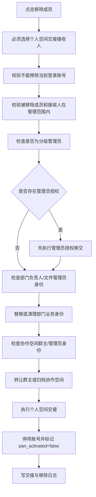

#### 6.2.5 技术实现说明

**前端实现**：

- 页面组件：[admin/member/index.vue](file:///d:/coder/codeProduct/RuoYi-Vue-Plus-v4/plus-ui-v4/src/views/pan/admin/member/index.vue)

**后端实现**：

- Controller：`PanAdminMemberController`
- Service：`PanAdminMemberServiceImpl`
- 个人空间交接：`PanPersonalSpaceHandoverSupport.handoverPersonalSpace(userId, recipientUserId)`

**数据表**：

- `sys_user`：RuoYi 用户主表
- `pan_member_profile`：成员网盘扩展
  - `user_id`、`file_permission`、`identity_label`、`employee_no`、`position`
  - `unassigned`、`local_managed`、`pan_activated`、`last_access_text`
- `pan_user_dept`：成员部门关系
  - `user_id`、`dept_id`、`is_primary`

---

### 6.3 管理员设置

#### 6.3.1 模块概述

管理员设置是组织架构三件套的第三个模块，配置谁可以进入管理中心、谁可以管理某个公司范围、谁可以继续委派下级分级管理员。

- **路由**：`/pan/admin/subadmin`
- **前端页面**：[views/pan/admin/subadmin/index.vue](file:///d:/coder/codeProduct/RuoYi-Vue-Plus-v4/plus-ui-v4/src/views/pan/admin/subadmin/index.vue)
- **业务文档**：[docs/product/modules/09-admin-subadmin.md](file:///d:/coder/codeProduct/RuoYi-Vue-Plus-v4/docs/product/modules/09-admin-subadmin.md)
- **状态**：✅ 核心已实现

#### 6.3.2 线框原型图

```
┌────────────────────────────────────────────────────────────────────────────┐
│  管理员设置                                            [+ 创建分级管理员]   │
├────────────────────────────────────────────────────────────────────────────┤
│  统计：分级管理员 8 人 | 已覆盖公司 5 家 | 启用中 7 人                      │
│                                                                            │
│  [搜索]  [管理员类型：全部/系统/公司]  [管辖公司：全部 ▼]                   │
│  ┌────────────────────────────────────────────────────────────────────────┐│
│  │ 管理员          │类型│管辖公司          │权限摘要      │状态│操作        ││
│  │────────────────────────────────────────────────────────────────────────││
│  │ 张三 👑         │公司│北京分公司、上海  │成员、部门、日志│启用│[编辑][移交]││
│  │ 李四            │公司│广州分公司        │成员、部门     │启用│[编辑][移交]││
│  │ 王五            │公司│深圳分公司        │成员           │停用│[启用][删除]││
│  └────────────────────────────────────────────────────────────────────────┘│
└────────────────────────────────────────────────────────────────────────────┘
```

**创建分级管理员弹窗**：

```
┌────────────────────────────────────────────────────┐
│  创建分级管理员                                [×] │
├────────────────────────────────────────────────────┤
│  Step 1: 选择成员                                  │
│  [搜索成员]                                        │
│  ┌────────────────────────────────────────────┐   │
│  │ ☑ 张三 (10001, 技术部)                      │   │
│  │ ☐ 李四 (10002, 市场部)                      │   │
│  └────────────────────────────────────────────┘   │
│                                                    │
│  Step 2: 选择管辖公司                              │
│  [搜索公司]                                        │
│  ┌────────────────────────────────────────────┐   │
│  │ ☑ 北京分公司 (含下级部门)                   │   │
│  │ ☐ 上海分公司                               │   │
│  │ ☐ 广州分公司                               │   │
│  └────────────────────────────────────────────┘   │
│                                                    │
│  Step 3: 配置控制台权限                            │
│  ┌────────────────────────────────────────────┐   │
│  │ 基础管理                                    │   │
│  │ ☑ 部门管理 (查看、新增、编辑)                │   │
│  │ ☐ 删除部门                                  │   │
│  │ ☑ 成员管理 (查看)                           │   │
│  │ ☑ 成员内容管理 (新增、编辑、分配)            │   │
│  │ ☐ 删除成员                                  │   │
│  │                                             │   │
│  │ 高级管理                                    │   │
│  │ ☐ 外部协作成员                              │   │
│  │ ☐ 群组管理                                  │   │
│  │ ☐ 数据报表                                  │   │
│  │ ☑ 日志查询                                  │   │
│  │                                             │   │
│  │ 管理员设置                                  │   │
│  │ ☑ 进入管理员设置 (查看)                     │   │
│  │ ☐ 委派下级分级管理员                        │   │
│  └────────────────────────────────────────────┘   │
│                                                    │
│  备注：[新任分级管理员，负责北京分公司]             │
│                                                    │
│             [取消]  [创建]                         │
└────────────────────────────────────────────────────┘
```

#### 6.3.3 功能详述

**管理员列表**

- **功能用途**：展示分级管理员列表
- **操作流程**：
  1. 进入管理员设置
  2. 调用 `GET /pan/admin/grant/list`
  3. 后端按当前用户管辖范围过滤
  4. 返回管理员授权列表

**创建分级管理员**

- **功能用途**：授权成员为分级管理员
- **前置条件**：用户有 `pan:admin:grant:add` 或 `grantSubAdmin` 权限
- **操作流程**：
  1. 点击"+ 创建分级管理员"
  2. 选择成员、管辖公司、权限
  3. 调用 `POST /pan/admin/grant/save-batch`
  4. 后端：
     - 校验操作者有 `grantSubAdmin` 或超级权限
     - 校验成员存在且在可见范围内
     - 校验公司节点为 `dept_category=sub*`
     - 归并冗余上级/下级公司范围
     - 校验范围不超出操作者管辖子树
     - 新增或更新 `pan_admin_grant`
     - 刷新目标成员在线会话权限
- **预期结果**：目标成员获得管理中心入口

**编辑分级管理员**

- **功能用途**：修改管理员授权
- **操作流程**：
  1. 点击"编辑"
  2. 修改管辖公司、权限、状态
  3. 调用 `PUT /pan/admin/grant`
  4. 后端更新 `pan_admin_grant`
  5. 刷新会话权限

**移交管理员**

- **功能用途**：将管理员授权移交给其他成员
- **操作流程**：
  1. 点击"移交"
  2. 选择接替成员
  3. 调用 `POST /pan/admin/grant/transfer-user`
  4. 后端：
     - 校验接替成员存在且在可见范围内
     - 接替成员不能与原管理员相同
     - 接替成员已有同范围授权：合并 `perm_json`，删除原授权
     - 否则：直接修改 `user_id`
     - 刷新双方会话权限
- **预期结果**：原管理员失去授权，接替成员获得

**启用/停用授权**

- **功能用途**：控制授权状态
- **操作流程**：
  1. 点击"启用"或"停用"
  2. 调用 `PUT /pan/admin/grant/{id}/status`
  3. 后端更新 `pan_admin_grant.status`
  4. 刷新被授权人会话权限
- **边界条件**：
  - 停用后该范围授权失效
  - 若该管理员还有其他启用授权，仍可进入管理中心

**删除授权**

- **功能用途**：永久移除授权
- **操作流程**：
  1. 点击"删除"
  2. 二次确认
  3. 调用 `DELETE /pan/admin/grant/{id}`
  4. 后端删除 `pan_admin_grant` 记录
  5. 刷新会话权限

#### 6.3.4 操作流程图

**进入管理中心流程**：

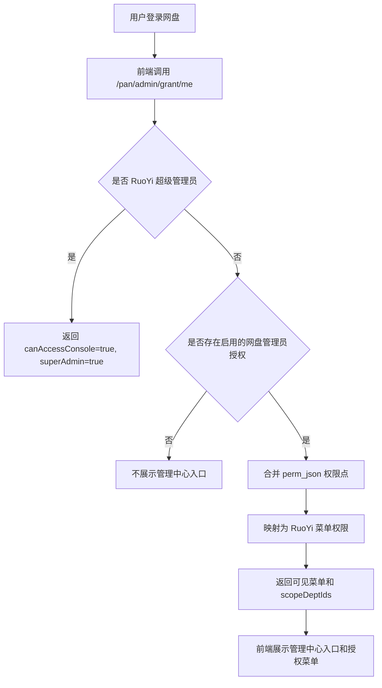

**创建分级管理员流程**：

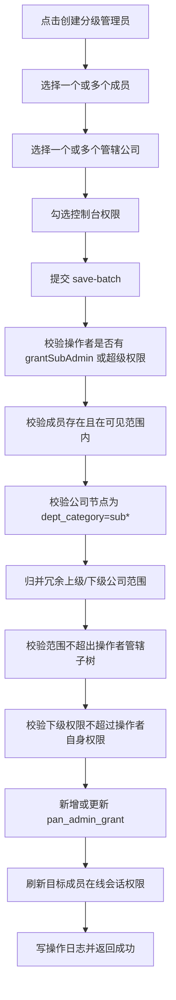

#### 6.3.5 技术实现说明

**前端实现**：

- 页面组件：[admin/subadmin/index.vue](file:///d:/coder/codeProduct/RuoYi-Vue-Plus-v4/plus-ui-v4/src/views/pan/admin/subadmin/index.vue)

**后端实现**：

- Controller：`PanAdminGrantController`
- Service：`PanAdminGrantServiceImpl`
- 权限支撑：`PanAdminGrantPermissionSupport`、`PanAdminGrantScopeSupport`、`PanAdminGrantSessionSupport`

**数据表**：`pan_admin_grant`

- `id`、`user_id`、`admin_type`（`SYSTEM`/`COMPANY`）
- `scope_dept_id`、`perm_json`、`status`、`remark`
- 唯一约束：`user_id + admin_type + scope_dept_id + tenant_id`

**权限点映射关键代码**（`PanAdminGrantPermissionSupport`）：

```java
private static final Map<String, String> PERM_KEY_TO_MENU = Map.of(
    "member", "pan:admin:member:list",
    "memberContent", "pan:admin:member:edit",
    "removeMember", "pan:admin:member:remove",
    "dept", "pan:admin:dept:list",
    "removeDept", "pan:admin:dept:remove",
    "adminSetting", "pan:admin:grant:list",
    "grantSubAdmin", "pan:admin:grant:add"
    // ...
);

public Set<String> resolveMenuPermissions(Long userId) {
    List<PanAdminGrant> grants = grantMapper.selectActiveByUserId(userId);
    Set<String> permissions = new HashSet<>();
    for (PanAdminGrant grant : grants) {
        Map<String, Boolean> permJson = parsePermJson(grant.getPermJson());
        for (Map.Entry<String, Boolean> entry : permJson.entrySet()) {
            if (entry.getValue() && PERM_KEY_TO_MENU.containsKey(entry.getKey())) {
                permissions.add(PERM_KEY_TO_MENU.get(entry.getKey()));
            }
        }
    }
    return permissions;
}
```

---

### 6.4 统计报表

#### 6.4.1 模块概述

统计报表模块展示空间用量、用户活跃度、文件流量、操作日志等统计数据。

- **路由**：`/pan/admin/statistics`
- **前端页面**：[views/pan/admin/statistics/index.vue](file:///d:/coder/codeProduct/RuoYi-Vue-Plus-v4/plus-ui-v4/src/views/pan/admin/statistics/index.vue)
- **状态**：⚠️ 基础已实现，📋 高级报表待补

#### 6.4.2 线框原型图

```
┌────────────────────────────────────────────────────────────────────────────┐
│  统计报表                                                                  │
├────────────────────────────────────────────────────────────────────────────┤
│  [空间用量] [用户活跃] [文件流量] [操作日志]    时间范围：[最近7天 ▼]       │
│                                                                            │
│  ── 空间用量概览 ──                                                        │
│  ┌────────────┐ ┌────────────┐ ┌────────────┐ ┌────────────┐              │
│  │ 总容量      │ │ 已用        │ │ 个人空间    │ │ 企业空间    │              │
│  │ 1.2 TB      │ │ 456 GB     │ │ 120 GB     │ │ 336 GB     │              │
│  │             │ │ 38%        │ │ 26%        │ │ 74%        │              │
│  └────────────┘ └────────────┘ └────────────┘ └────────────┘              │
│                                                                            │
│  ── 部门用量 TOP 10 ──                                                     │
│  ┌────────────────────────────────────────────────────────────────────────┐│
│  │ 技术部   ████████████████████ 56 GB                                    ││
│  │ 市场部   ██████████████ 38 GB                                          ││
│  │ 财务部   ████████ 22 GB                                                ││
│  │ 销售部   █████ 15 GB                                                   ││
│  └────────────────────────────────────────────────────────────────────────┘│
│                                                                            │
│  ── 增长趋势 ──                                                            │
│  ┌────────────────────────────────────────────────────────────────────────┐│
│  │  GB                                                                    ││
│  │  500 │                                          ┌─── 456              ││
│  │  400 │                                    ┌─── 410                   ││
│  │  300 │                              ┌─── 380                         ││
│  │  200 │                        ┌─── 350                               ││
│  │  100 │                  ┌─── 320                                     ││
│  │    0 └───────────────────────────────────────────                    ││
│  │      04-15  04-17  04-19  04-21  04-23  04-25  04-27                 ││
│  └────────────────────────────────────────────────────────────────────────┘│
└────────────────────────────────────────────────────────────────────────────┘
```

#### 6.4.3 功能详述

**空间用量统计**

- **功能用途**：展示各空间容量使用情况
- **操作流程**：
  1. 进入统计报表
  2. 调用 `GET /pan/admin/statistics/space`
  3. 后端聚合 `pan_space`、`pan_file` 数据
  4. 返回总容量、已用、各空间用量
- **可见范围**：
  - 超级管理员/系统管理员：全集团
  - 分级管理员：管辖公司范围

**用户活跃统计**

- **功能用途**：展示用户活跃度
- **数据来源**：`pan_entry_activity` 表
- **指标**：DAU、WAU、MAU、活跃排名

**文件流量统计**

- **功能用途**：展示上传/下载流量
- **数据来源**：`pan_file` 创建/修改记录
- **指标**：上传量、下载量、流量趋势

**操作日志**

- **功能用途**：展示关键操作审计日志
- **数据来源**：RuoYi `sys_oper_log` 表
- **筛选**：操作类型、操作人、时间范围

---

### 6.5 安全配置

#### 6.5.1 模块概述

安全配置模块管理水印策略、外链策略、文件类型限制等全局安全策略。

- **路由**：`/pan/admin/config`
- **前端页面**：[views/pan/admin/config/index.vue](file:///d:/coder/codeProduct/RuoYi-Vue-Plus-v4/plus-ui-v4/src/views/pan/admin/config/index.vue)
- **状态**：⚠️ 基础已实现

#### 6.5.2 线框原型图

```
┌────────────────────────────────────────────────────────────────────────────┐
│  安全配置                                                                  │
├────────────────────────────────────────────────────────────────────────────┤
│  [水印策略] [外链策略] [文件类型限制] [密码策略]                            │
│                                                                            │
│  ── 水印策略 ──                                                            │
│  ┌────────────────────────────────────────────────────────────────────────┐│
│  │ ☑ 启用预览水印                                                         ││
│  │ ☑ 启用下载水印                                                         ││
│  │ ☑ 启用打印水印                                                         ││
│  │                                                                        ││
│  │ 水印内容：                                                              ││
│  │ ☑ 姓名  ☑ 工号  ☑ 部门  ☑ 时间  ☐ IP                                  ││
│  │                                                                        ││
│  │ 水印样式：                                                              ││
│  │ 透明度：[─────●──] 50%                                                 ││
│  │ 字号：[12px ▼]                                                         ││
│  │ 旋转：[-30° ▼]                                                         ││
│  │                                                                        ││
│  │                                                    [保存]              ││
│  └────────────────────────────────────────────────────────────────────────┘│
│                                                                            │
│  ── 外链策略 ──                                                            │
│  ┌────────────────────────────────────────────────────────────────────────┐│
│  │ ☑ 允许创建外链                                                         ││
│  │ ☑ 强制提取码                                                           ││
│  │ 最长

### 6.6 账号中心

**页面入口**：管理端 > 系统配置 > 账号中心
**前端路由**：`/pan/admin/account`
**目标用户**：超级管理员、系统管理员

**线框原型图**

```
┌────────────────────────────────────────────────────────────────────────────┐
│ 管理中心 > 系统配置 > 账号中心                                              │
├────────────────────────────────────────────────────────────────────────────┤
│                                                                            │
│  ── 登录配置 ──                                                            │
│  ┌────────────────────────────────────────────────────────────────────────┐│
│  │ 登录方式：                                                             ││
│  │   ☑ 账号密码                                                           ││
│  │   ☐ 短信验证码                                                         ││
│  │   ☐ 邮箱验证码                                                         ││
│  │   ☐ 扫码登录                                                           ││
│  │   ☐ SSO 单点登录                                                       ││
│  │                                                                        ││
│  │ 登录失败锁定：                                                         ││
│  │   连续失败 [5 ▼] 次后锁定 [30 ▼] 分钟                                 ││
│  │                                                                        ││
│  │ 会话超时：                                                             ││
│  │   空闲 [120 ▼] 分钟后自动登出                                          ││
│  │                                                                        ││
│  ── 双因子认证 ──                                                          │
│  │ ☐ 强制开启双因子认证                                                   ││
│  │   适用范围：[全部成员 ▼]                                               ││
│  │   认证方式：[短信 ▼] [邮箱 ▼] [Authenticator ▼]                        ││
│  │                                                                        ││
│  ── 单点登录 SSO ──                                                        │
│  │ ☐ 启用 SSO                                                            ││
│  │   SSO 类型：[OAuth2 ▼] (OAuth2/SAML/CAS)                              ││
│  │   Client ID：    [____________________________]                       ││
│  │   Client Secret：[____________________________]                       ││
│  │   Issuer URL：   [____________________________]                       ││
│  │   回调地址：     [https://pan.example.com/sso/callback]               ││
│  │   自动创建账号： ☑                                                    ││
│  │   默认角色：     [普通成员 ▼]                                          ││
│  │                                                                        ││
│  ── 第三方账号绑定 ──                                                      │
│  │ ☑ 允许绑定企业微信                                                     ││
│  │ ☑ 允许绑定钉钉                                                         ││
│  │ ☐ 允许绑定飞书                                                         ││
│  │                                                                        ││
│                                                    [取消] [保存]          │
│  └────────────────────────────────────────────────────────────────────────┘│
└────────────────────────────────────────────────────────────────────────────┘
```

**功能详述**

| 元素 | 功能用途 | 交互逻辑 | 边界条件 |
|---|---|---|---|
| 登录方式 | 控制成员可用的登录方式 | 至少开启一种；关闭后登录页隐藏对应入口 | SSO 启用后可关闭账号密码 |
| 登录失败锁定 | 防暴力破解 | 连续失败达到阈值后锁定账号 | 锁定后管理员可解锁 |
| 会话超时 | 控制空闲会话自动登出 | 超时后跳转登录页 | 0 表示不超时 |
| 双因子认证 | 增强账号安全 | 启用后登录需二次验证 | 至少选择一种认证方式 |
| SSO 启用 | 启用单点登录 | 配置完整后可启用 | Client Secret 加密存储 |
| 自动创建账号 | SSO 首次登录自动创建账号 | 按默认角色创建 | 需开启 SSO |
| 第三方账号绑定 | 允许成员绑定企业 IM 账号 | 绑定后可扫码登录 | 需配置对应 IM 应用 |

**技术实现说明**

- 后端 Controller：`PanAccountConfigController`（待补全）
- SSO 配置存储：`sys_social`、扩展表 `pan_sso_config`
- 双因子认证：复用 RuoYi `SysProfileController.sendSmsCode`
- 登录失败锁定：`SysLoginService.login` 中扩展锁定逻辑
- 第三方绑定：复用 RuoYi `AuthController` 接入 JustAuth

### 6.7 域名管理

**页面入口**：管理端 > 系统配置 > 域名管理
**前端路由**：`/pan/admin/domain`
**目标用户**：超级管理员

**线框原型图**

```
┌────────────────────────────────────────────────────────────────────────────┐
│ 管理中心 > 系统配置 > 域名管理                                              │
├────────────────────────────────────────────────────────────────────────────┤
│                                                                            │
│  ── 企业域名 ──                                                            │
│  ┌────────────────────────────────────────────────────────────────────────┐│
│  │ 主域名：                                                               ││
│  │   https://pan.example.com         [验证状态：✓ 已验证] [解除绑定]      ││
│  │                                                                        ││
│  │ 备用域名：                                                             ││
│  │   https://pan2.example.com        [验证状态：✗ 未验证] [重新验证]      ││
│  │                                                                        ││
│  │ [+ 添加域名]                                                          ││
│  │                                                                        ││
│  ── 外链访问域名 ──                                                        │
│  │ 外链分享使用域名：                                                     ││
│  │   ◉ 使用主域名                                                         ││
│  │   ○ 使用独立域名（如 sso.example.com）                                 ││
│  │   独立域名：[____________________] [验证]                              ││
│  │                                                                        ││
│  ── SSL 证书 ──                                                            │
│  │ 当前证书：                                                             ││
│  │   颁发机构：Let's Encrypt                                              ││
│  │   有效期至：2026-12-31                                                 ││
│  │   状态：✓ 正常                                                         ││
│  │   [+ 上传新证书]                                                      ││
│  │                                                                        ││
│  ── 访问控制 ──                                                            │
│  │ ☑ 启用 HTTPS 强制跳转                                                  ││
│  │ ☑ 启用 HSTS                                                           ││
│  │ ☐ IP 白名单访问                                                       ││
│  │   允许的 IP：[192.168.1.0/24 ×]                                       ││
│  │                                                                        ││
│                                                    [取消] [保存]          │
│  └────────────────────────────────────────────────────────────────────────┘│
└────────────────────────────────────────────────────────────────────────────┘
```

**功能详述**

| 元素 | 功能用途 | 交互逻辑 | 边界条件 |
|---|---|---|---|
| 主域名 | 网盘访问的主入口 | 添加后需 DNS 验证 | 一个租户一个主域名 |
| 备用域名 | 容灾或备用入口 | 同样需验证 | 最多 3 个 |
| 外链访问域名 | 外链分享使用的独立域名 | 选择独立域名后外链 URL 使用此域名 | 需独立验证 |
| SSL 证书 | 启用 HTTPS | 上传证书和私钥 | 私钥加密存储 |
| HTTPS 强制跳转 | HTTP 请求自动跳转 HTTPS | 启用后所有 HTTP 请求 301 跳转 | 启用前需有效证书 |
| HSTS | 强制浏览器使用 HTTPS | 启用后响应头添加 HSTS | 启用前需有效证书 |
| IP 白名单 | 限制访问 IP | 启用后非白名单 IP 拒绝访问 | 支持 CIDR |

**技术实现说明**

- 后端 Controller：`PanDomainController`（待补全）
- 域名验证：DNS TXT 记录验证
- 证书存储：`pan_ssl_cert` 表，私钥 AES 加密
- HTTPS 跳转：Nginx 配置 + 后端拦截器双重保障
- HSTS：响应头 `Strict-Transport-Security`

### 6.8 外部协作管理

**页面入口**：管理端 > 系统配置 > 外部协作
**前端路由**：`/pan/admin/extcollab`
**目标用户**：超级管理员、系统管理员

> 当前阶段不实现外部成员加入，本节为产品规划文档。

**线框原型图**

```
┌────────────────────────────────────────────────────────────────────────────┐
│ 管理中心 > 系统配置 > 外部协作管理                                          │
├────────────────────────────────────────────────────────────────────────────┤
│                                                                            │
│  ⚠ 当前阶段不支持外部协作成员加入，以下为规划能力                          │
│                                                                            │
│  ── 外部成员策略 ──                                                        │
│  ┌────────────────────────────────────────────────────────────────────────┐│
│  │ ☐ 启用外部协作                                                         ││
│  │ ☐ 允许成员邀请外部用户                                                 ││
│  │   邀请方式：                                                          ││
│  │     ☑ 邮箱邀请                                                         ││
│  │     ☑ 手机号邀请                                                       ││
│  │     ☐ 链接邀请                                                         ││
│  │                                                                        ││
│  │ 外部成员有效期：                                                      ││
│  │   ◉ 7 天                                                              ││
│  │   ○ 30 天                                                             ││
│  │   ○ 90 天                                                             ││
│  │   ○ 永久（需管理员审批）                                              ││
│  │                                                                        ││
│  │ ☐ 外部成员可下载                                                       ││
│  │ ☐ 外部成员可上传                                                       ││
│  │ ☐ 外部成员可分享                                                       ││
│  │ ☑ 强制水印                                                             ││
│  │                                                                        ││
│  ── 外部成员列表 ──                                                        │
│  │ [搜索：____________] [状态：全部 ▼] [+ 邀请外部成员]                  ││
│  │ ┌──────────────────────────────────────────────────────────────────┐  ││
│  │ │ 邮箱            | 姓名     | 邀请人 | 状态   | 有效期   | 操作  │  ││
│  │ │ ext@partner.com | 张三     | admin  | 已加入 | 2026-12 | 移除  │  ││
│  │ │ partner@xx.com  | 李四     | user1  | 待确认 | 7 天     | 重发  │  ││
│  │ └──────────────────────────────────────────────────────────────────┘  ││
│  │                                                                        ││
│  ── 审批流程 ──                                                            │
│  │ ☐ 外部成员加入需管理员审批                                             ││
│  │   审批人：[____________] (默认超管)                                    ││
│  │                                                                        ││
│                                                    [取消] [保存]          │
│  └────────────────────────────────────────────────────────────────────────┘│
└────────────────────────────────────────────────────────────────────────────┘
```

**功能详述**

| 元素 | 功能用途 | 交互逻辑 | 边界条件 |
|---|---|---|---|
| 启用外部协作 | 全局开关 | 关闭后所有外部协作能力禁用 | 默认关闭 |
| 允许成员邀请 | 控制普通成员是否可邀请外部用户 | 关闭后仅管理员可邀请 | 默认关闭 |
| 邀请方式 | 邮箱/手机号/链接 | 至少选择一种 | 链接邀请需设置有效期 |
| 外部成员有效期 | 控制外部成员账号有效期 | 到期后自动失效 | 永久需审批 |
| 外部成员权限 | 下载/上传/分享/水印 | 按勾选控制 | 默认仅预览 |
| 外部成员列表 | 管理已邀请的外部成员 | 可移除、重发邀请 | 不显示内部成员 |
| 审批流程 | 外部成员加入需审批 | 启用后邀请需审批人确认 | 默认超管审批 |

**技术实现说明**

- 当前阶段不实现，规划如下：
- 数据表：`pan_external_member`、`pan_external_invite`
- 外部成员账号：独立于 `sys_user`，使用 `user_type=EXTERNAL`
- 权限隔离：外部成员不进入组织架构，仅参与指定协作空间
- 邀请链接：`/pan/invite/{token}`，token 加密签名

### 6.9 初始化向导

**页面入口**：首次登录或超级管理员手动触发
**前端路由**：`/pan/admin/wizard`
**目标用户**：超级管理员（首次登录）

**线框原型图**

```
┌────────────────────────────────────────────────────────────────────────────┐
│ 企业网盘初始化向导                                                          │
├────────────────────────────────────────────────────────────────────────────┤
│                                                                            │
│  步骤：① 企业信息 ──② 管理员账号 ──③ 存储配置 ──④ 组织架构 ──⑤ 完成      │
│                                                                            │
│  ── 当前步骤：① 企业信息 ──                                                │
│  ┌────────────────────────────────────────────────────────────────────────┐│
│  │                                                                        ││
│  │  企业名称：    [____________________________]                          ││
│  │  企业 logo：   [上传] (支持 png/jpg, ≤ 200KB)                          ││
│  │  所属行业：    [互联网/IT ▼]                                           ││
│  │  企业规模：    [50-200 人 ▼]                                           ││
│  │  联系电话：    [____________________________]                          ││
│  │  联系邮箱：    [____________________________]                          ││
│  │                                                                        ││
│  │  ── 空间配额 ──                                                        ││
│  │  企业空间总容量：[500 GB ▼]  (100GB/500GB/1TB/5TB/自定义)              ││
│  │  个人空间默认容量：[10 GB ▼]   (5GB/10GB/20GB/50GB/自定义)             ││
│  │                                                                        ││
│  │                                                  [上一步] [下一步]      ││
│  └────────────────────────────────────────────────────────────────────────┘│
│                                                                            │
│  ── 步骤预览 ──                                                            │
│  ① 企业信息    ✓ 已完成                                                   │
│  ② 管理员账号  ✓ 已完成                                                   │
│  ③ 存储配置    ● 进行中                                                   │
│  ④ 组织架构    ○ 待处理                                                   │
│  ⑤ 完成        ○ 待处理                                                   │
│                                                                            │
└────────────────────────────────────────────────────────────────────────────┘
```

**功能详述**

| 步骤 | 元素 | 功能用途 | 边界条件 |
|---|---|---|---|
| ① 企业信息 | 企业名称 | 设置企业显示名称 | 必填，2-50 字符 |
| ① 企业信息 | 企业 logo | 上传企业 logo | png/jpg，≤ 200KB |
| ① 企业信息 | 所属行业 | 用于统计和推荐 | 下拉选择 |
| ① 企业信息 | 企业规模 | 用于统计和推荐 | 下拉选择 |
| ① 企业信息 | 企业空间总容量 | 设置企业空间总配额 | 最小 100GB |
| ① 企业信息 | 个人空间默认容量 | 设置成员默认个人空间配额 | 最小 1GB |
| ② 管理员账号 | 超级管理员账号 | 设置超级管理员账号 | 首次登录必填 |
| ② 管理员账号 | 初始密码 | 设置超级管理员初始密码 | 符合密码策略 |
| ② 管理员账号 | 绑定手机/邮箱 | 用于找回密码 | 至少绑定一项 |
| ③ 存储配置 | OBS 类型 | 选择对象存储类型 | 支持 MinIO/阿里云 OSS/华为云 OBS/腾讯云 COS |
| ③ 存储配置 | Endpoint | OBS 访问地址 | 必填 |
| ③ 存储配置 | AccessKey | OBS 访问密钥 | 必填 |
| ③ 存储配置 | SecretKey | OBS 密钥 | 加密存储 |
| ③ 存储配置 | Bucket | OBS 桶名 | 必填，全局唯一 |
| ③ 存储配置 | 测试连接 | 验证 OBS 配置是否可用 | 必须通过才能下一步 |
| ④ 组织架构 | 根组织 | 创建企业根组织 | 必填 |
| ④ 组织架构 | 一级部门 | 创建一级部门 | 至少创建一个 |
| ④ 组织架构 | 部门负责人 | 指定部门负责人 | 可选 |
| ⑤ 完成 | 完成确认 | 确认初始化完成 | 不可回退 |

**操作流程**

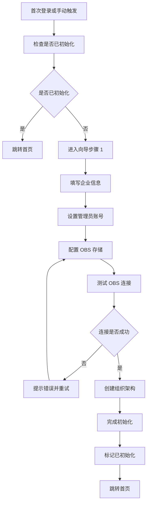

**技术实现说明**

- 后端 Controller：`PanWizardController`（待补全）
- 初始化状态：`sys_config` 中 `pan.initialized` 标记
- OBS 配置：写入 `sys_oss` 表
- 企业信息：写入 `sys_tenant` 扩展字段
- 组织架构：调用 `PanAdminDeptController.add`
- 完成标记：写入 `sys_config`，后续登录不再触发向导


## 7. 关键技术实现说明

本章结合前后端代码，详细说明网盘系统关键功能的技术实现方案，包括核心算法、数据处理流程、接口设计及关键技术难点与解决方案。

### 7.1 大文件分片上传

**业务场景**：用户上传大文件（GB 级别）时，需要支持断点续传、秒传、并发上传，避免单次请求超时和内存溢出。

**技术方案**

- 分片大小：5MB（`CHUNK_SIZE_BYTES = 5 * 1024 * 1024`）
- 并发数：3 个分片并发上传
- 重试次数：每个分片失败重试 3 次
- 秒传：上传前计算文件 SHA-256，命中则跳过上传
- 断点续传：服务端记录已上传分片，前端查询后跳过已上传分片

**前端实现**

文件位置：`plus-ui-v4/src/utils/panChunkUpload.ts`

核心流程：

```typescript
// 1. 计算文件 SHA-256
const fileHash = await calculateFileSha256(file);

// 2. 检查秒传
const checkResult = await checkInstantUpload(fileHash, fileName, fileSize);
if (checkResult.data.instant) {
  return { success: true, instant: true };
}

// 3. 初始化分片任务
const initResult = await initChunkTask(fileHash, fileName, fileSize, chunkCount);

// 4. 查询已上传分片
const uploadedChunks = await queryUploadedChunks(initResult.data.taskId);

// 5. 并发上传未完成分片
const chunksToUpload = getChunksToUpload(chunkCount, uploadedChunks);
await uploadChunksConcurrently(chunksToUpload, file, initResult.data.taskId, 3);

// 6. 合并分片
await mergeChunks(initResult.data.taskId);
```

关键代码片段（`plus-ui-v4/src/utils/panChunkUpload.ts`）：

```typescript
export const CHUNK_SIZE_BYTES = 5 * 1024 * 1024;
export const MAX_CONCURRENT_UPLOADS = 3;
export const MAX_RETRY_COUNT = 3;

export async function uploadFileWithChunks(
  file: File,
  spaceKey: string,
  folderId: number,
  onProgress?: (percent: number) => void
): Promise<UploadResult> {
  const fileHash = await calculateFileSha256(file);
  const fileSize = file.size;
  const chunkCount = Math.ceil(fileSize / CHUNK_SIZE_BYTES);

  // 秒传检查
  const checkRes = await checkInstantUpload({
    fileHash,
    fileName: file.name,
    fileSize,
    spaceKey,
    folderId
  });
  if (checkRes.data?.instant) {
    onProgress?.(100);
    return { success: true, fileId: checkRes.data.fileId, instant: true };
  }

  // 初始化任务
  const initRes = await initChunkTask({
    fileHash,
    fileName: file.name,
    fileSize,
    chunkCount,
    spaceKey,
    folderId
  });
  const taskId = initRes.data.taskId;

  // 查询已上传分片
  const queryRes = await queryUploadedChunks(taskId);
  const uploadedSet = new Set(queryRes.data?.chunkIndexes || []);

  // 并发上传
  const pendingChunks: number[] = [];
  for (let i = 0; i < chunkCount; i++) {
    if (!uploadedSet.has(i)) pendingChunks.push(i);
  }

  await runConcurrent(pendingChunks, MAX_CONCURRENT_UPLOADS, async (chunkIndex) => {
    const start = chunkIndex * CHUNK_SIZE_BYTES;
    const end = Math.min(start + CHUNK_SIZE_BYTES, fileSize);
    const blob = file.slice(start, end);
    await uploadChunkWithRetry(taskId, chunkIndex, blob, MAX_RETRY_COUNT);
    onProgress?.(Math.floor(((chunkIndex + 1) / chunkCount) * 100));
  });

  // 合并
  const mergeRes = await mergeChunks(taskId);
  return { success: true, fileId: mergeRes.data.fileId };
}
```

**后端实现**

文件位置：`ruoyi-modules/ruoyi-pan/src/main/java/org/dromara/pan/controller/PanChunkTaskController.java`

核心接口：

| 接口 | 方法 | 说明 |
|---|---|---|
| `/pan/chunk/init` | POST | 初始化分片任务，返回 taskId |
| `/pan/chunk/check` | POST | 秒传检查，返回是否已存在相同 hash 文件 |
| `/pan/chunk/upload` | POST | 上传单个分片 |
| `/pan/chunk/query` | GET | 查询已上传分片列表 |
| `/pan/chunk/merge` | POST | 合并所有分片为完整文件 |

核心 Service：`PanChunkTaskServiceImpl`

```java
@Service
public class PanChunkTaskServiceImpl implements IPanChunkTaskService {

    @Override
    @Transactional(rollbackFor = Exception.class)
    public Long initChunkTask(ChunkTaskInitBo bo) {
        // 1. 校验空间和文件夹权限
        panSpaceSupport.assertSpaceWritable(bo.getSpaceKey());
        panFolderSupport.assertFolderWritable(bo.getFolderId(), bo.getSpaceKey());

        // 2. 创建任务记录
        PanChunkTask task = new PanChunkTask();
        task.setFileHash(bo.getFileHash());
        task.setFileName(bo.getFileName());
        task.setFileSize(bo.getFileSize());
        task.setChunkCount(bo.getChunkCount());
        task.setChunkSize(CHUNK_SIZE_BYTES);
        task.setSpaceKey(bo.getSpaceKey());
        task.setFolderId(bo.getFolderId());
        task.setStatus("uploading");
        task.setUploadedCount(0);
        baseMapper.insert(task);

        return task.getId();
    }

    @Override
    @Transactional(rollbackFor = Exception.class)
    public void uploadChunk(Long taskId, Integer chunkIndex, MultipartFile file) {
        PanChunkTask task = baseMapper.selectById(taskId);
        Assert.notNull(task, "分片任务不存在");
        Assert.equals(task.getStatus(), "uploading", "任务状态异常");

        // 1. 上传到 OBS
        String objectKey = buildChunkObjectKey(task, chunkIndex);
        ossClient.uploadObject(objectKey, file.getInputStream());

        // 2. 记录分片
        PanChunkRecord record = new PanChunkRecord();
        record.setTaskId(taskId);
        record.setChunkIndex(chunkIndex);
        record.setChunkSize(file.getSize());
        record.setObjectKey(objectKey);
        record.setStatus("uploaded");
        chunkRecordMapper.insert(record);

        // 3. 更新任务进度
        int uploaded = task.getUploadedCount() + 1;
        task.setUploadedCount(uploaded);
        if (uploaded >= task.getChunkCount()) {
            task.setStatus("merging");
        }
        baseMapper.updateById(task);
    }

    @Override
    @Transactional(rollbackFor = Exception.class)
    public Long mergeChunks(Long taskId) {
        PanChunkTask task = baseMapper.selectById(taskId);
        Assert.notNull(task, "分片任务不存在");
        Assert.equals(task.getStatus(), "merging", "任务尚未上传完成");

        // 1. 查询所有分片
        List<PanChunkRecord> records = chunkRecordMapper.selectList(
            Wrappers.<PanChunkRecord>lambdaQuery()
                .eq(PanChunkRecord::getTaskId, taskId)
                .orderByAsc(PanChunkRecord::getChunkIndex)
        );

        // 2. 合并到 OBS
        String targetObjectKey = buildFileObjectKey(task);
        ossClient.mergeObjects(targetObjectKey,
            records.stream().map(PanChunkRecord::getObjectKey).collect(Collectors.toList())
        );

        // 3. 创建文件记录
        PanFile panFile = new PanFile();
        panFile.setFileName(task.getFileName());
        panFile.setFileSize(task.getFileSize());
        panFile.setFileHash(task.getFileHash());
        panFile.setSpaceKey(task.getSpaceKey());
        panFile.setFolderId(task.getFolderId());
        panFile.setOssId(createOssRecord(targetObjectKey, task));
        panFile.setIsDeleted(0);
        fileMapper.insert(panFile);

        // 4. 清理分片
        records.forEach(r -> ossClient.deleteObject(r.getObjectKey()));
        chunkRecordMapper.delete(
            Wrappers.<PanChunkRecord>lambdaQuery().eq(PanChunkRecord::getTaskId, taskId)
        );

        // 5. 更新任务状态
        task.setStatus("completed");
        task.setFileId(panFile.getId());
        baseMapper.updateById(task);

        return panFile.getId();
    }
}
```

**关键技术难点与解决方案**

| 难点 | 解决方案 |
|---|---|
| 大文件 SHA-256 计算阻塞 UI | 使用 Web Worker 在子线程计算，避免主线程阻塞 |
| 分片上传中断后恢复 | 服务端持久化分片记录，前端查询后跳过已上传分片 |
| 并发控制 | 使用 `runConcurrent` 工具函数限制并发数为 3 |
| 分片失败重试 | 单个分片最多重试 3 次，避免整体失败 |
| 秒传判断 | 上传前查询 `pan_file.file_hash`，命中则跳过上传 |
| 合并性能 | 使用 OBS 的 `mergeObjects` 接口服务端合并，避免下载再上传 |

### 7.2 OBS 存储路径设计

**业务场景**：网盘文件需要存储到对象存储（OBS），路径设计需要支持多租户隔离、空间隔离、按日期分目录、便于清理和审计。

**路径规则**

```
{env}/{groupId}/{companyId}/{spaceType}/{ownerId}/{yyyy}/{MM}/{dd}/{fileId}.{ext}
```

| 字段 | 说明 | 示例 |
|---|---|---|
| env | 环境标识 | `prod`、`dev`、`test` |
| groupId | 集团/租户 ID | `10001` |
| companyId | 公司节点 ID | `20001` |
| spaceType | 空间类型 | `personal`、`enterprise`、`collab` |
| ownerId | 所有者 ID | 用户 ID 或部门 ID 或协作空间 ID |
| yyyy | 年份 | `2026` |
| MM | 月份 | `06` |
| dd | 日期 | `22` |
| fileId | 文件 ID | `123456` |
| ext | 扩展名 | `docx`、`pdf` |

**示例路径**

```
prod/10001/20001/personal/10086/2026/06/22/123456.docx
prod/10001/20001/enterprise/20001/2026/06/22/123457.pdf
prod/10001/20001/collab/30001/2026/06/22/123458.zip
```

**设计考量**

| 设计点 | 说明 |
|---|---|
| 多租户隔离 | `groupId` 作为第一级目录，物理隔离不同租户 |
| 公司隔离 | `companyId` 作为第二级目录，支持集团内多公司 |
| 空间类型隔离 | `spaceType` 区分个人/企业/协作空间 |
| 按日期分目录 | `yyyy/MM/dd` 避免单目录文件过多 |
| 文件 ID 命名 | 使用 `fileId` 而非原文件名，避免特殊字符和重名问题 |
| 扩展名保留 | 保留扩展名便于 OBS 直接预览和 Content-Type 推断 |

**后端实现**

文件位置：`ruoyi-modules/ruoyi-pan/src/main/java/org/dromara/pan/service/support/PanOssPathSupport.java`

```java
@Component
public class PanOssPathSupport {

    public String buildObjectKey(PanFile file) {
        StringBuilder sb = new StringBuilder();
        sb.append(env).append("/");
        sb.append(file.getTenantId()).append("/");
        sb.append(file.getCompanyId()).append("/");
        sb.append(file.getSpaceType()).append("/");
        sb.append(file.getOwnerId()).append("/");
        LocalDate now = LocalDate.now();
        sb.append(now.getYear()).append("/");
        sb.append(String.format("%02d", now.getMonthValue())).append("/");
        sb.append(String.format("%02d", now.getDayOfMonth())).append("/");
        sb.append(file.getId()).append(".").append(getExtension(file.getFileName()));
        return sb.toString();
    }

    public String buildSpacePrefix(String spaceKey) {
        // spaceKey: personal-{userId} / enterprise / collab-{collabId}
        String[] parts = spaceKey.split("-", 2);
        String spaceType = parts[0];
        String ownerId = parts.length > 1 ? parts[1] : "";
        return env + "/" + TenantHelper.getTenantId() + "/" +
               getCompanyId() + "/" + spaceType + "/" + ownerId + "/";
    }
}
```

**关键技术难点**

| 难点 | 解决方案 |
|---|---|
| 路径生成性能 | 使用 `StringBuilder` 拼接，避免字符串格式化开销 |
| 多租户隔离 | 路径第一级为 `tenantId`，OBS 桶级别也可按租户分桶 |
| 跨空间文件移动 | 不移动 OBS 对象，只更新 `pan_file.space_key` 和 `owner_id` |
| 清理过期文件 | 按 `spacePrefix + yyyy/MM/dd` 前缀批量删除 |

### 7.3 复合权限服务

**业务场景**：网盘权限模型需要同时支持 RuoYi 原生角色菜单权限和网盘业务层的分级管理员权限（`pan_admin_grant.perm_json`），两套权限需要合并后参与接口鉴权。

**技术方案**

- 复合权限服务 `PanCompositePermissionService` 标注 `@Primary`，覆盖 RuoYi 默认权限服务
- 登录时合并 RuoYi 角色菜单权限和 `pan_admin_grant.perm_json` 权限
- 接口鉴权时使用 Sa-Token `@SaCheckPermission` 二次校验

**后端实现**

文件位置：`ruoyi-modules/ruoyi-pan/src/main/java/org/dromara/pan/service/support/PanCompositePermissionService.java`

```java
@Primary
@Service
public class PanCompositePermissionService implements ISaPermissionService {

    @Resource
    private PanAdminGrantPermissionSupport grantPermissionSupport;

    @Override
    public List<String> getPermissionList(LoginUser loginUser) {
        // 1. 获取 RuoYi 原生菜单权限
        List<String> sysPerms = loginUser.getMenuPermission();

        // 2. 超级管理员直接返回全部权限
        if (loginUser.isSuperAdmin()) {
            return Collections.singletonList("*:*:*");
        }

        // 3. 合并网盘管理员授权权限
        List<String> panPerms = grantPermissionSupport.loadUserPanPermissions(loginUser.getUserId());
        List<String> merged = new ArrayList<>(sysPerms);
        merged.addAll(panPerms);
        return merged;
    }

    @Override
    public boolean hasPermission(String permission) {
        LoginUser loginUser = LoginHelper.getLoginUser();
        if (loginUser == null) return false;
        if (loginUser.isSuperAdmin()) return true;
        return getPermissionList(loginUser).contains(permission);
    }
}
```

权限点映射（`PanAdminGrantPermissionSupport`）：

```java
@Component
public class PanAdminGrantPermissionSupport {

    private static final Map<String, List<String>> PERM_MAPPING = new HashMap<>();

    static {
        PERM_MAPPING.put("dept", Arrays.asList("pan:admin:dept:list", "pan:admin:dept:query", "pan:admin:dept:add", "pan:admin:dept:edit"));
        PERM_MAPPING.put("removeDept", Collections.singletonList("pan:admin:dept:remove"));
        PERM_MAPPING.put("member", Collections.singletonList("pan:admin:member:list"));
        PERM_MAPPING.put("memberContent", Arrays.asList("pan:admin:member:add", "pan:admin:member:edit", "pan:admin:member:assign"));
        PERM_MAPPING.put("removeMember", Collections.singletonList("pan:admin:member:remove"));
        PERM_MAPPING.put("adminSetting", Arrays.asList("pan:admin:grant:list", "pan:admin:grant:query"));
        PERM_MAPPING.put("grantSubAdmin", Arrays.asList("pan:admin:grant:add", "pan:admin:grant:edit", "pan:admin:grant:remove"));
    }

    public List<String> loadUserPanPermissions(Long userId) {
        // 1. 查询用户所有启用的 COMPANY 授权
        List<PanAdminGrant> grants = grantMapper.selectList(
            Wrappers.<PanAdminGrant>lambdaQuery()
                .eq(PanAdminGrant::getUserId, userId)
                .eq(PanAdminGrant::getStatus, "0")
        );

        // 2. 合并所有授权的 perm_json
        Set<String> permKeys = new HashSet<>();
        for (PanAdminGrant grant : grants) {
            Map<String, Boolean> permJson = JsonUtils.parseObject(
                grant.getPermJson(), new TypeReference<Map<String, Boolean>>() {}
            );
            permJson.forEach((key, enabled) -> {
                if (Boolean.TRUE.equals(enabled)) permKeys.add(key);
            });
        }

        // 3. 映射为 RuoYi 菜单权限
        Set<String> result = new HashSet<>();
        for (String key : permKeys) {
            List<String> mapped = PERM_MAPPING.get(key);
            if (mapped != null) result.addAll(mapped);
        }
        return new ArrayList<>(result);
    }
}
```

**关键技术难点**

| 难点 | 解决方案 |
|---|---|
| 两套权限合并 | 复合服务 `@Primary` 覆盖，登录时合并 |
| 权限缓存 | 使用 Redis 缓存 `pan:perm:{userId}`，授权变更时刷新 |
| 在线会话刷新 | `PanAdminGrantSessionSupport` 主动调用 `StpUtil.getSessionByLoginId` 刷新 |
| 数据范围隔离 | `PanAdminGrantScopeSupport` 展开管辖公司子树，过滤查询 |
| 接口二次校验 | `@SaCheckPermission` 注解确保接口级别鉴权 |

### 7.4 软删除与回收站

**业务场景**：用户删除文件后需要可恢复，且不能立即删除 OBS 对象（避免误删和数据丢失）。

**技术方案**

- 软删除：`pan_file.is_deleted=1` + `pan_file.delete_time`
- 回收站：独立查询 `is_deleted=1` 的记录
- 保留期：默认 30 天，到期自动清理
- 彻底删除：检查 `ossId` 引用计数，引用为 0 时才删除 OBS 对象

**后端实现**

文件位置：`ruoyi-modules/ruoyi-pan/src/main/java/org/dromara/pan/service/impl/PanRecycleServiceImpl.java`

```java
@Service
public class PanRecycleServiceImpl implements IPanRecycleService {

    @Override
    public TableDataInfo<PanRecycleVo> queryList(PanRecycleBo bo) {
        // 1. 计算当前用户可见的删除项
        List<String> visibleSpaceKeys = computeVisibleSpaceKeys();

        // 2. 查询软删除文件
        LambdaQueryWrapper<PanFile> fileWrapper = Wrappers.<PanFile>lambdaQuery()
            .eq(PanFile::getIsDeleted, 1)
            .in(PanFile::getSpaceKey, visibleSpaceKeys);
        if (StringUtils.isNotBlank(bo.getKeyword())) {
            fileWrapper.like(PanFile::getFileName, bo.getKeyword());
        }

        // 3. 查询软删除文件夹
        LambdaQueryWrapper<PanFolder> folderWrapper = Wrappers.<PanFolder>lambdaQuery()
            .eq(PanFolder::getIsDeleted, 1)
            .in(PanFolder::getSpaceKey, visibleSpaceKeys);

        // 4. 合并、排序、分页
        return mergeAndPage(fileWrapper, folderWrapper, bo);
    }

    @Override
    @Transactional(rollbackFor = Exception.class)
    public void restore(Long entryId, String entryType) {
        // 1. 校验恢复权限
        assertCanRestore(entryId, entryType);

        if ("folder".equals(entryType)) {
            // 2. 文件夹：递归恢复
            restoreFolderRecursive(entryId);
        } else {
            // 3. 文件：直接恢复
            PanFile file = fileMapper.selectById(entryId);
            Assert.notNull(file, "文件不存在");
            Assert.equals(file.getIsDeleted(), 1, "文件未被删除");

            // 4. 检查原父目录
            PanFolder parent = folderMapper.selectById(file.getFolderId());
            if (parent == null || parent.getIsDeleted() == 1) {
                throw new ServiceException("原目录已删除，请选择新位置恢复");
            }

            // 5. 恢复
            file.setIsDeleted(0);
            file.setDeleteTime(null);
            fileMapper.updateById(file);
        }
    }

    @Override
    @Transactional(rollbackFor = Exception.class)
    public void purge(Long entryId, String entryType) {
        // 1. 校验彻底删除权限
        assertCanPurge(entryId, entryType);

        if ("folder".equals(entryType)) {
            purgeFolderRecursive(entryId);
            return;
        }

        PanFile file = fileMapper.selectById(entryId);
        Assert.notNull(file, "文件不存在");
        Assert.equals(file.getIsDeleted(), 1, "文件未被删除，不能彻底删除");

        // 2. 检查 ossId 引用计数
        int refCount = fileMapper.selectCount(
            Wrappers.<PanFile>lambdaQuery()
                .eq(PanFile::getOssId, file.getOssId())
                .eq(PanFile::getIsDeleted, 0)
        );
        if (refCount > 0) {
            // 引用计数大于 0，只删除业务记录，不删除 OBS 对象
            log.info("文件 ossId={} 仍有 {} 个引用，仅删除业务记录", file.getOssId(), refCount);
        } else {
            // 引用计数为 0，删除 OBS 对象
            ossClient.deleteObject(file.getOssId());
            log.info("文件 ossId={} 引用为 0，已删除 OBS 对象", file.getOssId());
        }

        // 3. 删除业务记录
        fileMapper.deleteById(entryId);

        // 4. 写审计日志
        writePurgeAuditLog(file);
    }
}
```

**关键技术难点**

| 难点 | 解决方案 |
|---|---|
| 文件夹递归恢复 | 按删除子树递归恢复，避免子项遗漏 |
| OBS 引用计数 | 彻底删除前查询 `pan_file.oss_id` 引用，引用 > 0 时不删 OBS |
| 跨空间恢复 | 校验目标空间权限，更新 `space_key` 和 `owner_id` |
| 自动清理 | 定时任务扫描 `delete_time < now() - 30 days`，自动彻底删除 |
| 外链失效联动 | 删除时同步更新 `pan_share_link.status = 'source_deleted'` |

### 7.5 外链分享与共享授权

**业务场景**：网盘需要支持两种文件分享机制：外链分享（公开链接，访客访问）和共享授权（内部成员协作，权限控制）。

**技术方案**

- 外链分享：`pan_share_link` 表，生成随机 token，支持提取码、有效期、访问次数限制
- 共享授权：`pan_file_grant` 表，授权给指定用户/部门，支持原子权限和权限角色
- 严格区分：外链不进入 `pan_file_grant`，共享授权不生成 token

**外链分享实现**

文件位置：`ruoyi-modules/ruoyi-pan/src/main/java/org/dromara/pan/service/impl/PanShareLinkServiceImpl.java`

```java
@Service
public class PanShareLinkServiceImpl implements IPanShareLinkService {

    @Override
    @Transactional(rollbackFor = Exception.class)
    public Long createShareLink(PanShareLinkBo bo) {
        // 1. 校验来源文件权限
        assertCanShare(bo.getEntryId(), bo.getEntryType());

        // 2. 生成随机 token
        String token = IdUtil.fastSimpleUUID();

        // 3. 生成提取码（如未指定）
        String extractCode = bo.getExtractCode();
        if (StringUtils.isBlank(extractCode) && securityConfig.isForceExtractCode()) {
            extractCode = RandomUtil.randomNumbers(6);
        }

        // 4. 计算过期时间
        Date expireTime = computeExpireTime(bo.getExpireDays());

        // 5. 创建记录
        PanShareLink link = new PanShareLink();
        link.setShareToken(token);
        link.setEntryId(bo.getEntryId());
        link.setEntryType(bo.getEntryType());
        link.setShareUserId(LoginHelper.getUserId());
        link.setExtractCode(extractCode);
        link.setExpireTime(expireTime);
        link.setMaxVisitCount(bo.getMaxVisitCount());
        link.setVisitCount(0);
        link.setStatus("active");
        link.setAllowDownload(bo.getAllowDownload());
        link.setAllowSaveToPersonal(bo.getAllowSaveToPersonal());
        link.setWatermarkEnabled(bo.getWatermarkEnabled());
        baseMapper.insert(link);

        return link.getId();
    }

    @Override
    public PanShareLinkAccessVo accessByToken(String token, String extractCode) {
        PanShareLink link = baseMapper.selectOne(
            Wrappers.<PanShareLink>lambdaQuery().eq(PanShareLink::getShareToken, token)
        );
        Assert.notNull(link, "外链不存在或已失效");

        // 1. 校验状态
        Assert.equals(link.getStatus(), "active", "外链已失效");
        Assert.notNull(link.getExpireTime(), "外链已过期");
        if (link.getExpireTime().before(new Date())) {
            throw new ServiceException("外链已过期");
        }

        // 2. 校验提取码
        if (StringUtils.isNotBlank(link.getExtractCode())) {
            Assert.equals(link.getExtractCode(), extractCode, "提取码错误");
        }

        // 3. 校验访问次数
        if (link.getMaxVisitCount() != null && link.getMaxVisitCount() > 0) {
            if (link.getVisitCount() >= link.getMaxVisitCount()) {
                throw new ServiceException("外链访问次数已达上限");
            }
        }

        // 4. 累加访问次数
        link.setVisitCount(link.getVisitCount() + 1);
        baseMapper.updateById(link);

        // 5. 返回访问信息
        return buildAccessVo(link);
    }
}
```

**共享授权实现**

文件位置：`ruoyi-modules/ruoyi-pan/src/main/java/org/dromara/pan/service/impl/PanFileGrantServiceImpl.java`

```java
@Service
public class PanFileGrantServiceImpl implements IPanFileGrantService {

    @Override
    @Transactional(rollbackFor = Exception.class)
    public Long grantPermission(PanFileGrantBo bo) {
        // 1. 校验授权人权限
        assertCanGrant(bo.getEntryId(), bo.getEntryType());

        // 2. 校验被授权人存在
        sysUserService.checkUserExist(bo.getGranteeUserId());

        // 3. 校验权限角色和原子权限
        validatePermissionRole(bo.getPermissionRole(), bo.getAtomicPermissions());

        // 4. 创建授权记录
        PanFileGrant grant = new PanFileGrant();
        grant.setEntryId(bo.getEntryId());
        grant.setEntryType(bo.getEntryType());
        grant.setGrantorUserId(LoginHelper.getUserId());
        grant.setGranteeUserId(bo.getGranteeUserId());
        grant.setPermissionRole(bo.getPermissionRole());
        grant.setAtomicPermissions(JsonUtils.toJsonString(bo.getAtomicPermissions()));
        grant.setExpireTime(bo.getExpireTime());
        grant.setStatus("active");
        baseMapper.insert(grant);

        return grant.getId();
    }

    @Override
    public boolean checkPermission(Long entryId, String entryType, Long userId, String atomicPerm) {
        // 1. 查询用户对该文件的有效授权
        List<PanFileGrant> grants = baseMapper.selectList(
            Wrappers.<PanFileGrant>lambdaQuery()
                .eq(PanFileGrant::getEntryId, entryId)
                .eq(PanFileGrant::getEntryType, entryType)
                .eq(PanFileGrant::getGranteeUserId, userId)
                .eq(PanFileGrant::getStatus, "active")
                .and(w -> w.isNull(PanFileGrant::getExpireTime)
                          .or().gt(PanFileGrant::getExpireTime, new Date()))
        );

        if (grants.isEmpty()) return false;

        // 2. 检查权限角色
        for (PanFileGrant grant : grants) {
            if (hasAtomicPermission(grant, atomicPerm)) {
                return true;
            }
        }
        return false;
    }

    private boolean hasAtomicPermission(PanFileGrant grant, String atomicPerm) {
        // 权限角色优先：禁止访问者直接拒绝
        if ("denied".equals(grant.getPermissionRole())) return false;
        // 操作者拥有全部权限
        if ("operator".equals(grant.getPermissionRole())) return true;
        // 其他角色按原子权限判断
        List<String> atomics = JsonUtils.parseArray(grant.getAtomicPermissions(), String.class);
        return atomics.contains(atomicPerm);
    }
}
```

**关键技术难点**

| 难点 | 解决方案 |
|---|---|
| token 安全性 | 使用 `IdUtil.fastSimpleUUID` 生成 32 位随机 token |
| 提取码暴力破解 | 错误 5 次后锁定 IP 30 分钟 |
| 外链失效联动 | 文件删除时同步更新 `pan_share_link.status='source_deleted'` |
| 共享授权继承 | 文件夹授权自动继承到子文件，子文件可单独覆盖 |
| 权限缓存 | 使用 Redis 缓存 `pan:grant:{entryId}:{userId}`，授权变更时刷新 |

### 7.6 个人空间交接

**业务场景**：成员离职或被移除时，需要将其个人空间文件交接给指定接收人，避免数据丢失。

**技术方案**

- 交接包：在接收人个人空间根目录创建 `{被移除成员姓名}的个人空间交接包` 文件夹
- 文件移动：递归更新源成员文件的 `space_key` 和 `folder_id`
- 不复制 OBS：只更新数据库记录，不移动 OBS 对象

**后端实现**

文件位置：`ruoyi-modules/ruoyi-pan/src/main/java/org/dromara/pan/service/support/PanPersonalSpaceHandoverSupport.java`

```java
@Component
public class PanPersonalSpaceHandoverSupport {

    @Resource
    private PanFileMapper fileMapper;
    @Resource
    private PanFolderMapper folderMapper;
    @Resource
    private PanSpaceSupport panSpaceSupport;

    @Transactional(rollbackFor = Exception.class)
    public Long handoverPersonalSpace(Long sourceUserId, Long recipientUserId) {
        // 1. 校验源成员和接收人
        Assert.notNull(sourceUserId, "源成员不能为空");
        Assert.notNull(recipientUserId, "接收人不能为空");
        Assert.notEquals(sourceUserId, recipientUserId, "不能交接给自己");

        // 2. 确保接收人个人空间已创建
        panSpaceSupport.ensurePersonalSpace(recipientUserId);

        // 3. 读取源成员个人空间根目录
        String sourceSpaceKey = "personal-" + sourceUserId;
        List<PanFolder> sourceRootFolders = folderMapper.selectList(
            Wrappers.<PanFolder>lambdaQuery()
                .eq(PanFolder::getSpaceKey, sourceSpaceKey)
                .eq(PanFolder::getParentId, 0)
                .eq(PanFolder::getIsDeleted, 0)
        );
        List<PanFile> sourceRootFiles = fileMapper.selectList(
            Wrappers.<PanFile>lambdaQuery()
                .eq(PanFile::getSpaceKey, sourceSpaceKey)
                .eq(PanFile::getFolderId, 0)
                .eq(PanFile::getIsDeleted, 0)
        );

        if (sourceRootFolders.isEmpty() && sourceRootFiles.isEmpty()) {
            log.info("源成员 {} 个人空间为空，无需创建交接包", sourceUserId);
            return null;
        }

        // 4. 在接收人个人空间创建交接包文件夹
        String recipientSpaceKey = "personal-" + recipientUserId;
        SysUser sourceUser = userMapper.selectById(sourceUserId);
        String handoverFolderName = sourceUser.getNickName() + "的个人空间交接包";

        PanFolder handoverFolder = new PanFolder();
        handoverFolder.setFolderName(handoverFolderName);
        handoverFolder.setParentId(0L);
        handoverFolder.setSpaceKey(recipientSpaceKey);
        handoverFolder.setOwnerId(recipientUserId);
        handoverFolder.setIsDeleted(0);
        folderMapper.insert(handoverFolder);

        // 5. 移动源成员根文件夹到交接包
        for (PanFolder folder : sourceRootFolders) {
            moveFolderToHandover(folder, handoverFolder.getId(), recipientSpaceKey, recipientUserId);
        }

        // 6. 移动源成员根文件到交接包
        for (PanFile file : sourceRootFiles) {
            file.setSpaceKey(recipientSpaceKey);
            file.setFolderId(handoverFolder.getId());
            file.setOwnerId(recipientUserId);
            fileMapper.updateById(file);
        }

        log.info("个人空间交接完成：源成员 {} -> 接收人 {}，交接包 folderId={}",
                 sourceUserId, recipientUserId, handoverFolder.getId());
        return handoverFolder.getId();
    }

    private void moveFolderToHandover(PanFolder folder, Long newParentId,
                                       String newSpaceKey, Long newOwnerId) {
        // 1. 更新文件夹
        folder.setParentId(newParentId);
        folder.setSpaceKey(newSpaceKey);
        folder.setOwnerId(newOwnerId);
        folderMapper.updateById(folder);

        // 2. 递归更新子文件夹
        List<PanFolder> subFolders = folderMapper.selectList(
            Wrappers.<PanFolder>lambdaQuery()
                .eq(PanFolder::getParentId, folder.getId())
                .eq(PanFolder::getIsDeleted, 0)
        );
        for (PanFolder sub : subFolders) {
            moveFolderToHandover(sub, folder.getId(), newSpaceKey, newOwnerId);
        }

        // 3. 更新文件夹下的文件
        List<PanFile> files = fileMapper.selectList(
            Wrappers.<PanFile>lambdaQuery()
                .eq(PanFile::getFolderId, folder.getId())
                .eq(PanFile::getIsDeleted, 0)
        );
        for (PanFile file : files) {
            file.setSpaceKey(newSpaceKey);
            file.setOwnerId(newOwnerId);
            fileMapper.updateById(file);
        }
    }
}
```

**关键技术难点**

| 难点 | 解决方案 |
|---|---|
| 大量文件递归更新 | 使用递归 + 批量更新，避免内存溢出 |
| OBS 对象不移动 | 只更新数据库 `space_key` 和 `owner_id`，OBS 对象保持不变 |
| 交接包命名冲突 | 接收人已有同名交接包时，自动追加 `(2)`、`(3)` 后缀 |
| 交接事务一致性 | 整个交接过程在单个事务中，失败回滚 |
| 交接审计日志 | 记录源成员、接收人、交接文件数量、交接时间 |

### 7.7 MDM 同步

**业务场景**：企业已有 MDM（移动设备管理）系统，需要将 MDM 中的人员组织数据同步到网盘，避免重复维护。

**技术方案**

- MDM 网关：通过 Gafz 网关集成，定时拉取人员和部门数据
- 增量同步：按 `last_modified` 字段增量同步，避免全量拉取
- 本地管理标记：`pan_member_profile.local_managed=true` 表示本地改过，增量同步不覆盖
- 离职处理：MDM 标记离职的成员，网盘自动停用并进入待交接流程

**后端实现**

文件位置：`ruoyi-modules/ruoyi-pan/src/main/java/org/dromara/pan/service/support/PanMdmSyncSupport.java`

```java
@Component
public class PanMdmSyncSupport {

    @Resource
    private GafzGatewayClient gafzClient;
    @Resource
    private PanMemberProfileSupport memberProfileSupport;

    @Scheduled(cron = "0 0 1 * * ?")  // 每天凌晨 1 点同步
    public void syncMdmData() {
        log.info("开始 MDM 同步");
        try {
            // 1. 拉取已批准的同步范围
            List<MdmSyncScope> scopes = mdmScopeMapper.selectApprovedScopes();
            for (MdmSyncScope scope : scopes) {
                syncByScope(scope);
            }
            log.info("MDM 同步完成");
        } catch (Exception e) {
            log.error("MDM 同步失败", e);
        }
    }

    private void syncByScope(MdmSyncScope scope) {
        // 1. 拉取 MDM 部门数据
        List<MdmDeptDto> mdmDepts = gafzClient.fetchDepts(scope.getScopeId());
        for (MdmDeptDto mdmDept : mdmDepts) {
            syncDept(mdmDept);
        }

        // 2. 拉取 MDM 人员数据
        List<MdmUserDto> mdmUsers = gafzClient.fetchUsers(scope.getScopeId());
        for (MdmUserDto mdmUser : mdmUsers) {
            syncUser(mdmUser);
        }
    }

    private void syncUser(MdmUserDto mdmUser) {
        // 1. 查询本地是否已存在
        PanMemberProfile profile = memberProfileSupport.getByEmployeeNo(mdmUser.getEmployeeNo());

        if (profile == null) {
            // 2. 新增：创建 sys_user 和 pan_member_profile
            createMemberFromMdm(mdmUser);
        } else {
            // 3. 更新：检查 local_managed 标记
            if (Boolean.TRUE.equals(profile.getLocalManaged())) {
                log.info("成员 {} 已被本地管理，跳过 MDM 同步", mdmUser.getEmployeeNo());
                return;
            }
            updateMemberFromMdm(profile, mdmUser);
        }

        // 4. 处理离职
        if ("resigned".equals(mdmUser.getStatus())) {
            handleResignedMember(mdmUser);
        }
    }

    private void handleResignedMember(MdmUserDto mdmUser) {
        PanMemberProfile profile = memberProfileSupport.getByEmployeeNo(mdmUser.getEmployeeNo());
        if (profile == null) return;

        // 1. 停用账号
        SysUser user = userMapper.selectById(profile.getUserId());
        user.setStatus("1");
        userMapper.updateById(user);

        // 2. 标记网盘未启用
        profile.setPanActivated(false);
        memberProfileSupport.updateById(profile);

        // 3. 通知管理员处理交接
        notifyAdminsForHandover(profile.getUserId());

        log.info("MDM 离职成员 {} 已停用，待管理员处理交接", mdmUser.getEmployeeNo());
    }
}
```

**关键技术难点**

| 难点 | 解决方案 |
|---|---|
| 同步性能 | 增量同步按 `last_modified` 过滤，避免全量拉取 |
| 字段冲突 | `local_managed=true` 时跳过本地字段覆盖 |
| 离职处理 | 自动停用账号，通知管理员处理交接 |
| 同步失败重试 | 单个人员同步失败不影响整体，记录失败日志 |
| 同步范围控制 | 按已批准的 `mdm_sync_scope` 限制同步范围 |
| 部门变更 | MDM 部门变更时同步更新 `pan_user_dept` 和 `sys_user.dept_id` |


## 8. 附录

### 8.1 数据库表清单

#### 8.1.1 网盘业务表

| 表名 | 说明 | 所属模块 |
|---|---|---|
| `pan_space` | 网盘空间表，记录个人/企业/协作空间 | 公共 |
| `pan_file` | 文件表，记录文件元数据 | 公共 |
| `pan_folder` | 文件夹表，记录文件夹结构 | 公共 |
| `pan_chunk_task` | 分片上传任务表 | 大文件上传 |
| `pan_chunk_record` | 分片上传记录表 | 大文件上传 |
| `pan_share_link` | 外链分享表 | 安全外链 |
| `pan_share_link_visit` | 外链访问日志表 | 安全外链 |
| `pan_collab_space` | 协作空间表 | 协作空间 |
| `pan_collab_member` | 协作空间成员表 | 协作空间 |
| `pan_file_grant` | 共享授权表 | 与我相关 |
| `pan_permission_apply` | 权限申请表 | 与我相关 |
| `pan_dept_profile` | 部门扩展资料表 | 部门管理 |
| `pan_dept_admin` | 部门负责人/文件管理员表 | 部门管理 |
| `pan_admin_grant` | 管理员授权表 | 管理员设置 |
| `pan_member_profile` | 成员扩展资料表 | 成员管理 |
| `pan_user_dept` | 成员部门关系表 | 成员管理 |
| `pan_recycle_record` | 回收站记录表（规划中） | 误删恢复 |
| `pan_file_tag` | 文件标签表 | 个人/企业空间 |
| `pan_file_property` | 文件属性表 | 个人/企业空间 |
| `pan_file_favorite` | 文件收藏表 | 个人/企业空间 |
| `pan_operation_log` | 文件操作日志表 | 日志 |

#### 8.1.2 复用的 RuoYi 系统表

| 表名 | 说明 | 复用方式 |
|---|---|---|
| `sys_user` | 用户主表 | 网盘成员账号 |
| `sys_dept` | 部门主表 | 组织架构树 |
| `sys_role` | 角色表 | RuoYi 角色权限 |
| `sys_menu` | 菜单表 | 网盘菜单注册 |
| `sys_oss` | 对象存储表 | OBS 配置 |
| `sys_config` | 系统配置表 | 网盘策略配置 |
| `sys_tenant` | 租户表 | 多租户隔离 |
| `sys_social` | 第三方账号表 | SSO 集成 |
| `sys_logininfor` | 登录日志表 | 安全审计 |
| `sys_oper_log` | 操作日志表 | 管理员审计 |

### 8.2 后端 Controller 清单

| Controller | 路径前缀 | 主要功能 |
|---|---|---|
| `PanFileController` | `/pan/file` | 文件 CRUD、上传、下载、预览 |
| `PanFolderController` | `/pan/folder` | 文件夹 CRUD、树形结构 |
| `PanSpaceController` | `/pan/space` | 空间管理、配额查询 |
| `PanChunkTaskController` | `/pan/chunk` | 分片上传任务管理 |
| `PanShareLinkController` | `/pan/share-link` | 外链分享管理 |
| `PanShareLinkAccessController` | `/pan/share-link-access` | 外链访客访问 |
| `PanCollabSpaceController` | `/pan/collab` | 协作空间管理 |
| `PanCollabMemberController` | `/pan/collab-member` | 协作空间成员管理 |
| `PanFileGrantController` | `/pan/file-grant` | 共享授权管理 |
| `PanPermissionApplyController` | `/pan/permission-apply` | 权限申请审批 |
| `PanRelatedController` | `/pan/related` | 与我相关 |
| `PanRecycleController` | `/pan/recycle` | 回收站 |
| `PanAdminDeptController` | `/pan/admin/dept` | 部门管理 |
| `PanAdminMemberController` | `/pan/admin/member` | 成员管理 |
| `PanAdminGrantController` | `/pan/admin/grant` | 管理员设置 |
| `PanAdminStatsController` | `/pan/admin/stats` | 统计报表 |
| `PanFileTagController` | `/pan/file-tag` | 文件标签 |
| `PanFilePropertyController` | `/pan/file-property` | 文件属性 |
| `PanFileFavoriteController` | `/pan/file-favorite` | 文件收藏 |
| `PanOperationLogController` | `/pan/operation-log` | 操作日志 |

### 8.3 前端 API 清单

| API 文件 | 路径 | 说明 |
|---|---|---|
| `plus-ui-v4/src/api/pan/file.ts` | 文件相关接口 | 上传、下载、删除、重命名 |
| `plus-ui-v4/src/api/pan/folder.ts` | 文件夹相关接口 | 创建、删除、移动、树形查询 |
| `plus-ui-v4/src/api/pan/space.ts` | 空间相关接口 | 空间列表、配额 |
| `plus-ui-v4/src/api/pan/chunk.ts` | 分片上传接口 | 初始化、上传、合并 |
| `plus-ui-v4/src/api/pan/share-link.ts` | 外链分享接口 | 创建、查询、访问 |
| `plus-ui-v4/src/api/pan/collab.ts` | 协作空间接口 | 创建、成员管理 |
| `plus-ui-v4/src/api/pan/grant.ts` | 共享授权接口 | 授权、查询、撤销 |
| `plus-ui-v4/src/api/pan/related.ts` | 与我相关接口 | 共享给我、申请、动态 |
| `plus-ui-v4/src/api/pan/recycle.ts` | 回收站接口 | 列表、还原、彻底删除 |
| `plus-ui-v4/src/api/pan/admin.ts` | 管理端接口 | 部门、成员、管理员 |
| `plus-ui-v4/src/api/pan/stats.ts` | 统计接口 | 空间、用户、流量 |
| `plus-ui-v4/src/api/pan/tag.ts` | 标签接口 | 标签 CRUD |
| `plus-ui-v4/src/api/pan/property.ts` | 属性接口 | 属性 CRUD |
| `plus-ui-v4/src/api/pan/favorite.ts` | 收藏接口 | 收藏、取消收藏 |
| `plus-ui-v4/src/api/pan/log.ts` | 日志接口 | 操作日志查询 |
| `plus-ui-v4/src/api/pan/types.ts` | 类型定义 | 所有网盘相关 TypeScript 类型 |

### 8.4 权限码清单

#### 8.4.1 用户侧权限码

| 权限码 | 说明 |
|---|---|
| `pan:personal:list` | 查看个人空间 |
| `pan:personal:upload` | 个人空间上传 |
| `pan:personal:download` | 个人空间下载 |
| `pan:personal:delete` | 个人空间删除 |
| `pan:personal:share` | 个人空间分享 |
| `pan:enterprise:list` | 查看企业空间 |
| `pan:enterprise:upload` | 企业空间上传 |
| `pan:enterprise:download` | 企业空间下载 |
| `pan:enterprise:delete` | 企业空间删除 |
| `pan:enterprise:share` | 企业空间分享 |
| `pan:collab:list` | 查看协作空间 |
| `pan:collab:create` | 创建协作空间 |
| `pan:collab:upload` | 协作空间上传 |
| `pan:collab:download` | 协作空间下载 |
| `pan:collab:delete` | 协作空间删除 |
| `pan:collab:member` | 协作空间成员管理 |
| `pan:share-link:list` | 查看外链列表 |
| `pan:share-link:create` | 创建外链 |
| `pan:share-link:cancel` | 取消外链 |
| `pan:related:list` | 查看与我相关 |
| `pan:recycle:list` | 查看回收站 |
| `pan:recycle:restore` | 还原删除项 |
| `pan:recycle:purge` | 彻底删除 |

#### 8.4.2 管理端权限码

| 权限码 | 说明 |
|---|---|
| `pan:admin:dept:list` | 查看部门 |
| `pan:admin:dept:query` | 查询部门详情 |
| `pan:admin:dept:add` | 新增部门 |
| `pan:admin:dept:edit` | 编辑部门 |
| `pan:admin:dept:remove` | 删除部门 |
| `pan:admin:member:list` | 查看成员 |
| `pan:admin:member:query` | 查询成员详情 |
| `pan:admin:member:add` | 新增成员 |
| `pan:admin:member:edit` | 编辑成员 |
| `pan:admin:member:assign` | 分配成员部门 |
| `pan:admin:member:remove` | 移除成员 |
| `pan:admin:member:sync` | MDM 同步成员 |
| `pan:admin:grant:list` | 查看管理员授权 |
| `pan:admin:grant:query` | 查询授权详情 |
| `pan:admin:grant:add` | 新增管理员授权 |
| `pan:admin:grant:edit` | 编辑管理员授权 |
| `pan:admin:grant:remove` | 删除管理员授权 |
| `pan:admin:grant:transfer` | 移交管理员授权 |
| `pan:admin:stats:space` | 查看空间统计 |
| `pan:admin:stats:user` | 查看用户统计 |
| `pan:admin:stats:traffic` | 查看流量统计 |
| `pan:admin:log:list` | 查看操作日志 |
| `pan:admin:log:export` | 导出操作日志 |

### 8.5 公共组件清单

#### 8.5.1 前端公共组件

| 组件 | 路径 | 说明 |
|---|---|---|
| `AppIcon` | `src/components/ui/icons/AppIcon.vue` | 应用图标组件 |
| `PanFileIcon` | `src/components/ui/icons/PanFileIcon.vue` | 文件类型图标组件 |
| `AppShell` | `src/components/ui/layout/AppShell.vue` | 应用外壳 |
| `PageContainer` | `src/components/ui/layout/PageContainer.vue` | 页面容器 |
| `PanSidebar` | `src/views/pan/layout/PanSidebar.vue` | 网盘侧边栏 |
| `PanHeader` | `src/views/pan/layout/PanHeader.vue` | 网盘顶部栏 |
| `AppButton` | `src/components/ui/controls/AppButton.vue` | 统一按钮 |
| `AppInput` | `src/components/ui/controls/AppInput.vue` | 统一输入框 |
| `AppSelect` | `src/components/ui/controls/AppSelect.vue` | 统一下拉选择 |
| `AppTable` | `src/components/ui/data/AppTable.vue` | 统一表格 |
| `AppPagination` | `src/components/ui/data/AppPagination.vue` | 统一分页 |
| `AppModal` | `src/components/ui/overlay/AppModal.vue` | 统一弹窗 |
| `AppDrawer` | `src/components/ui/overlay/AppDrawer.vue` | 统一抽屉 |
| `AppMessage` | `src/components/ui/feedback/AppMessage.vue` | 消息提示 |
| `AppConfirm` | `src/components/ui/feedback/AppConfirm.vue` | 确认对话框 |
| `AppTabs` | `src/components/ui/navigation/AppTabs.vue` | 标签页 |
| `AppBreadcrumb` | `src/components/ui/navigation/AppBreadcrumb.vue` | 面包屑 |
| `FileUploader` | `src/views/pan/shared/FileUploader.vue` | 文件上传组件 |
| `FilePreviewer` | `src/views/pan/shared/FilePreviewer.vue` | 文件预览组件 |
| `FileList` | `src/views/pan/shared/FileList.vue` | 文件列表组件 |
| `FolderTree` | `src/views/pan/shared/FolderTree.vue` | 文件夹树组件 |
| `ShareLinkDialog` | `src/views/pan/shared/ShareLinkDialog.vue` | 分享外链弹窗 |
| `GrantPermissionDialog` | `src/views/pan/shared/GrantPermissionDialog.vue` | 共享授权弹窗 |
| `MoveToDialog` | `src/views/pan/shared/MoveToDialog.vue` | 移动到弹窗 |
| `BatchDownloadDialog` | `src/views/pan/shared/BatchDownloadDialog.vue` | 批量下载弹窗 |

#### 8.5.2 后端公共 Support 类

| Support 类 | 路径 | 说明 |
|---|---|---|
| `PanCompositePermissionService` | `service/support/` | 复合权限服务（`@Primary`） |
| `PanAdminGrantPermissionSupport` | `service/support/` | 管理员授权权限加载 |
| `PanAdminGrantScopeSupport` | `service/support/` | 管理员数据范围过滤 |
| `PanAdminGrantSessionSupport` | `service/support/` | 管理员会话刷新 |
| `PanAdminSysDataSupport` | `service/support/` | 管理端数据读取 |
| `PanEnterprisePermissionSupport` | `service/support/` | 企业空间权限校验 |
| `PanPersonalSpaceHandoverSupport` | `service/support/` | 个人空间交接 |
| `PanMemberProfileSupport` | `service/support/` | 成员扩展资料 |
| `PanOssPathSupport` | `service/support/` | OBS 路径生成 |
| `PanSpaceSupport` | `service/support/` | 空间管理 |
| `PanFolderSupport` | `service/support/` | 文件夹管理 |
| `PanFilePermissionSupport` | `service/support/` | 文件权限校验 |
| `PanMdmSyncSupport` | `service/support/` | MDM 同步 |
| `PanWatermarkSupport` | `service/support/` | 水印生成 |

### 8.6 文档维护说明

#### 8.6.1 文档版本

| 版本 | 日期 | 修订内容 | 作者 |
|---|---|---|---|
| v1.0 | 2026-06-22 | 初始版本，覆盖系统概述、用户侧功能、管理端功能、关键技术实现、附录 | 智能体生成 |

#### 8.6.2 文档更新规则

1. **业务规则变更**：同步更新对应章节和 `docs/product/modules/` 下的模块文档
2. **新增功能模块**：在对应章节追加，并更新目录导航
3. **代码实现变更**：更新技术实现说明章节，确保文档与代码一致
4. **线框图调整**：同步更新线框原型图和功能详述表格
5. **权限码变更**：同步更新附录 8.4 权限码清单

#### 8.6.3 相关文档索引

| 文档 | 路径 | 说明 |
|---|---|---|
| 智能体执行规则 | `AGENTS.md` | 项目编码规范和智能体协作约定 |
| 系统总说明 | `docs/product/system-overview.md` | 网盘系统业务总览 |
| 模块地图 | `docs/product/modules/00-module-map.md` | 模块索引 |
| 企业空间模块 | `docs/product/modules/02-enterprise-space.md` | 企业空间业务规则 |
| 个人空间模块 | `docs/product/modules/03-personal-space.md` | 个人空间业务规则 |
| 协作空间模块 | `docs/product/modules/04-collaboration-space.md` | 协作空间业务规则 |
| 与我相关模块 | `docs/product/modules/05-related.md` | 与我相关业务规则 |
| 安全外链模块 | `docs/product/modules/06-share-link.md` | 安全外链业务规则 |
| 部门管理模块 | `docs/product/modules/07-admin-dept.md` | 部门管理业务规则 |
| 误删恢复模块 | `docs/product/modules/08-recycle-bin.md` | 误删恢复业务规则 |
| 管理员设置模块 | `docs/product/modules/09-admin-subadmin.md` | 管理员设置业务规则 |
| 成员管理模块 | `docs/product/modules/10-admin-member.md` | 成员管理业务规则 |
| UI 设计系统 | `docs/ui/DESIGN_SYSTEM.md` | UI 设计规范 |
| 组件规则 | `docs/ui/COMPONENT_RULES.md` | 公共组件使用规则 |
| 页面模板 | `docs/ui/PAGE_TEMPLATES.md` | 页面模板规范 |
| 图标规则 | `docs/ui/ICON_RULES.md` | 图标使用规范 |
| 布局规则 | `docs/ui/LAYOUT_RULES.md` | 布局规范 |
| 迁移指南 | `docs/ui/MIGRATION_GUIDE.md` | 页面迁移指南 |
| OBS 存储设计 | `script/sql/pan_obs_storage_design.md` | OBS 路径设计说明 |
| 组织架构 SQL | `script/sql/pan_org_schema.sql` | 组织架构表结构 |
| 组织菜单 SQL | `script/sql/pan_org_menu.sql` | 组织菜单和权限码 |

---

## 9. 文档导航

### 9.1 章节快速跳转

- [第 1 章 文档说明](#1-文档说明)
- [第 2 章 术语表](#2-术语表)
- [第 3 章 系统概述](#3-系统概述)
- [第 4 章 公共技术架构](#4-公共技术架构)
- [第 5 章 用户侧功能模块](#5-用户侧功能模块)
  - [5.1 个人空间](#51-个人空间)
  - [5.2 企业空间](#52-企业空间)
  - [5.3 协作空间](#53-协作空间)
  - [5.4 与我相关](#54-与我相关)
  - [5.5 安全外链](#55-安全外链)
  - [5.6 误删恢复](#56-误删恢复)
  - [5.7 文件搜索](#57-文件搜索)
  - [5.8 文件标签](#58-文件标签)
  - [5.9 文件属性](#59-文件属性)
  - [5.10 文件收藏](#510-文件收藏)
  - [5.11 文件预览](#511-文件预览)
  - [5.12 批量下载](#512-批量下载)
  - [5.13 水印设置](#513-水印设置)
- [第 6 章 管理端功能模块](#6-管理端功能模块)
  - [6.1 部门管理](#61-部门管理)
  - [6.2 成员管理](#62-成员管理)
  - [6.3 管理员设置](#63-管理员设置)
  - [6.4 统计报表](#64-统计报表)
  - [6.5 安全配置](#65-安全配置)
  - [6.6 账号中心](#66-账号中心)
  - [6.7 域名管理](#67-域名管理)
  - [6.8 外部协作管理](#68-外部协作管理)
  - [6.9 初始化向导](#69-初始化向导)
- [第 7 章 关键技术实现说明](#7-关键技术实现说明)
  - [7.1 大文件分片上传](#71-大文件分片上传)
  - [7.2 OBS 存储路径设计](#72-obs-存储路径设计)
  - [7.3 复合权限服务](#73-复合权限服务)
  - [7.4 软删除与回收站](#74-软删除与回收站)
  - [7.5 外链分享与共享授权](#75-外链分享与共享授权)
  - [7.6 个人空间交接](#76-个人空间交接)
  - [7.7 MDM 同步](#77-mdm-同步)
- [第 8 章 附录](#8-附录)
  - [8.1 数据库表清单](#81-数据库表清单)
  - [8.2 后端 Controller 清单](#82-后端-controller-清单)
  - [8.3 前端 API 清单](#83-前端-api-清单)
  - [8.4 权限码清单](#84-权限码清单)
  - [8.5 公共组件清单](#85-公共组件清单)
  - [8.6 文档维护说明](#86-文档维护说明)

### 9.2 按角色快速导航

| 角色 | 推荐阅读章节 |
|---|---|
| 产品经理 | 第 1-3 章、第 5 章、第 6 章 |
| UI/UX 设计师 | 第 4 章、第 5 章、第 6 章、`docs/ui/` |
| 前端开发 | 第 4 章、第 5 章、第 6 章、第 7 章、第 8.3 节、第 8.5 节 |
| 后端开发 | 第 4 章、第 7 章、第 8.1 节、第 8.2 节、第 8.4 节 |
| 测试工程师 | 第 5 章、第 6 章、第 7 章 |
| 运维工程师 | 第 3 章、第 4 章、第 6.5-6.9 章、第 8.1 节 |
| 实施工程师 | 第 1 章、第 3 章、第 6.9 章、第 8 章 |

### 9.3 文档结束

本文档基于 RuoYi-Vue-Plus 企业网盘系统当前代码实现编写，覆盖系统概述、用户侧功能、管理端功能、关键技术实现和附录五大板块。文档采用模块化结构设计，便于后续更新和扩展。

如需了解各模块的详细业务规则，请参阅 `docs/product/modules/` 下的对应模块文档。如需了解 UI 设计规范，请参阅 `docs/ui/` 下的设计系统文档。

---

**文档结束**


## 10. 详细设计要求

本章基于 `plus-ui-v4/src/assets/styles/pan/tokens.scss` 设计令牌和 `docs/ui/` 设计规范，详细说明网盘用户端与管理端的视觉设计要求，覆盖色彩规范、排版标准、组件样式、交互效果及响应式设计规则。

### 10.1 色彩规范

#### 10.1.1 品牌主色

网盘采用"柔和企业蓝 + 冷灰白"主题，主色锚点为智能蓝 `#2563EB`，辅以知识绿 `#22C55E` 作为次要品牌色。

| 色彩变量 | 色值 | 用途 | 示例 |
|---|---|---|---|
| `--color-primary` | `#2563EB` | 主按钮、选中态、链接、焦点环 | 主按钮背景、侧栏选中项 |
| `--color-primary-hover` | `#1D4ED8` | 主色悬停态 | 主按钮 hover |
| `--color-primary-active` | `#1E40AF` | 主色按下态 | 主按钮 active |
| `--color-primary-soft` | `#EFF6FF` | 主色浅背景 | 选中行背景、标签背景 |
| `--color-primary-subtle` | `#F8FAFC` | 主色极浅背景 | 卡片悬浮态 |
| `--color-primary-border` | `#93C5FD` | 主色边框 | 输入框聚焦边框 |
| `--color-primary-focus` | `rgba(37,99,235,0.12)` | 焦点环 | 输入框聚焦光晕 |
| `--color-secondary` | `#22C55E` | 次要品牌色 | 成功状态、上传完成 |
| `--color-secondary-hover` | `#16A34A` | 次要色悬停 | 成功按钮 hover |
| `--color-secondary-soft` | `#F0FDF4` | 次要色浅背景 | 成功提示背景 |

#### 10.1.2 背景系统

| 色彩变量 | 色值 | 用途 |
|---|---|---|
| `--color-bg-page` | `#F8FAFC` | 页面整体背景 |
| `--color-bg-surface` | `#FFFFFF` | 卡片、表格、弹窗背景 |
| `--color-bg-elevated` | `#FEFEFE` | 浮层、下拉菜单背景 |
| `--color-bg-soft` | `#F1F5F9` | 次级背景、分隔区域 |
| `--color-bg-hover` | `#F1F5F9` | 列表项、按钮悬停背景 |
| `--color-bg-active` | `#EFF6FF` | 选中项背景 |
| `--color-bg-disabled` | `#F1F5F9` | 禁用态背景 |
| `--color-bg-sidebar` | `#FFFFFF` | 侧栏背景 |
| `--color-bg-topbar` | `#FFFFFF` | 顶栏背景 |
| `--color-bg-overlay` | `rgba(15,23,42,0.5)` | 遮罩层背景 |

#### 10.1.3 文字系统

| 色彩变量 | 色值 | 用途 | 对比度 |
|---|---|---|---|
| `--color-text-primary` | `#0F172A` | 主标题、重要数据 | AA 13.05:1 |
| `--color-text-secondary` | `#475569` | 正文、表格内容 | AA 7.21:1 |
| `--color-text-tertiary` | `#64748B` | 次要说明、标签 | AA 4.78:1 |
| `--color-text-muted` | `#94A3B8` | 占位符、禁用文字 | AA 2.85:1（仅大字号） |
| `--color-text-disabled` | `#CBD5E1` | 禁用态文字 | — |
| `--color-text-inverse` | `#FFFFFF` | 主色背景上的文字 | — |
| `--color-text-link` | `#2563EB` | 链接文字 | AA 4.56:1 |

#### 10.1.4 边框系统

| 色彩变量 | 色值 | 用途 |
|---|---|---|
| `--color-border-default` | `#E2E8F0` | 默认边框 |
| `--color-border-subtle` | `#F1F5F9` | 次级边框、分隔线 |
| `--color-border-strong` | `#CBD5E1` | 强调边框、表格表头 |
| `--color-divider` | `#E2E8F0` | 分割线 |
| `--color-focus-ring` | `#2563EB` | 焦点环 |

#### 10.1.5 状态色

| 状态 | 色彩变量 | 色值 | 浅背景 | 用途 |
|---|---|---|---|---|
| 成功 | `--color-success` | `#10B981` | `#ECFDF5` | 上传成功、操作完成 |
| 警告 | `--color-warning` | `#F59E0B` | `#FFFBEB` | 容量警告、即将过期 |
| 危险 | `--color-danger` | `#EF4444` | `#FEF2F2` | 删除、错误、失效 |
| 信息 | `--color-info` | `#2563EB` | `#EFF6FF` | 提示、通知 |

#### 10.1.6 色彩使用规则

1. **单一品牌锚点**：所有交互元素的主色统一使用 `--color-primary`，不引入第二套品牌色
2. **状态色克制**：状态色仅用于状态标识，不作为装饰色
3. **背景层级**：页面背景 → 卡片背景 → 浮层背景，逐级提亮
4. **文字对比度**：正文文字必须达到 WCAG AA 标准（4.5:1）
5. **禁用态**：禁用态使用 `--color-text-disabled` + `--color-bg-disabled`，不降低透明度
6. **暗色模式**：当前阶段不实现暗色模式，所有变量基于浅色主题

### 10.2 排版标准

#### 10.2.1 字体系统

| 变量 | 值 | 用途 |
|---|---|---|
| `--font-family-base` | `'Inter', -apple-system, BlinkMacSystemFont, 'Segoe UI', 'PingFang SC', 'Hiragino Sans GB', 'Microsoft YaHei', sans-serif` | 正文、标题、按钮 |
| `--font-family-mono` | `'JetBrains Mono', 'Fira Code', Consolas, monospace` | 代码、哈希值、文件 ID |

#### 10.2.2 字号系统

| 变量 | 值 | 用途 | 示例 |
|---|---|---|---|
| `--font-size-xs` | `11px` | 辅助说明、标签 | 表格次要信息 |
| `--font-size-sm` | `12px` | 次要正文、表单提示 | 输入框 placeholder |
| `--font-size-base` | `13px` | 表格正文、列表项 | 文件列表名称 |
| `--font-size-md` | `14px` | 默认正文、按钮 | 按钮文字 |
| `--font-size-lg` | `15px` | 卡片标题、表单标签 | 卡片标题 |
| `--font-size-xl` | `16px` | 页面副标题 | PageHeader 描述 |
| `--font-size-2xl` | `18px` | 区块标题 | 区块标题 |
| `--font-size-3xl` | `20px` | 页面标题 | PageHeader 标题 |
| `--font-size-4xl` | `24px` | 大标题 | 弹窗标题 |
| `--font-size-5xl` | `30px` | 统计数字 | 统计卡片数字 |
| `--font-size-6xl` | `36px` | 超大数字 | 工作台主指标 |

#### 10.2.3 字重系统

| 变量 | 值 | 用途 |
|---|---|---|
| `--font-weight-light` | `300` | 大字号辅助 |
| `--font-weight-normal` | `400` | 默认正文 |
| `--font-weight-medium` | `500` | 表单标签、表格表头 |
| `--font-weight-semibold` | `600` | 卡片标题、按钮 |
| `--font-weight-bold` | `700` | 页面标题、统计数字 |
| `--font-weight-extrabold` | `800` | 超大数字 |

#### 10.2.4 行高系统

| 变量 | 值 | 用途 |
|---|---|---|
| `--line-height-tight` | `1.25` | 标题、按钮 |
| `--line-height-snug` | `1.375` | 表格单元格 |
| `--line-height-normal` | `1.5` | 默认正文 |
| `--line-height-relaxed` | `1.625` | 段落说明 |
| `--line-height-loose` | `1.75` | 长文本说明 |

#### 10.2.5 排版规则

1. **正文基准**：默认正文 13px/14px，行高 1.5，字重 400
2. **表格密度**：表格正文 13px，行高 1.375，表头字重 500
3. **标题层级**：页面标题 20px/700 → 区块标题 18px/600 → 卡片标题 15px/600
4. **数字强调**：统计数字使用 30px/700，等宽字体
5. **中文优先**：中文字体优先使用 `PingFang SC`、`Microsoft YaHei`
6. **不使用斜体**：中文场景禁用斜体，英文场景仅用于变量名

### 10.3 间距与圆角

#### 10.3.1 间距系统（4px 基准）

| 变量 | 值 | 用途 |
|---|---|---|
| `--space-0` | `0` | 无间距 |
| `--space-1` | `4px` | 图标与文字间距 |
| `--space-2` | `8px` | 紧凑元素间距 |
| `--space-3` | `12px` | 表单项间距 |
| `--space-4` | `16px` | 默认元素间距 |
| `--space-5` | `20px` | 卡片内边距 |
| `--space-6` | `24px` | 页面内边距 |
| `--space-8` | `32px` | 区块间距 |
| `--space-10` | `40px` | 大区块间距 |
| `--space-12` | `48px` | 页面主区块间距 |

#### 10.3.2 圆角系统

| 变量 | 值 | 用途 |
|---|---|---|
| `--radius-xs` | `4px` | 小标签、徽章 |
| `--radius-sm` | `6px` | 小按钮、输入框 |
| `--radius-md` | `8px` | 默认按钮、卡片、表格 |
| `--radius-lg` | `10px` | 业务卡片、大按钮 |
| `--radius-xl` | `12px` | 弹窗、抽屉 |
| `--radius-2xl` | `16px` | 大弹窗、特殊卡片 |
| `--radius-full` | `9999px` | 圆形头像、圆形按钮 |

#### 10.3.3 圆角使用规则

1. **业务卡片**：8px 到 10px（`--radius-md` 到 `--radius-lg`）
2. **弹窗/抽屉**：10px 到 12px（`--radius-lg` 到 `--radius-xl`）
3. **按钮**：6px 到 8px（`--radius-sm` 到 `--radius-md`）
4. **输入框**：6px（`--radius-sm`）
5. **标签/徽章**：4px（`--radius-xs`）
6. **头像**：圆形（`--radius-full`）

### 10.4 阴影系统

| 变量 | 值 | 用途 |
|---|---|---|
| `--shadow-xs` | `0 1px 2px rgba(0,0,0,0.04)` | 卡片默认阴影 |
| `--shadow-sm` | `0 1px 3px rgba(0,0,0,0.06), 0 1px 2px rgba(0,0,0,0.04)` | 卡片悬浮态 |
| `--shadow-md` | `0 4px 6px -1px rgba(0,0,0,0.08), 0 2px 4px -2px rgba(0,0,0,0.04)` | 下拉菜单 |
| `--shadow-lg` | `0 10px 15px -3px rgba(0,0,0,0.08), 0 4px 6px -4px rgba(0,0,0,0.04)` | 弹窗 |
| `--shadow-xl` | `0 20px 25px -5px rgba(0,0,0,0.1), 0 8px 10px -6px rgba(0,0,0,0.04)` | 抽屉 |
| `--shadow-2xl` | `0 25px 50px -12px rgba(0,0,0,0.18)` | 全屏遮罩弹窗 |

**阴影使用规则**：
1. **仅浮层使用**：只有浮层、弹窗、抽屉、下拉菜单可使用明显阴影
2. **卡片克制**：卡片默认使用 `--shadow-xs`，悬浮态升级为 `--shadow-sm`
3. **不用阴影表达层级**：层级通过背景色和边框区分，不依赖厚重阴影

### 10.5 组件样式规范

#### 10.5.1 按钮规范

| 类型 | 背景 | 文字 | 边框 | 圆角 | 高度 |
|---|---|---|---|---|---|
| 主按钮（Primary） | `--color-primary` | `#FFFFFF` | 无 | `--radius-md` | `--control-height-md` (38px) |
| 次按钮（Secondary） | `--color-bg-surface` | `--color-text-primary` | `--color-border-default` | `--radius-md` | `--control-height-md` |
| 文字按钮（Text） | 透明 | `--color-primary` | 无 | 无 | 自适应 |
| 危险按钮（Danger） | `--color-danger` | `#FFFFFF` | 无 | `--radius-md` | `--control-height-md` |
| 图标按钮（Icon） | 透明 | `--color-text-secondary` | 无 | `--radius-md` | `--icon-button-size` (36px) |

**按钮状态**：
- Hover：主按钮背景变 `--color-primary-hover`；次按钮背景变 `--color-bg-hover`
- Active：主按钮背景变 `--color-primary-active`；次按钮背景变 `--color-bg-active`
- Disabled：背景变 `--color-bg-disabled`，文字变 `--color-text-disabled`，cursor: not-allowed
- Loading：显示加载图标，禁用点击

**按钮尺寸**：
- Small：高度 32px（`--control-height-sm`），字号 12px
- Medium：高度 38px（`--control-height-md`），字号 14px（默认）
- Large：高度 42px（`--control-height-lg`），字号 15px

#### 10.5.2 输入框规范

| 属性 | 值 |
|---|---|
| 高度 | `--control-height-md` (38px) |
| 背景色 | `--color-bg-surface` |
| 边框 | 1px solid `--color-border-default` |
| 圆角 | `--radius-sm` (6px) |
| 字号 | `--font-size-md` (14px) |
| 文字色 | `--color-text-primary` |
| 占位符色 | `--color-text-muted` |
| 聚焦边框 | `--color-primary` |
| 聚焦光晕 | `0 0 0 3px var(--color-primary-focus)` |
| 禁用态 | 背景 `--color-bg-disabled`，cursor: not-allowed |
| 错误态 | 边框 `--color-danger`，下方错误提示 12px `--color-danger` |

#### 10.5.3 表格规范

| 属性 | 值 |
|---|---|
| 表头背景 | `--color-bg-soft` |
| 表头文字 | `--color-text-secondary`，字重 500 |
| 表头字号 | `--font-size-sm` (12px) |
| 行高 | `--row-height` (52px) |
| 行背景 | `--color-bg-surface` |
| 行悬浮背景 | `--color-bg-hover` |
| 行选中背景 | `--color-bg-active` |
| 单元格字号 | `--font-size-base` (13px) |
| 单元格文字色 | `--color-text-primary` |
| 单元格内边距 | 12px 16px |
| 边框 | 行间 1px solid `--color-border-subtle` |
| 空状态 | 居中显示图标 + 文字，文字色 `--color-text-tertiary` |

#### 10.5.4 卡片规范

| 属性 | 值 |
|---|---|
| 背景 | `--color-bg-surface` |
| 圆角 | `--radius-md` (8px) 到 `--radius-lg` (10px) |
| 阴影 | `--shadow-xs` |
| 内边距 | `--space-5` (20px) |
| 标题字号 | `--font-size-lg` (15px)，字重 600 |
| 标题颜色 | `--color-text-primary` |
| 正文字号 | `--font-size-md` (14px) |
| 正文颜色 | `--color-text-secondary` |

#### 10.5.5 弹窗规范

| 属性 | 值 |
|---|---|
| 遮罩 | `--color-bg-overlay` |
| 圆角 | `--radius-xl` (12px) |
| 阴影 | `--shadow-lg` |
| 标题字号 | `--font-size-4xl` (24px)，字重 600 |
| 标题颜色 | `--color-text-primary` |
| 正文字号 | `--font-size-md` (14px) |
| 内边距 | 24px 32px |
| 最大宽度 | 600px（默认）、800px（宽）、480px（窄） |
| 关闭按钮 | 右上角图标按钮，36px × 36px |

#### 10.5.6 抽屉规范

| 属性 | 值 |
|---|---|
| 遮罩 | `--color-bg-overlay` |
| 圆角 | 左上、右上 `--radius-xl` (12px) |
| 阴影 | `--shadow-xl` |
| 宽度 | 400px（窄）、480px（默认）、600px（宽） |
| 标题高度 | `--header-height` (62px) |
| 标题字号 | `--font-size-2xl` (18px)，字重 600 |
| 内边距 | 24px |
| 关闭按钮 | 左上角或右上角图标按钮 |

#### 10.5.7 标签规范

| 类型 | 背景 | 文字 | 边框 |
|---|---|---|---|
| 默认 | `--color-bg-soft` | `--color-text-secondary` | 无 |
| 主色 | `--color-primary-soft` | `--color-primary` | 无 |
| 成功 | `--color-success-soft` | `--color-success` | 无 |
| 警告 | `--color-warning-soft` | `--color-warning` | 无 |
| 危险 | `--color-danger-soft` | `--color-danger` | 无 |
| 圆角 | `--radius-xs` (4px) | — | — |
| 内边距 | 2px 8px | — | — |
| 字号 | `--font-size-xs` (11px) | — | — |

#### 10.5.8 图标规范

| 类型 | 组件 | 尺寸 | 颜色 |
|---|---|---|---|
| 通用操作图标 | `AppIcon` | 16px/18px/20px | 继承文字色 |
| 文件类型图标 | `PanFileIcon` | 24px/32px | 多色 |
| 导航图标 | `AppIcon` | 18px/20px | `--color-text-secondary`，选中 `--color-primary` |
| 按钮图标 | `AppIcon` | 16px | 继承按钮文字色 |
| 状态图标 | `AppIcon` | 16px | 对应状态色 |

**图标规则**：
1. 通用操作图标统一使用 `AppIcon` 组件
2. 文件类型图标统一使用 `PanFileIcon` 或 `plus-ui-v4/src/assets/myicons`
3. 不新增手写 SVG 或装饰性图标体系
4. 图标按钮必须有明确 `title` 或可访问名称

### 10.6 交互效果规范

#### 10.6.1 动效系统

| 变量 | 值 | 用途 |
|---|---|---|
| `--motion-duration-instant` | `50ms` | 即时反馈 |
| `--motion-duration-fast` | `120ms` | 按钮悬停、颜色切换 |
| `--motion-duration-normal` | `200ms` | 弹窗出现、抽屉滑动 |
| `--motion-duration-slow` | `300ms` | 页面过渡 |
| `--motion-duration-slower` | `500ms` | 复杂动画 |

**缓动函数**：
| 变量 | 值 | 用途 |
|---|---|---|
| `--motion-easing-default` | `cubic-bezier(0.4, 0, 0.2, 1)` | 默认缓动 |
| `--motion-easing-enter` | `cubic-bezier(0, 0, 0.2, 1)` | 元素进入 |
| `--motion-easing-exit` | `cubic-bezier(0.4, 1, 1, 1)` | 元素离开 |
| `--motion-easing-bounce` | `cubic-bezier(0.34, 1.56, 0.64, 1)` | 弹性效果 |

#### 10.6.2 交互状态

| 状态 | 触发方式 | 视觉反馈 | 持续时间 |
|---|---|---|---|
| Hover | 鼠标悬停 | 背景色变化、阴影升级 | 120ms |
| Active | 鼠标按下 | 背景色加深、缩放 0.98 | 50ms |
| Focus | 键盘聚焦 | 焦点环显示 | 即时 |
| Selected | 点击选中 | 背景色变 `--color-bg-active` | 即时 |
| Disabled | 禁用态 | 灰色化、cursor: not-allowed | — |
| Loading | 数据加载 | 加载图标旋转、骨架屏 | — |
| Success | 操作成功 | 成功提示、绿色勾 | 200ms |
| Error | 操作失败 | 错误提示、红色叉 | 200ms |

#### 10.6.3 过渡效果

| 场景 | 过渡属性 | 持续时间 |
|---|---|---|
| 按钮颜色切换 | `background-color, color, border-color` | 120ms |
| 卡片悬浮 | `box-shadow, transform` | 120ms |
| 弹窗出现 | `opacity, transform` | 200ms |
| 抽屉滑动 | `transform` | 200ms |
| 下拉菜单 | `opacity, transform` | 120ms |
| 标签页切换 | `opacity` | 120ms |
| 列表项展开 | `height, opacity` | 200ms |
| 页面过渡 | `opacity` | 300ms |

#### 10.6.4 反馈机制

| 反馈类型 | 组件 | 触发时机 | 持续时间 |
|---|---|---|---|
| 消息提示 | `AppMessage` | 操作完成、轻量提示 | 3 秒自动消失 |
| 确认对话框 | `AppConfirm` | 危险操作前确认 | 用户关闭 |
| 通知 | `ElNotification` | 重要操作结果 | 4.5 秒自动消失 |
| 加载遮罩 | `ElLoading` | 数据请求中 | 请求完成 |
| 骨架屏 | `Skeleton` | 首屏数据加载 | 数据加载完成 |
| 空状态 | `EmptyState` | 列表无数据 | 持续 |
| 错误边界 | `ErrorBoundary` | 组件渲染异常 | 持续 |

#### 10.6.5 拖拽交互

| 场景 | 拖拽源 | 放置目标 | 视觉反馈 |
|---|---|---|---|
| 文件上传 | 系统文件 | 上传区域 | 上传区域高亮、边框变虚线 |
| 文件移动 | 文件/文件夹 | 目标文件夹 | 目标文件夹高亮、边框变实线 |
| 文件排序 | 文件行 | 目标位置 | 拖拽预览、插入线 |
| 文件夹拖拽 | 文件夹 | 目标文件夹 | 目标文件夹高亮 |

#### 10.6.6 键盘交互

| 快捷键 | 功能 | 适用场景 |
|---|---|---|
| `Ctrl/Cmd + C` | 复制选中文件 | 文件列表 |
| `Ctrl/Cmd + V` | 粘贴文件 | 文件列表 |
| `Ctrl/Cmd + X` | 剪切选中文件 | 文件列表 |
| `Ctrl/Cmd + A` | 全选 | 文件列表 |
| `Ctrl/Cmd + S` | 保存（预览场景） | 文件预览 |
| `Delete` | 删除选中项 | 文件列表、回收站 |
| `F2` | 重命名 | 文件列表 |
| `Enter` | 打开文件/文件夹 | 文件列表 |
| `Esc` | 关闭弹窗/取消选择 | 全局 |
| `↑↓←→` | 方向键导航 | 文件列表、菜单 |
| `Tab` | 焦点切换 | 全局 |

#### 10.6.7 无障碍设计

1. **焦点可见**：所有可交互元素必须有可见的焦点环（`--color-focus-ring`）
2. **键盘可达**：所有功能必须通过键盘完成，不依赖鼠标
3. **对比度**：文字对比度达到 WCAG AA 标准（4.5:1）
4. **ARIA 标签**：图标按钮、复杂组件必须有 `aria-label`
5. **减少动效**：支持 `prefers-reduced-motion`，动效降为 0.01ms
6. **屏幕阅读器**：语义化 HTML，正确使用 `role`、`aria-*` 属性

### 10.7 响应式设计规则

#### 10.7.1 断点系统

| 断点 | 宽度范围 | 适用设备 | 布局调整 |
|---|---|---|---|
| `xs` | < 768px | 手机 | 单列布局、侧栏抽屉化 |
| `sm` | 768px - 1023px | 平板 | 双列布局、侧栏可折叠 |
| `md` | 1024px - 1279px | 小屏笔记本 | 侧栏折叠、内容区适配 |
| `lg` | 1280px - 1535px | 标准笔记本 | 侧栏展开、标准布局 |
| `xl` | 1536px - 1919px | 桌面显示器 | 侧栏展开、宽内容区 |
| `2xl` | ≥ 1920px | 大屏显示器 | 侧栏展开、最大内容区 |

#### 10.7.2 必测视口

| 视口宽度 | 测试重点 |
|---|---|
| 1366px | 笔记本最小常见宽度，验证侧栏折叠、表格不溢出 |
| 1440px | 标准笔记本宽度，验证完整布局 |
| 1920px | 桌面显示器宽度，验证内容区不空洞 |

#### 10.7.3 布局响应规则

**侧栏**：
- `≥ 1280px`：侧栏展开（244px）
- `1024px - 1279px`：侧栏折叠（64px），悬浮展开
- `< 1024px`：侧栏抽屉化，点击按钮展开

**顶栏**：
- `≥ 1280px`：搜索框 460px，完整操作区
- `1024px - 1279px`：搜索框 280px，操作区收缩
- `< 1024px`：搜索框收起为按钮，操作区收纳到更多菜单

**文件列表**：
- `≥ 1280px`：显示全部列（名称、大小、修改时间、创建人、操作）
- `1024px - 1279px`：隐藏创建人列
- `768px - 1023px`：只显示名称、大小、操作
- `< 768px`：切换为卡片视图

**表格**：
- 优先横向滚动，不挤压列宽
- 关键列（名称、操作）固定，次要列可滚动
- 移动端切换为卡片列表

**弹窗**：
- `≥ 768px`：居中弹窗，最大宽度 600px
- `< 768px`：底部抽屉式弹窗，全宽

**抽屉**：
- `≥ 1024px`：右侧抽屉，宽度 480px
- `768px - 1023px`：右侧抽屉，宽度 400px
- `< 768px`：全屏抽屉

#### 10.7.4 内容区适配

| 内容类型 | 适配规则 |
|---|---|
| 文件列表 | 列宽自适应，最小列宽 120px |
| 表单 | 单列布局，最大宽度 600px |
| 卡片网格 | 自适应列数：`repeat(auto-fill, minmax(280px, 1fr))` |
| 统计图表 | 宽度自适应，高度固定 |
| 长文本 | 超出省略号，悬浮显示完整内容 |
| 图片预览 | 等比缩放，最大宽高 90vw × 90vh |

#### 10.7.5 字号响应

| 断点 | 页面标题 | 区块标题 | 正文 |
|---|---|---|---|
| `≥ 1280px` | 20px | 18px | 14px |
| `1024px - 1279px` | 20px | 18px | 14px |
| `768px - 1023px` | 18px | 16px | 13px |
| `< 768px` | 16px | 15px | 13px |

### 10.8 布局规范

#### 10.8.1 全局布局

```
┌────────────────────────────────────────────────────────────────────────────┐
│ 顶栏（--header-height: 62px）                                              │
├──────────────┬─────────────────────────────────────────────────────────────┤
│              │                                                             │
│  侧栏        │  页面内容区                                                 │
│  (--sidebar- │  (--page-padding-x: 24px)                                  │
│   width-     │  ┌─────────────────────────────────────────────────────┐   │
│   expanded:  │  │  PageHeader（标题 + 描述 + 操作区）                 │   │
│   244px)     │  ├─────────────────────────────────────────────────────┤   │
│              │  │                                                     │   │
│              │  │  页面具体内容                                       │   │
│              │  │  (--content-max-width: 1600px)                      │   │
│              │  │                                                     │   │
│              │  └─────────────────────────────────────────────────────┘   │
└──────────────┴─────────────────────────────────────────────────────────────┘
```

#### 10.8.2 页面模板分类

| 分类 | 模板结构 | 适用页面 |
|---|---|---|
| A. 仪表盘 | `PageHeader + 统计卡片网格 + 数据表格` | 工作台、统计报表 |
| B. 文件列表 | `工具栏 + 文件列表/网格 + 批量操作栏 + 右侧详情面板` | 个人空间、企业空间、协作空间 |
| C. 管理列表 | `PageHeader + 指标栏 + 筛选栏 + DataTable` | 与我相关、安全外链、误删恢复 |
| D. 树+表 | `PageHeader + 左侧组织树 + 右侧 DataTable` | 部门管理、成员管理、管理员设置 |
| E. 设置/表单 | `PageHeader + 设置卡片组` | 安全配置、账号中心、域名管理 |

#### 10.8.3 Z-index 层级

| 层级 | 变量 | 值 | 用途 |
|---|---|---|---|
| 基础 | `--z-base` | 0 | 页面内容 |
| 下拉 | `--z-dropdown` | 100 | 下拉菜单 |
| 吸顶 | `--z-sticky` | 200 | 吸顶表头、工具栏 |
| 固定 | `--z-fixed` | 300 | 侧栏、顶栏 |
| 遮罩 | `--z-modal-backdrop` | 400 | 弹窗遮罩 |
| 弹窗 | `--z-modal` | 500 | 弹窗 |
| 浮层 | `--z-popover` | 600 | 气泡、右键菜单 |
| 提示 | `--z-tooltip` | 700 | 工具提示 |
| 消息 | `--z-toast` | 800 | 消息提示 |
| 最高 | `--z-max` | 9999 | 全屏加载 |

### 10.9 设计令牌使用规则

1. **必须使用变量**：所有颜色、字号、间距、圆角、阴影必须使用 `tokens.scss` 中的变量，禁止硬编码
2. **不新增第二套系统**：不新增第二套颜色、圆角、阴影、按钮、输入框、表格、弹窗、抽屉和图标系统
3. **Element Plus 桥接**：Element Plus 主题变量已通过 `--el-*` 别名桥接到设计令牌
4. **禁用样式**：不使用紫色高饱和渐变、玻璃拟态、装饰光斑、营销式大 hero
5. **变量命名**：新增变量必须遵循 `--{category}-{property}-{state}` 命名规范
6. **变量分类**：颜色 `--color-*`、间距 `--space-*`、字号 `--font-size-*`、圆角 `--radius-*`、阴影 `--shadow-*`、动效 `--motion-*`


## 11. 业务流程图

本章汇总网盘系统所有核心业务场景的完整流程图，覆盖用户操作路径、系统处理流程及异常分支情况。流程图采用 Mermaid 语法，便于版本管理和更新。

### 11.1 用户认证与登录流程

#### 11.1.1 账号密码登录

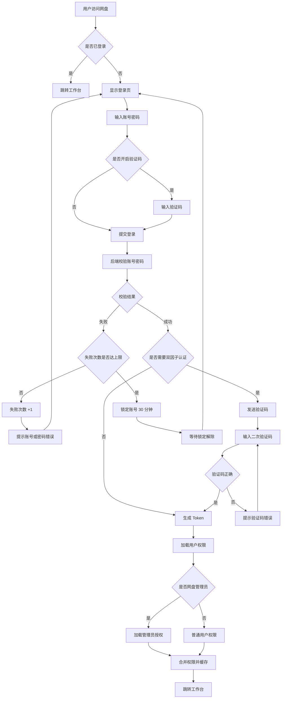

#### 11.1.2 SSO 单点登录流程

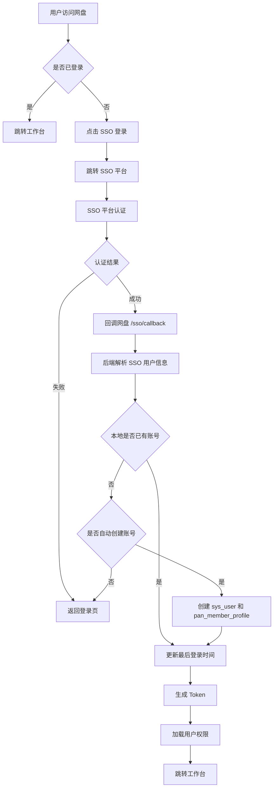

#### 11.1.3 密码找回流程

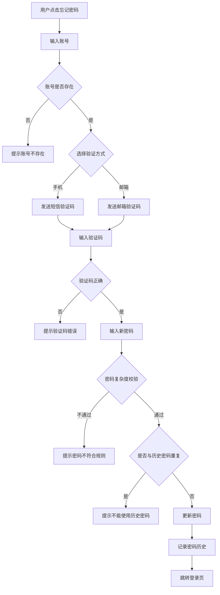

### 11.2 文件上传流程

#### 11.2.1 小文件直传流程

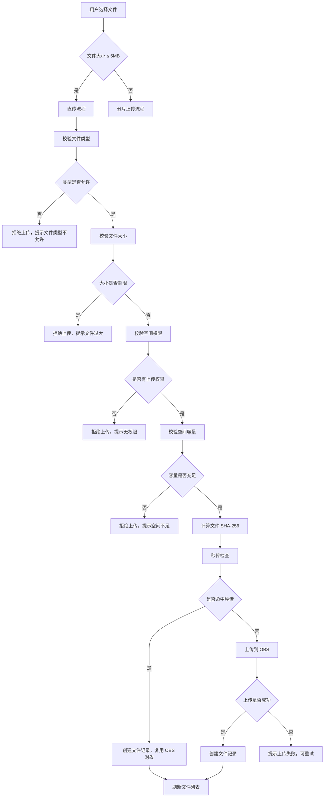

#### 11.2.2 大文件分片上传流程

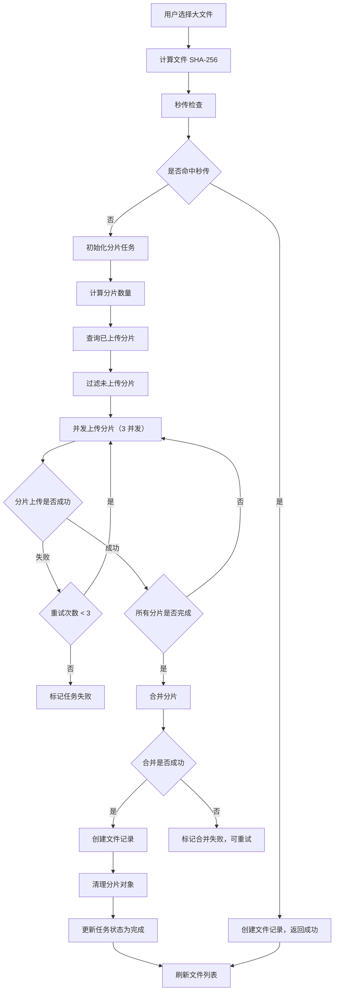

#### 11.2.3 断点续传流程

```mermaid
flowchart TD
  A["用户重新上传文件"] --> B["计算文件 SHA-256"]
  B --> C["查询是否存在未完成任务"]
  C --> D{"是否存在未完成任务"}
  D -->|否| E["走正常上传流程"]
  D -->|是| F["提示是否继续上传"]
  F --> G{"用户选择"}
  G -->|继续| H["查询已上传分片"]
  G =>|重新开始| I["删除旧任务，新建任务"]
  H --> J["过滤未上传分片"]
  J --> K["继续上传未完成分片"]
  K --> L["合并分片"]
  I --> M["走正常上传流程"]
  L --> N["上传完成"]
```

### 11.3 文件下载流程

#### 11.3.1 单文件下载

```mermaid
flowchart TD
  A["用户点击下载"] --> B["校验下载权限"]
  B --> C{"是否有下载权限"}
  C -->|否| D["提示无下载权限"]
  C -->|是| E["校验文件是否已删除"]
  E --> F{"文件是否已删除"}
  F -->|是| G["提示文件已删除"]
  F -->|否| H["生成下载 URL"]
  H --> I{"是否需要水印"}
  I -->|是| J["生成带水印的下载 URL"]
  I =>|否| K["生成普通下载 URL"]
  J --> L["记录下载日志"]
  K --> L
  L --> M["触发浏览器下载"]
  M --> N["下载完成"]
```

#### 11.3.2 批量下载（ZIP 打包）

```mermaid
flowchart TD
  A["用户多选文件"] --> B["点击批量下载"]
  B --> C["校验下载权限"]
  C --> D{"是否有全部下载权限"}
  D -->|否| E["提示部分文件无下载权限"]
  D =>|是| F["创建打包任务"]
  F --> G["后端异步打包"]
  G --> H["递归收集文件和文件夹"]
  H --> I["从 OBS 下载文件"]
  I --> J["压缩为 ZIP"]
  J --> K{"是否需要水印"}
  K -->|是| L["添加水印到 PDF/图片"]
  K =>|否| M["继续打包"]
  L --> M
  M --> N["上传 ZIP 到临时存储"]
  N --> O["生成下载 URL"]
  O --> P["通知用户下载完成"]
  P --> Q["用户点击下载"]
  R["打包失败"] --> S["通知用户失败原因"]
```

### 11.4 文件删除与回收站流程

#### 11.4.1 文件删除流程

```mermaid
flowchart TD
  A["用户选择文件"] --> B["点击删除"]
  B --> C["弹出确认对话框"]
  C --> D{"用户确认"}
  D -->|否| E["取消删除"]
  D =>|是| F["校验删除权限"]
  F --> G{"是否有删除权限"}
  G -->|否| H["提示无删除权限"]
  G =>|是| I{"是否为受保护目录"}
  I -->|是| J["提示受保护目录不可删除"]
  I =>|否| K["记录原路径快照"]
  K --> L["设置 is_deleted=1"]
  L --> M["记录 delete_time"]
  M --> N["写入回收站记录"]
  N --> O["失效相关外链"]
  O --> P["从搜索索引移除"]
  P --> Q["从与我相关移除"]
  Q --> R["写删除审计日志"]
  R --> S["刷新文件列表"]
```

#### 11.4.2 文件夹删除流程

```mermaid
flowchart TD
  A["用户选择文件夹"] --> B["点击删除"]
  B --> C["弹出确认对话框"]
  C --> D{"用户确认"}
  D -->|否| E["取消删除"]
  D =>|是| F["校验删除权限"]
  F --> G{"是否有删除权限"}
  G -->|否| H["提示无删除权限"]
  G =>|是| I{"是否为根目录或部门资料库"}
  I -->|是| J["提示受保护目录不可删除"]
  I =>|否| K["记录文件夹路径快照"]
  K --> L["设置根文件夹 is_deleted=1"]
  L --> M["递归标记子文件夹删除"]
  M --> N["递归标记子文件删除"]
  N --> O["写入回收站记录（仅根）"]
  O --> P["失效文件夹内外链"]
  P --> Q["从搜索索引移除"]
  Q --> R["写删除审计日志"]
  R --> S["刷新文件列表"]
```

#### 11.4.3 回收站还原流程

```mermaid
flowchart TD
  A["用户进入回收站"] --> B["选择删除项"]
  B --> C["点击还原"]
  C --> D["校验还原权限"]
  D --> E{"是否有还原权限"}
  E -->|否| F["提示无还原权限"]
  E =>|是| G["检查原父目录"]
  G --> H{"原父目录是否存在且未删除"}
  H -->|否| I["提示选择新位置"]
  I --> J["用户选择新位置"]
  J => K["校验新位置权限"]
  H =>|是| L["检查来源空间可用性"]
  K --> L
  L --> M{"来源空间是否可用"}
  M =>|否| N["提示来源空间不可用"]
  M =>|是| O["检查同名冲突"]
  O --> P{"是否存在同名冲突"}
  P =>|是| Q["自动重命名"]
  P =>|否| R["恢复 is_deleted=0"]
  Q --> R
  R --> S["清除 delete_time"]
  S --> T["恢复搜索索引"]
  T --> U["恢复与我相关"]
  U --> V["恢复外链状态"]
  V --> W["写还原审计日志"]
  W --> X["刷新回收站列表"]
```

#### 11.4.4 彻底删除流程

```mermaid
flowchart TD
  A["用户选择删除项"] --> B["点击彻底删除"]
  B --> C["弹出二次确认"]
  C --> D{"用户确认"}
  D =>|否| E["取消彻底删除"]
  D =>|是| F["校验彻底删除权限"]
  F --> G{"是否有彻底删除权限"}
  G =>|否| H["提示无权限"]
  G =>|是| I["检查 ossId 引用计数"]
  I --> J{"引用计数是否为 0"}
  J =>|是| K["删除 OBS 对象"]
  J =>|否| L["仅删除业务记录"]
  K --> M["删除 OSS 记录"]
  L --> M
  M --> N["删除文件记录"]
  N --> O["删除回收站记录"]
  O --> P["写彻底删除审计日志"]
  P --> Q["刷新回收站列表"]
```

### 11.5 外链分享流程

#### 11.5.1 创建外链

```mermaid
flowchart TD
  A["用户选择文件/文件夹"] --> B["点击分享外链"]
  B --> C["弹出分享设置弹窗"]
  C --> D["配置分享参数"]
  D --> E{"是否强制提取码"}
  E =>|是| F["提取码必填"]
  E =>|否| G["提取码可选"]
  F --> H["校验有效期"]
  G --> H
  H --> I{"有效期是否超限"}
  I =>|是| J["提示有效期超限"]
  I =>|否| K["校验分享权限"]
  K --> L{"是否有分享权限"}
  L =>|否| M["提示无分享权限"]
  L =>|是| N["生成随机 token"]
  N --> O["生成提取码（如未指定）"]
  O --> P["计算过期时间"]
  P --> Q["创建 pan_share_link 记录"]
  Q --> R["生成分享链接"]
  R --> S["显示链接和提取码"]
  S --> T["提供复制按钮"]
```

#### 11.5.2 外链访问流程

```mermaid
flowchart TD
  A["访客打开外链"] --> B["解析 token"]
  B --> C{"外链是否存在"}
  C =>|否| D["显示外链不存在"]
  C =>|是| E["检查外链状态"]
  E --> F{"状态是否为 active"}
  F =>|否| G["显示外链已失效"]
  F =>|是| H["检查过期时间"]
  H --> I{"是否已过期"}
  I =>|是| J["显示外链已过期"]
  I =>|否| K["检查访问次数"]
  K --> L{"是否超限"}
  L =>|是| M["显示访问次数已达上限"]
  L =>|否| N{"是否需要提取码"}
  N =>|是| O["显示提取码输入页"]
  N =>|否| P["直接访问"]
  O --> Q["输入提取码"]
  Q --> R{"提取码正确"}
  R =>|否| S["提示提取码错误"]
  R =>|是| P
  P --> T["累加访问次数"]
  T --> U["记录访问日志"]
  U --> V["显示外链内容"]
  V --> W{"是否需要水印"}
  W =>|是| X["添加访客信息水印"]
  W =>|否| Y["正常显示"]
  X --> Y
```

#### 11.5.3 外链保存至个人空间

```mermaid
flowchart TD
  A["访客点击保存至个人空间"] --> B{"是否已登录"}
  B =>|否| C["跳转登录页"]
  B =>|是| D["校验个人空间容量"]
  D --> E{"容量是否充足"}
  E =>|否| F["提示空间不足"]
  E =>|是| G["选择保存位置"]
  G --> H["校验保存权限"]
  H --> I{"是否允许保存"}
  I =>|否| J["提示不允许保存"]
  I =>|是| K["从 OBS 复制文件"]
  K --> L["创建文件记录"]
  L --> M["记录保存日志"]
  M --> N["提示保存成功"]
```

### 11.6 共享授权流程

#### 11.6.1 创建共享授权

```mermaid
flowchart TD
  A["用户选择文件/文件夹"] --> B["点击共享授权"]
  B --> C["弹出授权设置弹窗"]
  C --> D["选择被授权人"]
  D --> E["选择权限角色"]
  E --> F{"权限角色是否为自定义"}
  F =>|是| G["勾选原子权限"]
  F =>|否| H["按角色映射权限"]
  G --> I["设置有效期"]
  H --> I
  I --> J["校验授权权限"]
  J --> K{"是否有授权权限"}
  K =>|否| L["提示无授权权限"]
  K =>|是| M["创建 pan_file_grant 记录"]
  M --> N["通知被授权人"]
  N --> O["刷新授权列表"]
```

#### 11.6.2 权限申请审批流程

```mermaid
flowchart TD
  A["用户发现无权限文件"] --> B["点击申请权限"]
  B --> C["填写申请理由"]
  C --> D["选择申请权限"]
  D --> E["提交申请"]
  E --> F["创建 pan_permission_apply 记录"]
  F --> G["通知文件所有者"]
  G --> H["所有者查看申请"]
  H --> I{"审批结果"}
  I =>|同意| J["创建共享授权"]
  I =>|拒绝| K["填写拒绝理由"]
  I =>|忽略| L["申请超时自动关闭"]
  J --> M["通知申请人"]
  K --> M
  M --> N["更新申请状态"]
  N --> O["流程结束"]
```

### 11.7 协作空间流程

#### 11.7.1 创建协作空间

```mermaid
flowchart TD
  A["用户点击创建协作空间"] --> B["填写空间信息"]
  B --> C["输入空间名称"]
  C --> D["选择空间图标"]
  D --> E["填写空间描述"]
  E --> F["提交创建"]
  F --> G["校验名称唯一性"]
  G --> H{"名称是否重复"}
  H =>|是| I["提示名称重复"]
  H =>|否| J["创建 pan_collab_space 记录"]
  J --> K["创建者自动成为群主"]
  K --> L["创建协作空间根目录"]
  L --> M["跳转协作空间"]
```

#### 11.7.2 邀请协作成员

```mermaid
flowchart TD
  A["群主点击邀请成员"] --> B["选择成员"]
  B --> C["选择成员角色"]
  C --> D["提交邀请"]
  D --> E["校验邀请权限"]
  E --> F{"是否有邀请权限"}
  F =>|否| G["提示无邀请权限"]
  F =>|是| H{"成员是否已在空间"}
  H =>|是| I["提示成员已存在"]
  H =>|否| J["创建 pan_collab_member 记录"]
  J --> K["通知被邀请成员"]
  K --> L["刷新成员列表"]
```

#### 11.7.3 协作空间解散流程

```mermaid
flowchart TD
  A["群主点击解散"] --> B["弹出二次确认"]
  B --> C{"用户确认"}
  C =>|否| D["取消解散"]
  C =>|是| E["校验群主身份"]
  E --> F{"是否为群主"}
  F =>|否| G["提示无解散权限"]
  F =>|是| H["标记空间为解散中"]
  H --> I["通知所有成员"]
  I --> J["按策略处理文件"]
  J --> K{"解散策略"}
  K =>|彻底删除| L["删除所有文件和 OBS 对象"]
  K =>|归档| M["打包文件到企业空间"]
  K =>|转移| N["转移文件到指定空间"]
  L --> O["删除成员关系"]
  M --> O
  N --> O
  O --> P["删除协作空间记录"]
  P --> Q["写解散审计日志"]
  Q --> R["流程结束"]
```

### 11.8 组织架构管理流程

#### 11.8.1 部门创建流程

```mermaid
flowchart TD
  A["管理员点击新增部门"] --> B["填写部门信息"]
  B --> C["输入部门名称"]
  C --> D["选择上级部门"]
  D --> E["设置部门负责人"]
  E --> F["设置文件管理员"]
  F --> G["提交创建"]
  G --> H["校验部门名称唯一性"]
  H --> I{"名称是否重复"}
  I =>|是| J["提示名称重复"]
  I =>|否| K["校验上级部门范围"]
  K --> L{"上级部门是否在管理范围"}
  L =>|否| M["提示无权限"]
  L =>|是| N["创建 sys_dept 记录"]
  N --> O["创建 pan_dept_profile 记录"]
  O --> P["创建部门公共资料库"]
  P --> Q["写入部门负责人关系"]
  Q --> R["写入文件管理员关系"]
  R --> S["写操作日志"]
  S --> T["刷新部门树"]
```

#### 11.8.2 成员移除与交接流程

```mermaid
flowchart TD
  A["管理员选择成员"] --> B["点击移除"]
  B --> C["选择交接接收人"]
  C --> D["校验不能移除自己"]
  D --> E{"是否为当前账号"}
  E =>|是| F["提示不能移除自己"]
  E =>|否| G["校验成员在管理范围"]
  G --> H{"是否在管理范围"}
  H =>|否| I["提示无权限"]
  H =>|是| J["检查分级管理员身份"]
  J --> K{"是否为分级管理员"}
  K =>|是| L["先移交管理员授权"]
  K =>|否| M["检查部门负责人/文件管理员"]
  L --> M
  M --> N{"是否为部门负责人/文件管理员"}
  N =>|是| O["清理部门业务身份"]
  N =>|否| P["检查协作空间群主"]
  O --> P
  P --> Q{"是否为协作空间群主"}
  Q =>|是| R["转让群主或归档"]
  Q =>|否| S["执行个人空间交接"]
  R --> S
  S --> T["移动个人空间文件到交接包"]
  T --> U["停用账号"]
  U --> V["标记 pan_activated=false"]
  V --> W["写交接与移除日志"]
  W --> X["刷新成员列表"]
```

#### 11.8.3 管理员授权移交流程

```mermaid
flowchart TD
  A["选择原管理员"] --> B["选择接替成员"]
  B --> C["校验接替成员存在"]
  C --> D{"成员是否存在"}
  D =>|否| E["提示成员不存在"]
  D =>|是| F["校验接替成员在管理范围"]
  F --> G{"是否在管理范围"}
  G =>|否| H["提示无权限"]
  G =>|是| I["读取原管理员全部授权"]
  I --> J{"是否有授权"}
  J =>|否| K["提示当前成员不是管理员"]
  J =>|是| L["逐条执行移交"]
  L --> M{"接替成员是否已有同范围授权"}
  M =>|是| N["合并双方 perm_json"]
  M =>|否| O["直接修改 user_id"]
  N --> P["删除原授权记录"]
  O --> Q["保留原授权记录"]
  P --> R["刷新两人会话权限"]
  Q --> R
  R --> S["通知相关管理员"]
  S --> T["写移交日志"]
```

### 11.9 文件预览流程

```mermaid
flowchart TD
  A["用户点击文件预览"] --> B["校验预览权限"]
  B --> C{"是否有预览权限"}
  C =>|否| D["提示无预览权限"]
  C =>|是| E["检查文件是否已删除"]
  E --> F{"文件是否已删除"}
  F =>|是| G["提示文件已删除"]
  F =>|否| H["判断文件类型"]
  H --> I{"文件类型"}
  I =>|图片| J["图片预览器"]
  I =>|视频| K["视频播放器"]
  I =>|音频| L["音频播放器"]
  I =>|PDF| M["PDF 预览器"]
  I =>|Office| N["Office 在线预览"]
  I =>|文本| O["代码编辑器预览"]
  I =>|其他| P["提示不支持预览"]
  J --> Q["生成预览 URL"]
  K --> Q
  L --> Q
  M --> Q
  N --> R["调用 Office 预览服务"]
  O --> S["读取文件内容"]
  Q --> T{"是否需要水印"}
  R --> T
  S --> T
  T =>|是| U["添加水印"]
  T =>|否| V["正常预览"]
  U --> V
  V --> W["记录预览日志"]
  W --> X["显示预览界面"]
```

### 11.10 文件搜索流程

```mermaid
flowchart TD
  A["用户输入搜索关键字"] --> B["防抖 300ms"]
  B --> C["提交搜索请求"]
  C --> D["后端解析关键字"]
  D --> E["计算用户可见空间范围"]
  E --> F["个人空间搜索"]
  E --> G["企业空间搜索"]
  E --> H["协作空间搜索"]
  F --> I["匹配文件名和标签"]
  G --> I
  H --> I
  I --> J["过滤已删除文件"]
  J --> K["过滤无权限文件"]
  K --> L["按相关度排序"]
  L --> M["高亮关键字"]
  M --> N["分页返回结果"]
  N --> O["显示搜索结果"]
  O --> P{"是否点击结果"}
  P =>|是| Q["跳转文件位置"]
  P =>|否| R["结束"]
```

### 11.11 容量管理流程

```mermaid
flowchart TD
  A["用户上传文件"] --> B["校验空间容量"]
  B --> C{"容量是否充足"}
  C =>|是| D["允许上传"]
  C =>|否| E{"是否为个人空间"}
  E =>|是| F["提示个人空间不足"]
  E =>|否| G["提示企业空间不足"]
  F --> H{"是否允许扩容"}
  H =>|是| I["跳转扩容申请"]
  H =>|否| J["提示清理文件"]
  G --> K["通知管理员扩容"]
  I --> L["管理员审批"]
  L --> M{"审批结果"}
  M =>|同意| N["调整容量配额"]
  M =>|拒绝| O["通知用户"]
  N --> D
```

### 11.12 异常处理流程

#### 11.12.1 网络异常处理

```mermaid
flowchart TD
  A["发起请求"] --> B{"网络是否正常"}
  B =>|是| C["正常处理"]
  B =>|否| D["显示网络异常提示"]
  D --> E["提供重试按钮"]
  E --> F{"用户点击重试"}
  F =>|是| A
  F =>|否| G["保持当前状态"]
```

#### 11.12.2 权限不足处理

```mermaid
flowchart TD
  A["用户操作"] --> B["后端校验权限"]
  B --> C{"是否有权限"}
  C =>|是| D["正常处理"]
  C =>|否| E["返回 403"]
  E --> F["前端拦截 403"]
  F --> G{"是否有申请入口"}
  G =>|是| H["提示可申请权限"]
  G =>|否| I["提示无权限"]
  H --> J{"用户点击申请"}
  J =>|是| K["跳转权限申请"]
  J =>|否| L["关闭提示"]
```

#### 11.12.3 文件冲突处理

```mermaid
flowchart TD
  A["上传/移动文件"] --> B["检查同名冲突"]
  B --> C{"是否存在同名"}
  C =>|否| D["正常处理"]
  C =>|是| E{"冲突处理策略"}
  E =>|重命名| F["自动追加 (1) (2) 后缀"]
  E =>|覆盖| G["提示是否覆盖"]
  E =>|跳过| H["跳过冲突文件"]
  F --> I["继续处理"]
  G --> J{"用户确认"}
  J =>|是| I
  J =>|否| H
  H --> K["继续下一个文件"]
  I --> L["完成"]
  K --> L
```

#### 11.12.4 OBS 存储异常处理

```mermaid
flowchart TD
  A["OBS 操作"] --> B{"操作是否成功"}
  B =>|是| C["正常流程"]
  B =>|否| D["记录错误日志"]
  D --> E{"错误类型"}
  E =>|网络超时| F["重试 3 次"]
  E =>|权限不足| G["通知管理员检查 OBS 配置"]
  E =>|对象不存在| H["清理无效引用"]
  E =>|存储空间不足| I["通知管理员扩容"]
  F --> J{"重试是否成功"}
  J =>|是| C
  J =>|否| K["标记操作失败"]
  G --> K
  H --> L["删除无效记录"]
  I --> K
  K --> M["通知用户操作失败"]
```

### 11.13 定时任务流程

#### 11.13.1 回收站自动清理

```mermaid
flowchart TD
  A["定时任务触发（每天 3 点）"] --> B["查询过期删除项"]
  B --> C["delete_time < now() - 30 天"]
  C --> D["遍历删除项"]
  D --> E["检查 ossId 引用计数"]
  E --> F{"引用计数是否为 0"}
  F =>|是| G["删除 OBS 对象"]
  F =>|否| H["仅删除业务记录"]
  G --> I["删除文件记录"]
  H --> I
  I --> J["删除回收站记录"]
  J --> K["写自动清理日志"]
  K --> L{"是否还有删除项"}
  L =>|是| D
  L =>|否| M["任务完成"]
```

#### 11.13.2 MDM 同步任务

```mermaid
flowchart TD
  A["定时任务触发（每天 1 点）"] --> B["读取已批准同步范围"]
  B --> C["遍历同步范围"]
  C --> D["拉取 MDM 部门数据"]
  D --> E["同步部门"]
  E --> F["拉取 MDM 人员数据"]
  F --> G["遍历人员"]
  G --> H["查询本地是否已存在"]
  H --> I{"是否已存在"}
  I =>|否| J["创建 sys_user 和 pan_member_profile"]
  I =>|是| K{"local_managed 是否为 true"}
  K =>|是| L["跳过同步"]
  K =>|否| M["更新成员信息"]
  J --> N{"MDM 状态是否为离职"}
  M --> N
  N =>|是| O["停用账号并通知交接"]
  N =>|否| P["继续下一个"]
  L --> P
  O --> P
  P --> Q{"是否还有人员"}
  Q =>|是| G
  Q =>|否| R["写同步日志"]
  R --> S["任务完成"]
```

#### 11.13.3 外链自动失效

```mermaid
flowchart TD
  A["定时任务触发（每小时）"] --> B["查询过期外链"]
  B --> C["expire_time < now()"]
  C --> D["遍历过期外链"]
  D --> E["更新状态为 expired"]
  E --> F["通知外链创建者"]
  F --> G{"是否还有外链"}
  G =>|是| D
  G =>|否| H["任务完成"]
```


## 12. 补充线框图与功能完善

本章补充遗漏的功能模块线框图，完善页面状态变化、交互控件位置及响应式布局，确保线框图完整呈现产品的全部功能与用户体验。

### 12.1 遗漏功能模块线框图

#### 12.1.1 登录页

**页面路由**：`/login`
**目标用户**：所有用户

```
┌────────────────────────────────────────────────────────────────────────────┐
│                                                                            │
│                          [企业 Logo]                                       │
│                       企业网盘系统                                          │
│                                                                            │
│          ┌──────────────────────────────────────────────────────────┐      │
│          │                                                            │      │
│          │  ── 登录方式 ──                                            │      │
│          │  [账号密码] [短信登录] [扫码登录] [SSO]                   │      │
│          │                                                            │      │
│          │  ┌──────────────────────────────────────────────────┐    │      │
│          │  │ 👤  账号          [____________________________]  │    │      │
│          │  └──────────────────────────────────────────────────┘    │      │
│          │                                                            │      │
│          │  ┌──────────────────────────────────────────────────┐    │      │
│          │  │ 🔒  密码          [____________________________]  │    │      │
│          │  └──────────────────────────────────────────────────┘    │      │
│          │                                                            │      │
│          │  ┌──────────────────────┐  ┌─────────────────────────┐  │      │
│          │  │ 🔢  验证码 [______]   │  │  [获取验证码] (60s)     │  │      │
│          │  └──────────────────────┘  └─────────────────────────┘  │      │
│          │                                                            │      │
│          │  ☐ 记住我                          [忘记密码？]          │      │
│          │                                                            │      │
│          │  ┌──────────────────────────────────────────────────┐    │      │
│          │  │                      登 录                       │    │      │
│          │  └──────────────────────────────────────────────────┘    │      │
│          │                                                            │      │
│          │  ── 其他登录方式 ──                                        │      │
│          │  [企业微信]  [钉钉]  [飞书]                               │      │
│          │                                                            │      │
│          └──────────────────────────────────────────────────────────┘      │
│                                                                            │
│          © 2026 企业网盘  |  隐私政策  |  服务条款  |  帮助中心             │
│                                                                            │
└────────────────────────────────────────────────────────────────────────────┘
```

**状态变化**：
- 默认状态：账号密码登录方式选中
- 输入聚焦：输入框边框变蓝，显示焦点环
- 输入错误：边框变红，下方显示错误提示
- 验证码倒计时：按钮禁用，显示倒计时秒数
- 登录中：按钮显示加载图标，禁用点击
- 登录失败：弹出错误提示，验证码刷新

#### 12.1.2 文件预览页（详细）

**页面路由**：`/pan/preview/{fileId}`
**目标用户**：有预览权限的用户

```
┌────────────────────────────────────────────────────────────────────────────┐
│ ← 返回  │  📄  项目方案.docx                              [⋯ 更多操作]    │
├────────────────────────────────────────────────────────────────────────────┤
│                                                                            │
│  ┌────────────────────────────────────────────────────────────────────┐    │
│  │                                                                    │    │
│  │                                                                    │    │
│  │                     [文件预览内容区域]                             │    │
│  │                                                                    │    │
│  │                  支持：图片/视频/PDF/Office/文本                   │    │
│  │                                                                    │    │
│  │                                                                    │    │
│  │                                                                    │    │
│  │                                                                    │    │
│  └────────────────────────────────────────────────────────────────────┘    │
│                                                                            │
│  ── 底部工具栏 ──                                                          │
│  ┌────────────────────────────────────────────────────────────────────┐    │
│  │  [⬅ 上一页]    页码 1/10    [➡ 下一页]    [🔍 放大] [🔍 缩小]    │    │
│  │  [⤓ 下载]  [🖨 打印]  [🔗 分享]  [📋 复制]  [✏️ 编辑]            │    │
│  └────────────────────────────────────────────────────────────────────┘    │
│                                                                            │
│  ── 右侧信息面板（可折叠）──                                               │
│  ┌────────────────────────┐                                                │
│  │ 📋 文件信息            │                                                │
│  │ ─────────────────────  │                                                │
│  │ 名称：项目方案.docx    │                                                │
│  │ 大小：2.3 MB           │                                                │
│  │ 类型：Word 文档        │                                                │
│  │ 修改：2026-06-22 14:30 │                                                │
│  │ 创建：张三             │                                                │
│  │ 位置：企业空间/项目    │                                                │
│  │                        │                                                │
│  │ 📝 历史版本            │                                                │
│  │ ─────────────────────  │                                                │
│  │ v3.0 当前版本          │                                                │
│  │ v2.9 2026-06-20 张三   │                                                │
│  │ v2.8 2026-06-18 李四   │                                                │
│  │                        │                                                │
│  │ 🏷️ 标签               │                                                │
│  │ ─────────────────────  │                                                │
│  │ [重要] [项目] [方案]   │                                                │
│  │                        │                                                │
│  │ 👥 共享成员            │                                                │
│  │ ─────────────────────  │                                                │
│  │ 张三 (操作者)          │                                                │
│  │ 李四 (预览者)          │                                                │
│  │ [+ 添加共享]           │                                                │
│  └────────────────────────┘                                                │
└────────────────────────────────────────────────────────────────────────────┘
```

**状态变化**：
- 加载中：显示骨架屏或加载图标
- 预览失败：显示"文件预览失败，请下载后查看"
- 不支持的类型：显示文件图标和"该文件类型不支持在线预览"
- 水印模式：预览内容叠加访客信息水印
- 全屏模式：隐藏顶栏和侧栏，仅保留预览内容
- 信息面板折叠：点击按钮收起右侧面板

#### 12.1.3 消息中心

**页面路由**：`/pan/message`
**目标用户**：所有用户

```
┌────────────────────────────────────────────────────────────────────────────┐
│  消息中心                                                                   │
├────────────────────────────────────────────────────────────────────────────┤
│                                                                            │
│  ── 消息分类 ──                                                            │
│  [全部(28)] [共享(5)] [审批(3)] [系统(8)] [协作(12)]                       │
│  ─────────────────────────────────────────────────────────────────────     │
│  ☑ 全部已读    [🗑 清空已读]    [⚙️ 消息设置]                              │
│  ─────────────────────────────────────────────────────────────────────     │
│                                                                            │
│  ┌────────────────────────────────────────────────────────────────────┐    │
│  │ 🔵 张三 共享了文件给你                              2 分钟前       │    │
│  │    "项目方案.docx"                                                 │    │
│  │    [查看] [忽略]                                                   │    │
│  ├────────────────────────────────────────────────────────────────────┤    │
│  │ 🟡 李四 申请下载 "财务报表.xlsx" 的权限            15 分钟前       │    │
│  │    申请理由：月底财务汇总需要                                      │    │
│  │    [同意] [拒绝] [查看详情]                                        │    │
│  ├────────────────────────────────────────────────────────────────────┤    │
│  │ ⚪ 系统通知：您的个人空间容量已使用 80%             1 小时前        │    │
│  │    建议清理不需要的文件或申请扩容                                  │    │
│  │    [前往清理] [申请扩容]                                           │    │
│  ├────────────────────────────────────────────────────────────────────┤    │
│  │ ⚪ 王五 邀请你加入协作空间 "设计组"                 3 小时前        │    │
│  │    角色：编辑者                                                    │    │
│  │    [接受] [拒绝]                                                   │    │
│  ├────────────────────────────────────────────────────────────────────┤    │
│  │ ⚪ 外链 "项目方案分享" 将在 3 天后过期              昨天 18:30      │    │
│  │    [续期] [查看外链]                                               │    │
│  └────────────────────────────────────────────────────────────────────┘    │
│                                                                            │
│  ── 分页 ──                                                                │
│  [上一页]  1 2 3 4 5  下一页                          共 28 条              │
└────────────────────────────────────────────────────────────────────────────┘
```

**状态变化**：
- 未读消息：左侧显示蓝色圆点，背景高亮
- 已读消息：圆点变灰色，背景正常
- 悬浮状态：显示操作按钮
- 操作完成：消息标记为已处理，淡出动画

#### 12.1.4 全局搜索页

**页面路由**：`/pan/search`
**目标用户**：所有用户

```
┌────────────────────────────────────────────────────────────────────────────┐
│  ┌──────────────────────────────────────────────────────────────────────┐  │
│  │ 🔍  [项目方案_____________________________________] [搜索]          │  │
│  └──────────────────────────────────────────────────────────────────────┘  │
│                                                                            │
│  ── 筛选条件 ──                                                            │
│  类型：[全部] [📁 文件夹] [📄 文档] [🖼️ 图片] [🎬 视频] [📊 表格]        │
│  空间：[全部] [👤 个人] [🏢 企业] [👥 协作]                                │
│  时间：[全部] [今天] [本周] [本月] [自定义]                                │
│  大小：[全部] [< 1MB] [1-10MB] [10-100MB] [> 100MB]                       │
│  ─────────────────────────────────────────────────────────────────────     │
│                                                                            │
│  找到 23 个结果（耗时 0.12 秒）                                            │
│                                                                            │
│  ┌────────────────────────────────────────────────────────────────────┐    │
│  │ 📄 **项目**方案.docx                                               │    │
│  │    📍 企业空间 / 项目文档 / 2026-Q2                                │    │
│  │    📝 2.3 MB | 修改于 2026-06-22 | 创建者：张三                    │    │
│  │    [预览] [下载] [定位]                                            │    │
│  ├────────────────────────────────────────────────────────────────────┤    │
│  │ 📄 **项目**立项书.pdf                                               │    │
│  │    📍 个人空间 / 工作 / 2026                                       │    │
│  │    📝 1.8 MB | 修改于 2026-06-20 | 创建者：我                      │    │
│  │    [预览] [下载] [定位]                                            │    │
│  ├────────────────────────────────────────────────────────────────────┤    │
│  │ 📁 **项目**文档/                                                   │    │
│  │    📍 企业空间 / 部门资料库                                        │    │
│  │    📝 15 个文件 | 修改于 2026-06-21 | 创建者：李四                 │    │
│  │    [打开] [定位]                                                   │    │
│  └────────────────────────────────────────────────────────────────────┘    │
│                                                                            │
│  ── 分页 ──                                                                │
│  [上一页]  1 2 3  下一页                              共 23 条              │
└────────────────────────────────────────────────────────────────────────────┘
```

**状态变化**：
- 搜索中：显示加载图标
- 无结果：显示空状态"未找到相关文件"
- 关键字高亮：搜索关键字在结果中高亮显示
- 筛选切换：筛选条件变化时自动重新搜索

#### 12.1.5 文件收集页

**页面路由**：`/pan/collection`
**目标用户**：所有用户

```
┌────────────────────────────────────────────────────────────────────────────┐
│  文件收集                                                    [+ 新建收集]   │
├────────────────────────────────────────────────────────────────────────────┤
│                                                                            │
│  ── 进行中 (3) ──                                                          │
│  ┌────────────────────────────────────────────────────────────────────┐    │
│  │ 📥 2026 Q2 项目汇报收集                            [⋯ 更多操作]    │    │
│  │ ────────────────────────────────────────────────────────           │    │
│  │ 截止时间：2026-06-30 23:59                        剩余 8 天        │    │
│  │ 收集到：12 / 20 份文件                                             │    │
│  │ 进度：[████████████░░░░░░░░] 60%                                  │    │
│  │ 收集位置：企业空间 / 项目汇报                                      │    │
│  │ [查看详情] [复制链接] [提醒未提交]                                 │    │
│  ├────────────────────────────────────────────────────────────────────┤    │
│  │ 📥 设计素材收集                                    [⋯ 更多操作]    │    │
│  │ ────────────────────────────────────────────────────────           │    │
│  │ 截止时间：2026-06-25 23:59                        剩余 3 天        │    │
│  │ 收集到：8 / 15 份文件                                              │    │
│  │ 进度：[████████░░░░░░░░░░░░] 53%                                  │    │
│  │ [查看详情] [复制链接] [提醒未提交]                                 │    │
│  └────────────────────────────────────────────────────────────────────┘    │
│                                                                            │
│  ── 已结束 (5) ──                                                          │
│  ┌────────────────────────────────────────────────────────────────────┐    │
│  │ 📥 2026 Q1 项目汇报收集                            [⋯ 更多操作]    │    │
│  │ ────────────────────────────────────────────────────────           │    │
│  │ 截止时间：2026-03-31 23:59                        已结束           │    │
│  │ 收集到：18 / 20 份文件                                             │    │
│  │ [查看详情] [导出] [重新开启]                                       │    │
│  └────────────────────────────────────────────────────────────────────┘    │
└────────────────────────────────────────────────────────────────────────────┘
```

#### 12.1.6 可疑文件页

**页面路由**：`/pan/suspicious`
**目标用户**：所有用户

```
┌────────────────────────────────────────────────────────────────────────────┐
│  可疑文件管理                                                              │
├────────────────────────────────────────────────────────────────────────────┤
│                                                                            │
│  ── 统计概览 ──                                                            │
│  ┌────────────┐  ┌────────────┐  ┌────────────┐  ┌────────────┐           │
│  │ 待处理     │  │ 已隔离     │  │ 已恢复     │  │ 已删除     │           │
│  │    3       │  │    12      │  │    45      │  │    8       │           │
│  └────────────┘  └────────────┘  └────────────┘  └────────────┘           │
│                                                                            │
│  ── 筛选 ──                                                                │
│  [搜索：______] [状态：全部 ▼] [类型：全部 ▼] [时间：全部 ▼]              │
│  ─────────────────────────────────────────────────────────────────────     │
│                                                                            │
│  ┌────────────────────────────────────────────────────────────────────┐    │
│  │ ☐ ⚠️ virus.exe                                  🔴 高风险          │    │
│  │    📍 个人空间 / 下载                       📝 1.2 MB              │    │
│  │    检测时间：2026-06-22 10:30          检测结果：包含恶意代码       │    │
│  │    [隔离] [恢复] [删除] [查看详情]                                 │    │
│  ├────────────────────────────────────────────────────────────────────┤    │
│  │ ☐ ⚠️ suspicious.zip                              🟡 中风险          │    │
│  │    📍 企业空间 / 共享                       📝 5.6 MB              │    │
│  │    检测时间：2026-06-22 09:15          检测结果：包含可疑脚本       │    │
│  │    [隔离] [恢复] [删除] [查看详情]                                 │    │
│  └────────────────────────────────────────────────────────────────────┘    │
│                                                                            │
│  ── 批量操作 ──                                                            │
│  [批量隔离] [批量恢复] [批量删除]                                          │
└────────────────────────────────────────────────────────────────────────────┘
```

### 12.2 页面状态变化线框图

#### 12.2.1 文件列表状态变化

**空状态**：
```
┌────────────────────────────────────────────────────────────────────────────┐
│  工具栏（禁用上传、删除等按钮）                                             │
├────────────────────────────────────────────────────────────────────────────┤
│                                                                            │
│                                                                            │
│                              📁                                            │
│                                                                            │
│                          此文件夹为空                                       │
│                                                                            │
│                      拖拽文件到此处，或                      │
│                                                                            │
│                                                                            │
└────────────────────────────────────────────────────────────────────────────┘
```

**加载状态**：
```
┌────────────────────────────────────────────────────────────────────────────┐
│  工具栏                                                                     │
├────────────────────────────────────────────────────────────────────────────┤
│  ┌────────────────────────────────────────────────────────────────────┐    │
│  │ ▓▓▓▓▓▓▓▓▓▓▓▓▓▓▓▓▓▓▓▓▓▓▓▓▓▓▓▓▓▓▓▓▓▓▓▓▓▓▓▓▓▓▓▓▓▓▓▓▓▓▓▓▓▓▓▓▓▓▓ │    │
│  │ ▓▓▓▓▓▓▓▓▓▓▓▓▓▓▓▓▓▓▓▓▓▓▓▓▓▓▓▓▓▓▓▓▓▓▓▓▓▓▓▓▓▓▓▓▓▓▓▓▓▓▓▓▓▓▓▓▓▓▓ │    │
│  │ ▓▓▓▓▓▓▓▓▓▓▓▓▓▓▓▓▓▓▓▓▓▓▓▓▓▓▓▓▓▓▓▓▓▓▓▓▓▓▓▓▓▓▓▓▓▓▓▓▓▓▓▓▓▓▓▓▓▓▓ │    │
│  │ ▓▓▓▓▓▓▓▓▓▓▓▓▓▓▓▓▓▓▓▓▓▓▓▓▓▓▓▓▓▓▓▓▓▓▓▓▓▓▓▓▓▓▓▓▓▓▓▓▓▓▓▓▓▓▓▓▓▓▓ │    │
│  └────────────────────────────────────────────────────────────────────┘    │
└────────────────────────────────────────────────────────────────────────────┘
```

**错误状态**：
```
┌────────────────────────────────────────────────────────────────────────────┐
│  工具栏                                                                     │
├────────────────────────────────────────────────────────────────────────────┤
│                                                                            │
│                                                                            │
│                              ❌                                            │
│                                                                            │
│                          加载失败                                          │
│                                                                            │
│                      网络异常，请稍后重试                                   │
│                                                                            │
│                          [重新加载]                                        │
│                                                                            │
│                                                                            │
└────────────────────────────────────────────────────────────────────────────┘
```

**无权限状态**：
```
┌────────────────────────────────────────────────────────────────────────────┐
│                                                                            │
│                                                                            │
│                              🔒                                            │
│                                                                            │
│                          无访问权限                                        │
│                                                                            │
│                      您没有权限访问此文件夹                                 │
│                                                                            │
│                      [申请权限]  [返回]                                    │
│                                                                            │
│                                                                            │
└────────────────────────────────────────────────────────────────────────────┘
```

#### 12.2.2 上传进度弹窗

```
┌────────────────────────────────────────────────────────────────────────────┐
│  上传中 (3/5)                                              [最小化] [×]    │
├────────────────────────────────────────────────────────────────────────────┤
│                                                                            │
│  ┌────────────────────────────────────────────────────────────────────┐    │
│  │ 📄 项目方案.docx                                  ✅ 已完成        │    │
│  │ 2.3 MB / 2.3 MB                                                    │    │
│  │ [████████████████████████████████████████] 100%                    │    │
│  ├────────────────────────────────────────────────────────────────────┤    │
│  │ 📊 财务报表.xlsx                                  ⏳ 上传中 80%    │    │
│  │ 4.0 MB / 5.0 MB                                                    │    │
│  │ [████████████████████████████░░░░░░░░░░░] 80%                      │    │
│  ├────────────────────────────────────────────────────────────────────┤    │
│  │ 🎬 演示视频.mp4                                   ⏳ 上传中 45%    │    │
│  │ 22.5 MB / 50.0 MB                                                  │    │
│  │ [██████████████████░░░░░░░░░░░░░░░░░░░░░] 45%                      │    │
│  ├────────────────────────────────────────────────────────────────────┤    │
│  │ 📄 合同.pdf                                       ⏸️ 暂停          │    │
│  │ 1.2 MB / 3.0 MB                                                    │    │
│  │ [████████░░░░░░░░░░░░░░░░░░░░░░░░░░░░░░] 40%                       │    │
│  │ [继续] [取消]                                                      │    │
│  ├────────────────────────────────────────────────────────────────────┤    │
│  │ 📷 照片.jpg                                       ❌ 失败          │    │
│  │ 0 MB / 8.5 MB                                                      │    │
│  │ 错误：网络超时                                                     │    │
│  │ [重试] [取消]                                                      │    │
│  └────────────────────────────────────────────────────────────────────┘    │
│                                                                            │
│  总进度：[████████████████████░░░░░░░░░░░░░░] 60%                          │
│                                                                            │
│                                          [全部暂停] [全部取消]             │
└────────────────────────────────────────────────────────────────────────────┘
```

#### 12.2.3 批量操作工具栏

```
┌────────────────────────────────────────────────────────────────────────────┐
│  已选择 5 项                                  [全选] [取消选择]            │
├────────────────────────────────────────────────────────────────────────────┤
│  [⬇ 下载] [✏️ 重命名] [📁 移动] [📋 复制] [🔗 分享] [🗑️ 删除] [⋯ 更多]   │
└────────────────────────────────────────────────────────────────────────────┘
```

#### 12.2.4 右键菜单

```
                                    ┌────────────────────────┐
                                    │ 👁️ 预览                │
                                    │ ⬇️ 下载                │
                                    │ ✏️ 重命名              │
                                    │ 📋 复制                │
                                    │ ✂️ 剪切                │
                                    │ 📁 移动到...           │
                                    ├────────────────────────┤
                                    │ 🔗 分享外链            │
                                    │ 👥 共享授权            │
                                    │ 📋 复制链接            │
                                    ├────────────────────────┤
                                    │ 📋 查看属性            │
                                    │ 📜 查看历史版本        │
                                    ├────────────────────────┤
                                    │ 🗑️ 删除                │
                                    └────────────────────────┘
```

#### 12.2.5 文件详情侧边面板

```
┌────────────────────────────────────┐
│  📋 文件详情               [×]     │
├────────────────────────────────────┤
│                                    │
│  📄 项目方案.docx                  │
│                                    │
│  ── 基本信息 ──                    │
│  ─────────────────────             │
│  大小：2.3 MB                      │
│  类型：Word 文档                   │
│  位置：企业空间/项目文档            │
│  创建：张三                        │
│  创建时间：2026-06-20 10:00        │
│  修改：张三                        │
│  修改时间：2026-06-22 14:30        │
│                                    │
│  ── 标签 ──                        │
│  ─────────────────────             │
│  [重要] [项目] [方案] [+ 添加]     │
│                                    │
│  ── 共享 ──                        │
│  ─────────────────────             │
│  🔗 外链：2 个活跃                 │
│  👥 共享：3 位成员                 │
│  [管理共享]                        │
│                                    │
│  ── 权限 ──                        │
│  ─────────────────────             │
│  当前用户：操作者                  │
│  可预览、下载、上传、修改、删除    │
│                                    │
│  ── 历史 ──                        │
│  ─────────────────────             │
│  v3.0 当前版本  2026-06-22 14:30   │
│  v2.9 2026-06-20 张三              │
│  v2.8 2026-06-18 李四              │
│  [查看全部历史]                    │
│                                    │
└────────────────────────────────────┘
```

### 12.3 响应式布局线框图

#### 12.3.1 桌面端（≥ 1280px）

```
┌────┬───────────────────────────────────────────────────────────────────────┐
│    │  🔍 [搜索____________]                    [📤 上传] [📁 新建] [👤]    │
│ 侧 ├───────────────────────────────────────────────────────────────────────┤
│ 栏 │  企业空间 > 项目文档                                                   │
│    │  ┌─────────────────────────────────────────────────────────────────┐  │
│ 244│  │ [全部] [文件] [文件夹]  [搜索]  [排序▼] [视图▼]  [⬜ ☰]        │  │
│ px │  ├─────────────────────────────────────────────────────────────────┤  │
│    │  │ ☐ │ 📄 │ 名称          │ 大小    │ 修改时间      │ 操作        │  │
│    │  │───┼────┼───────────────┼─────────┼───────────────┼─────────────│  │
│    │  │ ☐ │ 📄 │ 项目方案.docx │ 2.3 MB  │ 2026-06-22    │ [⋯]         │  │
│    │  │ ☐ │ 📊 │ 财务报表.xlsx │ 5.0 MB  │ 2026-06-21    │ [⋯]         │  │
│    │  │ ☐ │ 📁 │ 设计素材     │ 15 项   │ 2026-06-20    │ [⋯]         │  │
│    │  └─────────────────────────────────────────────────────────────────┘  │
└────┴───────────────────────────────────────────────────────────────────────┘
```

#### 12.3.2 平板端（768px - 1023px）

```
┌──┬─────────────────────────────────────────────────────────────────────────┐
│  │  🔍 [搜索____]                              [📤] [📁] [👤]              │
│  ├─────────────────────────────────────────────────────────────────────────┤
│  │  企业空间 > 项目文档                                                     │
│  │  ┌───────────────────────────────────────────────────────────────────┐  │
│  │  │ [全部] [文件]  [搜索]  [排序▼]                                    │  │
│  │  ├───────────────────────────────────────────────────────────────────┤  │
│  │  │ 📄 项目方案.docx          │ 2.3 MB  │ 2026-06-22 │ [⋯]           │  │
│  │  │ 📊 财务报表.xlsx          │ 5.0 MB  │ 2026-06-21 │ [⋯]           │  │
│  │  │ 📁 设计素材               │ 15 项   │ 2026-06-20 │ [⋯]           │  │
│  │  └───────────────────────────────────────────────────────────────────┘  │
└──┴─────────────────────────────────────────────────────────────────────────┘
   64px
```

#### 12.3.3 移动端（< 768px）

```
┌────────────────────────────────────────────┐
│ ☰  企业网盘              🔍  [📤]  [👤]    │
├────────────────────────────────────────────┤
│  企业空间 > 项目文档                       │
│                                            │
│  ┌──────────────────────────────────────┐  │
│  │ 📄 项目方案.docx                     │  │
│  │ 2.3 MB | 2026-06-22          [⋯]    │  │
│  ├──────────────────────────────────────┤  │
│  │ 📊 财务报表.xlsx                     │  │
│  │ 5.0 MB | 2026-06-21          [⋯]    │  │
│  ├──────────────────────────────────────┤  │
│  │ 📁 设计素材                          │  │
│  │ 15 项 | 2026-06-20           [⋯]    │  │
│  └──────────────────────────────────────┘  │
│                                            │
│  侧栏抽屉化，点击 ☰ 展开                   │
└────────────────────────────────────────────┘
```

### 12.4 弹窗状态变化

#### 12.4.1 确认对话框

**默认状态**：
```
        ┌────────────────────────────────────────────┐
        │                                            │
        │  ⚠️ 确认删除                               │
        │                                            │
        │  确定要删除 "项目方案.docx" 吗？            │
        │  删除后可在回收站中恢复，保留期 30 天。     │
        │                                            │
        │                        [取消]  [确认删除]  │
        └────────────────────────────────────────────┘
```

**危险操作确认**：
```
        ┌────────────────────────────────────────────┐
        │                                            │
        │  🔴 彻底删除确认                           │
        │                                            │
        │  ⚠️ 此操作不可恢复！                       │
        │                                            │
        │  确定要彻底删除 "项目方案.docx" 吗？        │
        │  彻底删除后文件将永久丢失，无法恢复。       │
        │                                            │
        │  请输入文件名以确认：                       │
        │  [____________________________]            │
        │                                            │
        │                        [取消]  [彻底删除]  │
        └────────────────────────────────────────────┘
```

#### 12.4.2 表单弹窗状态

**默认状态**：
```
┌────────────────────────────────────────────────────────────┐
│  新建文件夹                                       [×]      │
├────────────────────────────────────────────────────────────┤
│                                                            │
│  文件夹名称                                                │
│  [____________________________]                            │
│                                                            │
│  位置                                                      │
│  📁 企业空间 / 项目文档                                    │
│                                                            │
│                                    [取消]  [创建]          │
└────────────────────────────────────────────────────────────┘
```

**校验错误状态**：
```
┌────────────────────────────────────────────────────────────┐
│  新建文件夹                                       [×]      │
├────────────────────────────────────────────────────────────┤
│                                                            │
│  文件夹名称                                                │
│  [____________________________]                            │
│  ⚠️ 文件夹名称不能为空                                     │
│                                                            │
│  位置                                                      │
│  📁 企业空间 / 项目文档                                    │
│                                                            │
│                                    [取消]  [创建]          │
└────────────────────────────────────────────────────────────┘
```

**提交中状态**：
```
┌────────────────────────────────────────────────────────────┐
│  新建文件夹                                       [×]      │
├────────────────────────────────────────────────────────────┤
│                                                            │
│  文件夹名称                                                │
│  [新文件夹______________________]                          │
│                                                            │
│  位置                                                      │
│  📁 企业空间 / 项目文档                                    │
│                                                            │
│                          [取消]  [⏳ 创建中...]            │
└────────────────────────────────────────────────────────────┘
```

### 12.5 遗漏功能模块检查清单

#### 12.5.1 已覆盖模块

| 模块 | 章节 | 线框图 | 状态变化 | 流程图 |
|---|---|---|---|---|
| 登录页 | 12.1.1 | ✅ | ✅ | ✅ |
| 工作台 | 5.1 | ✅ | ✅ | — |
| 个人空间 | 5.3 | ✅ | ✅ | ✅ |
| 企业空间 | 5.2 | ✅ | ✅ | ✅ |
| 协作空间 | 5.4 | ✅ | ✅ | ✅ |
| 与我相关 | 5.5 | ✅ | ✅ | ✅ |
| 安全外链 | 5.6 | ✅ | ✅ | ✅ |
| 误删恢复 | 5.7 | ✅ | ✅ | ✅ |
| 文件预览 | 12.1.2 | ✅ | ✅ | ✅ |
| 全局搜索 | 12.1.4 | ✅ | ✅ | ✅ |
| 消息中心 | 12.1.3 | ✅ | ✅ | — |
| 文件收集 | 12.1.5 | ✅ | — | — |
| 可疑文件 | 12.1.6 | ✅ | — | — |
| 部门管理 | 6.1 | ✅ | ✅ | ✅ |
| 成员管理 | 6.2 | ✅ | ✅ | ✅ |
| 管理员设置 | 6.3 | ✅ | ✅ | ✅ |
| 统计报表 | 6.4 | ✅ | — | — |
| 安全配置 | 6.5 | ✅ | — | — |
| 账号中心 | 6.6 | ✅ | — | — |
| 域名管理 | 6.7 | ✅ | — | — |
| 外部协作 | 6.8 | ✅ | — | — |
| 初始化向导 | 6.9 | ✅ | — | ✅ |

#### 12.5.2 补充交互控件

| 控件 | 位置 | 状态变化 |
|---|---|---|
| 上传进度弹窗 | 12.2.2 | 进行中、已完成、失败、暂停 |
| 批量操作工具栏 | 12.2.3 | 选中 0 项隐藏、选中 ≥1 项显示 |
| 右键菜单 | 12.2.4 | 根据文件类型和权限动态显示菜单项 |
| 文件详情面板 | 12.2.5 | 展开、折叠、加载中 |
| 确认对话框 | 12.4.1 | 默认、危险操作需输入确认 |
| 表单弹窗 | 12.4.2 | 默认、校验错误、提交中 |

#### 12.5.3 补充页面状态

| 状态 | 适用页面 | 说明 |
|---|---|---|
| 空状态 | 所有列表页 | 无数据时显示图标和引导文案 |
| 加载状态 | 所有列表页 | 骨架屏或加载图标 |
| 错误状态 | 所有页面 | 网络异常、服务异常 |
| 无权限状态 | 受控页面 | 显示无权限提示和申请入口 |
| 禁用状态 | 表单、按钮 | 不满足条件时禁用 |
| 悬浮状态 | 列表项、卡片 | 显示操作按钮 |
| 选中状态 | 列表项、卡片 | 背景高亮 |
| 焦点状态 | 输入框、按钮 | 焦点环显示 |

### 12.6 交互细节规范

#### 12.6.1 拖拽上传

```
┌────────────────────────────────────────────────────────────────────────────┐
│  ┌ ─ ─ ─ ─ ─ ─ ─ ─ ─ ─ ─ ─ ─ ─ ─ ─ ─ ─ ─ ─ ─ ─ ─ ─ ─ ─ ─ ─ ─ ┐            │
│  │                                                              │            │
│  │                    📁                                         │            │
│  │                                                              │            │
│  │              拖拽文件到此处上传                               │            │
│  │                                                              │            │
│  │              或点击 [选择文件]                               │            │
│  │                                                              │            │
│  └ ─ ─ ─ ─ ─ ─ ─ ─ ─ ─ ─ ─ ─ ─ ─ ─ ─ ─ ─ ─ ─ ─ ─ ─ ─ ─ ─ ─ ─ ┘            │
│                                                                            │
│  支持格式：doc, docx, xls, xlsx, ppt, pptx, pdf, jpg, png, mp4, zip       │
│  单文件最大：2 GB                                                          │
└────────────────────────────────────────────────────────────────────────────┘
```

**拖拽状态变化**：
- 默认：虚线边框，灰色背景
- 拖拽进入：实线边框变蓝，背景变浅蓝
- 拖拽离开：恢复默认
- 拖拽放下：触发上传

#### 12.6.2 文件拖拽移动

```
┌────────────────────────────────────────────────────────────────────────────┐
│  📁 源文件夹                                                               │
│  ┌────────────────────────────────────────────────────────────────────┐    │
│  │ 📄 项目方案.docx  ← 拖拽中（半透明预览）                           │    │
│  │ 📊 财务报表.xlsx                                                   │    │
│  └────────────────────────────────────────────────────────────────────┘    │
│                          ↓                                                 │
│  📁 目标文件夹                                                             │
│  ┌────────────────────────────────────────────────────────────────────┐    │
│  │ 📁 设计素材       ← 高亮蓝色边框                                   │    │
│  │ 📄 合同.pdf                                                        │    │
│  └────────────────────────────────────────────────────────────────────┘    │
└────────────────────────────────────────────────────────────────────────────┘
```

#### 12.6.3 骨架屏

```
┌────────────────────────────────────────────────────────────────────────────┐
│  工具栏                                                                     │
├────────────────────────────────────────────────────────────────────────────┤
│  ┌────────────────────────────────────────────────────────────────────┐    │
│  │ ▓▓▓▓▓▓▓▓▓▓▓▓▓▓▓▓▓▓▓▓▓▓▓▓▓▓▓▓▓▓▓▓▓▓▓▓▓▓▓▓▓▓▓▓▓▓▓▓▓▓▓▓▓▓▓▓▓▓▓ │    │
│  │ ▓▓▓▓▓▓▓▓▓▓▓▓▓▓▓▓▓▓▓▓▓▓▓▓▓▓▓▓▓▓▓▓▓▓▓▓▓▓▓▓▓▓▓▓▓▓▓▓▓▓▓▓▓▓▓▓▓▓▓ │    │
│  │ ▓▓▓▓▓▓▓▓▓▓▓▓▓▓▓▓▓▓▓▓▓▓▓▓▓▓▓▓▓▓▓▓▓▓▓▓▓▓▓▓▓▓▓▓▓▓▓▓▓▓▓▓▓▓▓▓▓▓▓ │    │
│  │ ▓▓▓▓▓▓▓▓▓▓▓▓▓▓▓▓▓▓▓▓▓▓▓▓▓▓▓▓▓▓▓▓▓▓▓▓▓▓▓▓▓▓▓▓▓▓▓▓▓▓▓▓▓▓▓▓▓▓▓ │    │
│  │ ▓▓▓▓▓▓▓▓▓▓▓▓▓▓▓▓▓▓▓▓▓▓▓▓▓▓▓▓▓▓▓▓▓▓▓▓▓▓▓▓▓▓▓▓▓▓▓▓▓▓▓▓▓▓▓▓▓▓▓ │    │
│  └────────────────────────────────────────────────────────────────────┘    │
└────────────────────────────────────────────────────────────────────────────┘
```

**骨架屏规则**：
- 使用 `--color-bg-soft` 作为骨架色
- 添加 1.2s 的 shimmer 动画
- 骨架形状与实际内容形状一致
- 表格骨架：表头 + 5 行占位
- 卡片骨架：卡片轮廓 + 标题占位 + 内容占位

### 12.7 文档完整性检查

#### 12.7.1 功能模块覆盖检查

| 检查项 | 状态 | 说明 |
|---|---|---|
| 用户认证 | ✅ | 登录、SSO、密码找回 |
| 文件上传 | ✅ | 小文件直传、大文件分片、断点续传 |
| 文件下载 | ✅ | 单文件、批量打包 |
| 文件删除 | ✅ | 软删除、彻底删除、回收站还原 |
| 外链分享 | ✅ | 创建、访问、保存至个人空间 |
| 共享授权 | ✅ | 创建、权限申请审批 |
| 协作空间 | ✅ | 创建、邀请、解散 |
| 组织架构 | ✅ | 部门、成员、管理员 |
| 文件预览 | ✅ | 各类型文件预览 |
| 文件搜索 | ✅ | 全局搜索、筛选 |
| 容量管理 | ✅ | 容量校验、扩容 |
| 异常处理 | ✅ | 网络、权限、冲突、OBS |
| 定时任务 | ✅ | 回收站清理、MDM 同步、外链失效 |
| 消息中心 | ✅ | 消息分类、已读未读 |
| 文件收集 | ✅ | 创建收集、进度跟踪 |
| 可疑文件 | ✅ | 检测、隔离、恢复 |

#### 12.7.2 线框图覆盖检查

| 检查项 | 状态 | 说明 |
|---|---|---|
| 登录页 | ✅ | 12.1.1 |
| 工作台 | ✅ | 5.1 |
| 文件列表页 | ✅ | 5.2/5.3/5.4 |
| 文件预览页 | ✅ | 12.1.2 |
| 消息中心 | ✅ | 12.1.3 |
| 全局搜索 | ✅ | 12.1.4 |
| 文件收集 | ✅ | 12.1.5 |
| 可疑文件 | ✅ | 12.1.6 |
| 回收站 | ✅ | 5.7 |
| 外链管理 | ✅ | 5.6 |
| 外链访问页 | ✅ | 5.13 |
| 协作空间 | ✅ | 5.4 |
| 与我相关 | ✅ | 5.5 |
| 部门管理 | ✅ | 6.1 |
| 成员管理 | ✅ | 6.2 |
| 管理员设置 | ✅ | 6.3 |
| 统计报表 | ✅ | 6.4 |
| 安全配置 | ✅ | 6.5 |
| 账号中心 | ✅ | 6.6 |
| 域名管理 | ✅ | 6.7 |
| 外部协作 | ✅ | 6.8 |
| 初始化向导 | ✅ | 6.9 |
| 空状态 | ✅ | 12.2.1 |
| 加载状态 | ✅ | 12.2.1 |
| 错误状态 | ✅ | 12.2.1 |
| 无权限状态 | ✅ | 12.2.1 |
| 上传进度 | ✅ | 12.2.2 |
| 批量操作 | ✅ | 12.2.3 |
| 右键菜单 | ✅ | 12.2.4 |
| 文件详情面板 | ✅ | 12.2.5 |
| 确认对话框 | ✅ | 12.4.1 |
| 表单弹窗 | ✅ | 12.4.2 |
| 响应式桌面 | ✅ | 12.3.1 |
| 响应式平板 | ✅ | 12.3.2 |
| 响应式移动 | ✅ | 12.3.3 |
| 拖拽上传 | ✅ | 12.6.1 |
| 文件拖拽 | ✅ | 12.6.2 |
| 骨架屏 | ✅ | 12.6.3 |

#### 12.7.3 业务流程覆盖检查

| 检查项 | 状态 | 说明 |
|---|---|---|
| 账号密码登录 | ✅ | 11.1.1 |
| SSO 登录 | ✅ | 11.1.2 |
| 密码找回 | ✅ | 11.1.3 |
| 小文件上传 | ✅ | 11.2.1 |
| 大文件分片上传 | ✅ | 11.2.2 |
| 断点续传 | ✅ | 11.2.3 |
| 单文件下载 | ✅ | 11.3.1 |
| 批量下载 | ✅ | 11.3.2 |
| 文件删除 | ✅ | 11.4.1 |
| 文件夹删除 | ✅ | 11.4.2 |
| 回收站还原 | ✅ | 11.4.3 |
| 彻底删除 | ✅ | 11.4.4 |
| 创建外链 | ✅ | 11.5.1 |
| 外链访问 | ✅ | 11.5.2 |
| 外链保存 | ✅ | 11.5.3 |
| 创建共享授权 | ✅ | 11.6.1 |
| 权限申请审批 | ✅ | 11.6.2 |
| 创建协作空间 | ✅ | 11.7.1 |
| 邀请协作成员 | ✅ | 11.7.2 |
| 协作空间解散 | ✅ | 11.7.3 |
| 部门创建 | ✅ | 11.8.1 |
| 成员移除交接 | ✅ | 11.8.2 |
| 管理员授权移交 | ✅ | 11.8.3 |
| 文件预览 | ✅ | 11.9 |
| 文件搜索 | ✅ | 11.10 |
| 容量管理 | ✅ | 11.11 |
| 网络异常 | ✅ | 11.12.1 |
| 权限不足 | ✅ | 11.12.2 |
| 文件冲突 | ✅ | 11.12.3 |
| OBS 异常 | ✅ | 11.12.4 |
| 回收站自动清理 | ✅ | 11.13.1 |
| MDM 同步 | ✅ | 11.13.2 |
| 外链自动失效 | ✅ | 11.13.3 |

